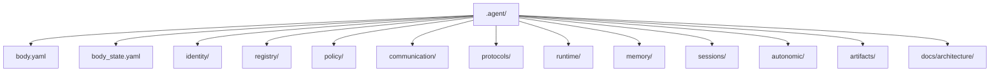

# 에이전트 본체 모델

## 목적

- `.agent` 를 한 명의 durable agent unit 을 이루는 private operating system 으로 정의한다.
- 어떤 기관이 body owner 인지, 무엇이 loadout 또는 mission site 로 빠져야 하는지 고정한다.

## 범위

- body 소유 메타, durable default, runtime layer, continuity, policy, protocol, long-term memory 를 다룬다.
- `.agent_class` loadout, `_workspaces` mission 자료, `_teams/shared` 협업 자산은 범위 밖이다.

## 포함 대상

- `body.yaml`, `body_state.yaml`
- `identity/`, `registry/`, `policy/`, `communication/`, `protocols/`, `runtime/`, `memory/`, `sessions/`, `autonomic/`, `artifacts/`, `docs/`
- section-owned YAML 메타 파일과 기관별 README

## 제외 대상

- installed `skills`, `tools`, `workflows`, `knowledge` 와 현재 장착 상태
- 실제 프로젝트 원본과 project contract
- `_teams/shared` 실제 협업 자료
- 별도 top-level body 폴더로서의 `.agent/export/`

## 구조 개요도



## 현재 본체 영역

```text
.agent/
├── body.yaml
├── body_state.yaml
├── docs/
│   └── architecture/
│       ├── AGENT_BODY_MODEL.md
│       ├── BODY_METADATA_CONTRACT.md
│       ├── RUNTIME_MODEL.md
│       ├── MEMORY_MODEL.md
│       ├── TEAM_EXPANSION_MODEL.md
│       └── COORDINATION_PROTOCOLS.md
├── identity/
│   ├── README.md
│   ├── species_profile.yaml
│   └── identity_manifest.yaml
├── registry/
│   ├── README.md
│   ├── active_class_binding.yaml
│   ├── workspace_binding.yaml
│   ├── capability_index.yaml
│   └── trait_bindings.yaml
├── policy/
│   ├── README.md
│   ├── precedence.yaml
│   ├── safety_rules.md
│   ├── approval_matrix.yaml
│   └── scope_rules.yaml
├── communication/
│   ├── README.md
│   ├── human_channel_profile.yaml
│   ├── peer_channel_profile.yaml
│   └── response_contract.md
├── protocols/
│   ├── README.md
│   ├── request_contract.yaml
│   ├── handoff_contract.yaml
│   ├── decision_contract.yaml
│   ├── incident_contract.yaml
│   └── escalation_contract.yaml
├── runtime/
│   ├── README.md
│   ├── bootstrap_order.md
│   ├── context_assembly.yaml
│   ├── tool_scope.yaml
│   ├── sandbox_profile.yaml
│   └── delivery_profile.yaml
├── memory/
│   ├── README.md
│   ├── self/
│   ├── project/
│   ├── decisions/
│   └── handoffs/
├── sessions/
│   ├── README.md
│   ├── checkpoints/
│   ├── checkpoint_template.yaml
│   └── active_session.example.yaml
├── autonomic/
│   ├── README.md
│   ├── checks/
│   ├── reminders/
│   └── rules/
└── artifacts/
    ├── README.md
    ├── templates/
    ├── playbooks/
    ├── rubrics/
    └── reports/
```

## 기관별 책임

| 기관 | 책임 | 대표 파일 |
| --- | --- | --- |
| `identity/` | durable identity default 와 species baseline | `species_profile.yaml`, `identity_manifest.yaml` |
| `registry/` | binding, index, reference 계층 | `active_class_binding.yaml`, `workspace_binding.yaml`, `capability_index.yaml`, `trait_bindings.yaml` |
| `policy/` | species-free floor | `precedence.yaml`, `approval_matrix.yaml`, `scope_rules.yaml`, `safety_rules.md` |
| `communication/` | 외부 상호작용 규범과 채널 semantics | `human_channel_profile.yaml`, `peer_channel_profile.yaml`, `response_contract.md` |
| `protocols/` | body 공통 operating contract 와 handoff 규칙 | `request_contract.yaml`, `handoff_contract.yaml`, `decision_contract.yaml`, `incident_contract.yaml`, `escalation_contract.yaml` |
| `runtime/` | 기관 조립과 실행 순서 | `bootstrap_order.md`, `context_assembly.yaml`, `tool_scope.yaml`, `sandbox_profile.yaml`, `delivery_profile.yaml` |
| `memory/` | private 장기 기억 | `self/`, `project/`, `decisions/`, `handoffs/` |
| `sessions/` | transcript 가 아닌 continuity 저장소 | `checkpoint_template.yaml`, `active_session.example.yaml` |
| `autonomic/` | 저소음 품질 보정 루틴 | `checks/`, `reminders/`, `rules/` |
| `artifacts/` | body 소유 재사용 산출물 | `templates/`, `playbooks/`, `rubrics/`, `reports/` |

## 중요한 구분

- `.agent_class` 는 body 가 아니라 loadout 이다.
- `_workspaces` 는 body 내부가 아니라 mission site 다.
- 팀 협업 확장은 `.agent` 안이 아니라 루트 `_teams/shared/` 에서 다룬다.
- 현재 baseline 은 species only 이며, species 는 `identity/` 의 durable default 만 담당한다.
- policy 는 species-free floor 로서 identity default 와 분리된다.
- sessions 는 continuity only 이며 raw transcript 저장소가 아니다.
- memory 는 private-first 이고 shared memory inside body 는 현재 `false` 다.

## 미래 확장 방향

- shared collaboration 표준은 `_teams/shared/` 로 확장한다.
- runtime, memory, protocol 세부 규칙은 각각의 세부 모델 문서에서 분리 유지한다.
- export 전달 포맷이 생겨도 별도 `.agent/export/` 는 도입하지 않는다.
