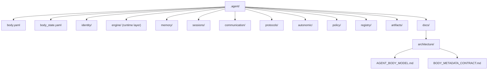

# 에이전트 본체 모델

## 목적

- `.agent` 를 한 명의 durable agent unit 을 이루는 private operating system 으로 정의한다.
- 어떤 기관이 body owner 인지, 무엇이 loadout 또는 mission site 로 빠져야 하는지 고정한다.

## 범위

- body 소유 메타, durable default, runtime layer, continuity, policy, protocol, long-term memory 를 다룬다.
- `.agent_class` loadout, `_workspaces` mission 자료, `_teams/shared` 협업 자산은 범위 밖이다.

## 포함 대상

- `body.yaml`, `body_state.yaml`
- `identity/`, `engine/`, `memory/`, `sessions/`, `communication/`, `protocols/`, `autonomic/`, `policy/`, `registry/`, `artifacts/`, `docs/`
- 본체 기관별 README 와 body 메타 계약

## 제외 대상

- installed `skills`, `tools`, `workflows`, `knowledge` 와 현재 장착 상태
- 실제 프로젝트 원본, project contract, mission 결과물 원본
- team shared 문서와 공용 프로세스
- 독립 top-level body 기관으로서의 `export/`

## 구조 개요도



## 현재 본체 영역

```text
.agent/
├── body.yaml
├── body_state.yaml
├── artifacts/
├── autonomic/
├── communication/
├── docs/
│   └── architecture/
│       ├── AGENT_BODY_MODEL.md
│       └── BODY_METADATA_CONTRACT.md
├── engine/
├── identity/
├── memory/
├── policy/
├── protocols/
├── registry/
└── sessions/
```

## 기관별 책임

| 기관 | 책임 |
| --- | --- |
| `identity/` | durable identity default 와 species baseline |
| `engine/` | 현재 경로명은 `engine/` 이지만 의미는 body runtime layer |
| `memory/` | loadout 교체 후에도 남는 장기 기억 |
| `sessions/` | transcript 가 아닌 continuity 저장소 |
| `communication/` | 외부 상호작용 규범과 채널 semantics |
| `protocols/` | body 공통 operating contract 와 handoff 규칙 |
| `autonomic/` | 저소음 품질 보정 루틴 |
| `policy/` | species-free floor |
| `registry/` | body 내부 자산 색인과 참조 |
| `artifacts/` | body 소유 파생 산출물, 단 별도 `export/` 기관은 두지 않음 |
| `docs/` | body owner 문서와 계약 |

## body 메타

- `body.yaml` 은 private operating system 의 정적 기관 배치를 정의한다.
- `body_state.yaml` 은 실제 `.agent/` 구조와 동기화한 현재 상태 스냅샷이다.
- 세부 필드 정의는 [`.agent/docs/architecture/BODY_METADATA_CONTRACT.md`](BODY_METADATA_CONTRACT.md) 를 기준으로 관리한다.

## 중요한 구분

- `.agent_class` 는 body 가 아니라 loadout 이다.
- `_workspaces` 는 body 내부가 아니라 mission site 다.
- 팀 협업 확장은 `.agent` 안이 아니라 루트 `_teams/shared/` 에서 다룬다.
- species 는 `identity/` 의 durable default 만 담당한다.
- policy 는 species-free floor 로서 identity default 와 분리된다.

## 미래 확장 방향

- `engine/` 은 runtime 의미를 우선 사용하고, major 정리에서 `runtime/` rename 을 검토한다.
- `protocols/` 는 private default 중심으로 유지하고, shared 프로토콜 표준은 `_teams/shared/` 로 확장한다.
- continuity, autonomic, policy floor 의 세부 파일 세트는 후속 문서로 나눈다.
