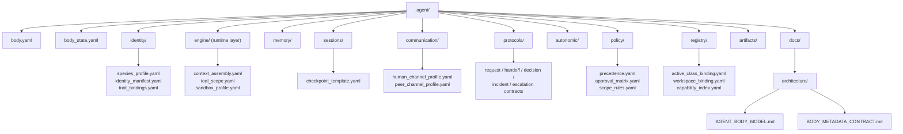

# 에이전트 본체 모델

## 목적

- `.agent` 를 한 명의 durable agent unit 을 이루는 private operating system 으로 정의한다.
- 어떤 기관이 body owner 인지, 무엇이 loadout 또는 mission site 로 빠져야 하는지 고정한다.

## 범위

- body 소유 메타, durable default, runtime layer, continuity, policy, protocol, long-term memory 를 다룬다.
- `.agent_class` loadout, `_workspaces` mission 자료, `_teams/shared` 협업 자산은 범위 밖이다.

## 포함 대상

- `body.yaml`, `body_state.yaml`
- `identity/`, `engine/`, `memory/`, `sessions/`, `communication/`, `protocols/`, `autonomic/`, `policy/`, `registry/`, `artifacts/`, `docs/`
- section-owned YAML 메타 파일, 본체 기관별 README, body 메타 계약

## 제외 대상

- installed `skills`, `tools`, `workflows`, `knowledge` 와 현재 장착 상태
- 실제 프로젝트 원본, project contract, mission 결과물 원본
- team shared 문서와 공용 프로세스
- 별도 top-level body 폴더로서의 `.agent/export/`

## 구조 개요도



## 현재 본체 영역

```text
.agent/
├── body.yaml
├── body_state.yaml
├── artifacts/
├── autonomic/
├── communication/
│   ├── human_channel_profile.yaml
│   └── peer_channel_profile.yaml
├── docs/
│   └── architecture/
│       ├── AGENT_BODY_MODEL.md
│       └── BODY_METADATA_CONTRACT.md
├── engine/
│   ├── context_assembly.yaml
│   ├── sandbox_profile.yaml
│   └── tool_scope.yaml
├── identity/
│   ├── identity_manifest.yaml
│   ├── species_profile.yaml
│   └── trait_bindings.yaml
├── memory/
├── policy/
│   ├── approval_matrix.yaml
│   ├── precedence.yaml
│   └── scope_rules.yaml
├── protocols/
│   ├── decision_contract.yaml
│   ├── escalation_contract.yaml
│   ├── handoff_contract.yaml
│   ├── incident_contract.yaml
│   └── request_contract.yaml
├── registry/
│   ├── active_class_binding.yaml
│   ├── capability_index.yaml
│   └── workspace_binding.yaml
└── sessions/
    └── checkpoint_template.yaml
```

## 기관별 책임

| 기관 | 책임 | 대표 YAML |
| --- | --- | --- |
| `identity/` | durable identity default 와 species baseline | `species_profile.yaml`, `identity_manifest.yaml`, `trait_bindings.yaml` |
| `engine/` | 현재 경로명은 `engine/` 이지만 의미는 body runtime layer | `context_assembly.yaml`, `tool_scope.yaml`, `sandbox_profile.yaml` |
| `memory/` | loadout 교체 후에도 남는 장기 기억. 현재 원칙은 private-first | body `operating_constraints.memory_mode` 참조 |
| `sessions/` | transcript 가 아닌 continuity 저장소 | `checkpoint_template.yaml` |
| `communication/` | 외부 상호작용 규범과 채널 semantics | `human_channel_profile.yaml`, `peer_channel_profile.yaml` |
| `protocols/` | body 공통 operating contract 와 handoff 규칙 | `request_contract.yaml`, `handoff_contract.yaml`, `decision_contract.yaml`, `incident_contract.yaml`, `escalation_contract.yaml` |
| `autonomic/` | 저소음 품질 보정 루틴 | 추후 YAML meta 확장 가능 |
| `policy/` | species-free floor | `precedence.yaml`, `approval_matrix.yaml`, `scope_rules.yaml` |
| `registry/` | body 내부 자산의 binding, index, reference 계층 | `active_class_binding.yaml`, `workspace_binding.yaml`, `capability_index.yaml` |
| `artifacts/` | body 소유 파생 산출물, 단 별도 `.agent/export/` 폴더는 두지 않음 | 추후 YAML meta 확장 가능 |
| `docs/` | body owner 문서와 계약 | `AGENT_BODY_MODEL.md`, `BODY_METADATA_CONTRACT.md` |

## body 메타

- `body.yaml` 은 private operating system 의 정적 기관 배치와 operating constraints 를 정의한다.
- `body.yaml.section_files` 는 section-owned YAML 정본 파일 목록을 고정한다.
- `body_state.yaml` 은 실제 `.agent/` 구조와 동기화한 현재 상태 스냅샷이다.
- 세부 필드 정의는 [`.agent/docs/architecture/BODY_METADATA_CONTRACT.md`](BODY_METADATA_CONTRACT.md) 를 기준으로 관리한다.

## 중요한 구분

- `.agent_class` 는 body 가 아니라 loadout 이다.
- `_workspaces` 는 body 내부가 아니라 mission site 다.
- 팀 협업 확장은 `.agent` 안이 아니라 루트 `_teams/shared/` 에서 다룬다.
- 현재 baseline 은 species only 이며, species 는 `identity/` 의 durable default 만 담당한다.
- policy 는 species-free floor 로서 identity default 와 분리된다.
- sessions 는 continuity only 이며 raw transcript 저장소가 아니다.
- memory 는 private-first 이고 shared memory inside body 는 현재 `false` 다.

## 미래 확장 방향

- `engine/` 경로는 현재 유지하고 runtime 의미를 우선 사용한다. 실제 rename 은 별도 coordinated migration 으로만 다룬다.
- `protocols/` 는 private default 중심으로 유지하고, shared 프로토콜 표준은 `_teams/shared/` 로 확장한다.
- continuity, autonomic, policy floor 의 세부 파일 세트는 후속 문서로 나눈다.
