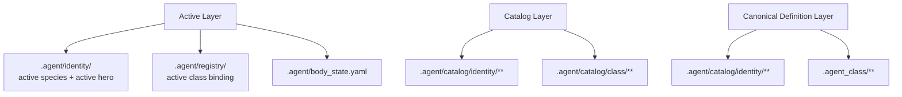

# 에이전트 본체 모델

## 목적

- `.agent` 를 한 명의 durable agent unit 을 이루는 private operating system 으로 정의한다.
- active layer, catalog layer, canonical definition layer 의 owner 경계를 body 기준으로 고정한다.

## 범위

- body 소유 메타, active identity, selection catalog, policy, runtime, continuity, private memory 를 다룬다.
- `.agent_class` canonical loadout asset 과 `_workspaces` mission 자료는 범위 밖이다.

## 3층 모델



- active layer 는 지금 선택되어 적용되는 state 다.
- catalog layer 는 UI 가 열람하고 선택할 후보 index 다.
- canonical definition layer 는 실제 정본 asset 본문이다.
- identity candidate 의 canonical source 는 `.agent/catalog/identity/**` 다.
- class asset 의 canonical source 는 `.agent_class/**` 다.
- `.agent/catalog/class/**` 는 canonical asset 의 복제본이 아니라 selection index 다.

## 핵심 역할 구분

| 개념 | owner | 의미 |
| --- | --- | --- |
| `species` | `.agent/identity/` + `.agent/catalog/identity/species/` | durable default |
| `hero` | `.agent/identity/hero_imprint.yaml` + `.agent/catalog/identity/heroes/` | species 위에 얹히는 optional identity overlay |
| `class` | `.agent_class/` | 설치 가능한 능력 패키지와 loadout template |
| `workflow` | `.agent_class/workflows/` | explicit `required` 조합식 |
| `profile` | `.agent_class/profiles/` | workflow 부재 시 기본 선호를 제공하는 `preferred` mode |

## 우선순위

1. 저장소 규칙과 policy floor
2. 현재 작업의 명시 지시
3. 선택된 workflow 의 `required`
4. active profile 의 `preferred`
5. active hero overlay 의 bias
6. species default

- workflow 는 required 다.
- profile 은 preferred 다.
- hero 는 bias 다.
- species 는 default 다.

## 현재 본체 영역

```text
.agent/
├── README.md
├── body.yaml
├── body_state.yaml
├── docs/
│   └── architecture/
│       ├── AGENT_BODY_MODEL.md
│       ├── BODY_METADATA_CONTRACT.md
│       ├── AGENT_CATALOG_LAYER_MODEL.md
│       ├── HERO_OVERLAY_MODEL.md
│       ├── RUNTIME_MODEL.md
│       ├── MEMORY_MODEL.md
│       ├── TEAM_EXPANSION_MODEL.md
│       └── COORDINATION_PROTOCOLS.md
├── identity/
│   ├── README.md
│   ├── species_profile.yaml
│   ├── hero_imprint.yaml
│   └── identity_manifest.yaml
├── catalog/
│   ├── README.md
│   ├── identity/
│   └── class/
├── registry/
│   ├── README.md
│   ├── active_class_binding.yaml
│   ├── workspace_binding.yaml
│   ├── capability_index.yaml
│   └── trait_bindings.yaml
├── policy/
├── communication/
├── protocols/
├── runtime/
├── memory/
├── sessions/
├── autonomic/
└── artifacts/
```

## 기관별 책임

| 기관 | 책임 | 대표 파일 |
| --- | --- | --- |
| `identity/` | active species 와 optional hero overlay | `species_profile.yaml`, `hero_imprint.yaml`, `identity_manifest.yaml` |
| `catalog/` | UI selection layer 와 canonical bridge | `catalog/identity/**`, `catalog/class/**` |
| `registry/` | active binding, index, reference | `active_class_binding.yaml`, `capability_index.yaml`, `trait_bindings.yaml` |
| `policy/` | species-free floor | `precedence.yaml`, `approval_matrix.yaml` |
| `communication/` | 외부 상호작용 규범 | `human_channel_profile.yaml`, `peer_channel_profile.yaml` |
| `protocols/` | request/handoff/decision/escalation contract | `request_contract.yaml`, `handoff_contract.yaml` |
| `runtime/` | 기관 조립과 실행 순서 | `context_assembly.yaml`, `tool_scope.yaml`, `execution_contract.yaml` |
| `memory/` | private 장기 기억 | `self/`, `project/`, `decisions/`, `handoffs/` |
| `sessions/` | continuity 저장소 | `checkpoint_template.yaml`, `active_session.example.yaml` |
| `autonomic/` | 저소음 품질 보정 루틴 | `checks/`, `reminders/`, `rules/` |
| `artifacts/` | body 소유 재사용 산출물 | `templates/`, `playbooks/`, `rubrics/`, `reports/` |

## 중요한 구분

- `.agent/catalog/**` 는 selection layer 다. canonical class asset 정본이 아니다.
- future generator 는 catalog population concern 이지 body core runtime concern 이 아니다.
- hero 는 profile 이 아니고 class 도 아니다.
- profile 은 hero 대체재가 아니고 installed asset 제한 장치도 아니다.
- hero 와 profile 은 installed asset 을 disable 하지 않는다.
- policy floor 는 species, hero, profile 위에 있다.

## 미래 확장 방향

- `_teams/` 가 생기면 shared catalog 나 shared memory 는 body 밖 루트 계층으로 확장한다.
- multi-class selection 이 들어와도 `.agent/catalog/class/**` 는 index 역할을 유지하고 canonical asset 은 `.agent_class/**` 에 남긴다.
