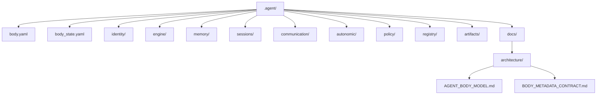

# 에이전트 본체 모델

## 목적

에이전트 본체는 Soulforge의 지속 계층이다.

클래스 변경, 프로젝트 변경, 워크플로우 교체 이후에도 유지되어야 하는 요소를 담기 위해 존재한다.
이 문서는 body 소유 정본 문서다.

## 구조 개요도



## 책임

- 본체 메타 정의와 상태 스냅샷
- 정체성
- 엔진 설정
- 메모리
- 세션 연속성
- 커뮤니케이션
- 자율 동작
- 정책
- 레지스트리
- 산출물
- 본체 관련 문서

## 현재 본체 영역

```text
.agent/
├── body.yaml
├── body_state.yaml
├── artifacts/
├── autonomic/
├── communication/
├── docs/
│   └── architecture/
│       ├── AGENT_BODY_MODEL.md
│       └── BODY_METADATA_CONTRACT.md
├── engine/
├── identity/
├── memory/
├── policy/
├── registry/
└── sessions/
```

## 메타 파일

- `body.yaml` 은 body 의 정적 정의를 둔다.
- `body_state.yaml` 은 현재 `.agent/` 구조와 동기화한 상태 스냅샷을 둔다.
- 세부 필드 정의는 `.agent/docs/architecture/BODY_METADATA_CONTRACT.md` 를 기준으로 관리한다.

## 중요한 구분

- `body.yaml` 은 본체 섹션의 기준 경로를 설명한다.
- `body_state.yaml` 은 현재 구조와 동기화한 파생 상태를 설명한다.
- 두 파일 모두 `.agent` 소유 메타지만, host-local 상태는 담지 않는다.

## 설계 규칙

본체 데이터는 지속성을 가진다.
설치된 지식, 스킬, 도구, 워크플로우는 본체 기본값이 아닌 한 여기에 속하지 않는다.
본체 상세 문서는 최종적으로 `.agent/docs/` 아래에 소유된다.
