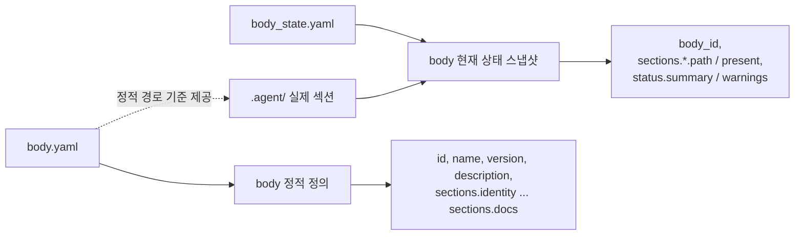

# body 메타 계약

## 목적

이 문서는 `.agent/body.yaml` 과 `.agent/body_state.yaml` 의 현재 기준 필드를 설명한다.

`body_state.yaml` 은 host-local 파일이 아니라, 구조와 메타에서 재생성 가능한 저장소 추적 상태 파일로 유지한다.

## 관계도

## 1. `body.yaml`

`body.yaml` 은 body 의 정적 정의를 둔다.
즉, 어떤 본체 섹션이 어떤 상대 경로를 기준으로 구성되는지 설명하는 기준 파일이다.

## 2. `body_state.yaml`

`body_state.yaml` 은 body 의 현재 상태 스냅샷이다.
같은 body 정의를 유지하더라도, 실제 `.agent/` 구조와 동기화한 결과는 이 파일에서 확인한다.

## 3. 현재 필드 표

### `body.yaml`

| 필드 | 의미 |
| --- | --- |
| `id` | body 식별자 |
| `name` | 사람이 읽는 body 이름 |
| `version` | body 메타 버전 |
| `description` | body 설명 |
| `sections.identity` | identity 섹션 경로 |
| `sections.engine` | engine 섹션 경로 |
| `sections.memory` | memory 섹션 경로 |
| `sections.sessions` | sessions 섹션 경로 |
| `sections.communication` | communication 섹션 경로 |
| `sections.autonomic` | autonomic 섹션 경로 |
| `sections.policy` | policy 섹션 경로 |
| `sections.registry` | registry 섹션 경로 |
| `sections.artifacts` | artifacts 섹션 경로 |
| `sections.export` | export 섹션 경로 |
| `sections.docs` | docs 섹션 경로 |

### `body_state.yaml`

| 필드 | 의미 |
| --- | --- |
| `body_id` | 연결된 body 식별자 |
| `sections.identity.path` | identity 실제 경로 |
| `sections.identity.present` | identity 존재 여부 |
| `sections.engine.path` | engine 실제 경로 |
| `sections.engine.present` | engine 존재 여부 |
| `sections.memory.path` | memory 실제 경로 |
| `sections.memory.present` | memory 존재 여부 |
| `sections.sessions.path` | sessions 실제 경로 |
| `sections.sessions.present` | sessions 존재 여부 |
| `sections.communication.path` | communication 실제 경로 |
| `sections.communication.present` | communication 존재 여부 |
| `sections.autonomic.path` | autonomic 실제 경로 |
| `sections.autonomic.present` | autonomic 존재 여부 |
| `sections.policy.path` | policy 실제 경로 |
| `sections.policy.present` | policy 존재 여부 |
| `sections.registry.path` | registry 실제 경로 |
| `sections.registry.present` | registry 존재 여부 |
| `sections.artifacts.path` | artifacts 실제 경로 |
| `sections.artifacts.present` | artifacts 존재 여부 |
| `sections.export.path` | export 실제 경로 |
| `sections.export.present` | export 존재 여부 |
| `sections.docs.path` | docs 실제 경로 |
| `sections.docs.present` | docs 존재 여부 |
| `status.summary` | 현재 스냅샷 요약 상태 |
| `status.warnings` | 구조 불일치 경고 목록 |

## 4. 차이

- `body.yaml` 은 body 의 정적 골격을 설명한다.
- `body_state.yaml` 은 그 골격 위에서 현재 구조가 어떻게 보이는지 설명한다.
- body 정의가 유지되어도 실제 구조 점검 결과는 `body_state.yaml` 에서 달라질 수 있다.

## 5. 확장 규칙

1. 새 필드를 추가할 때는 먼저 이 문서를 갱신한다.
2. 정적 정의 필드는 `body.yaml` 쪽에 둔다.
3. 상태 또는 파생 필드는 `body_state.yaml` 쪽에 둔다.

## 6. 설계 규칙

1. body 메타는 `.agent` 가 소유한다.
2. `body_state.yaml` 은 UI와 상태 파생에 사용할 수 있는 동기화 스냅샷이다.
3. host-local 상태와 실행 시점 임시 상태는 `body_state.yaml` 에 넣지 않는다.
