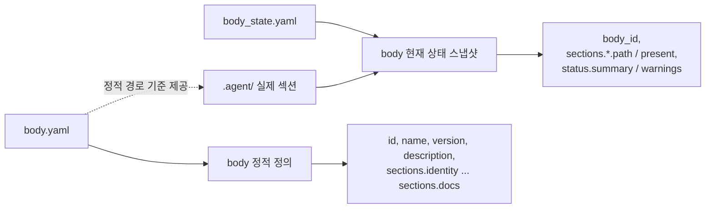

# body 메타 계약

## 목적

- 이 문서는 `.agent/body.yaml` 과 `.agent/body_state.yaml` 의 기준 필드와 의미를 설명한다.
- body 메타가 private operating system 의 어떤 기관을 추적하는지, 무엇을 추적하지 않는지 고정한다.

## 범위

- body 정적 정의와 body 현재 상태 스냅샷만 다룬다.
- loadout 상태, mission 자료, host-local 임시 상태, raw transcript 는 범위 밖이다.

## 포함 대상

- `body.yaml` 의 정적 기관 정의
- `body_state.yaml` 의 `path/present` 기반 동기화 스냅샷
- `engine` runtime 의미와 `protocols` 신규 섹션에 대한 계약

## 제외 대상

- `.agent_class` installed/loadout 메타
- `_workspaces` 현장 상태와 `.project_agent/`
- `_teams/shared` 협업 상태
- 독립 `export/` 기관 정의

## 관계도

## `body.yaml`

- `body.yaml` 은 body 의 정적 정의를 둔다.
- 어떤 본체 기관이 어떤 상대 경로를 기준으로 배치되는지 설명하는 기준 파일이다.

### `body.yaml` 필드

| 필드 | 의미 |
| --- | --- |
| `id` | body 식별자 |
| `name` | 사람이 읽는 body 이름 |
| `version` | body 메타 버전 |
| `description` | body 설명 |
| `sections.identity` | durable identity default 와 species baseline 경로 |
| `sections.engine` | 현재 경로명은 `engine` 이지만 의미는 runtime layer 경로 |
| `sections.memory` | long-term memory 경로 |
| `sections.sessions` | transcript 가 아닌 continuity 저장소 경로 |
| `sections.communication` | 외부 상호작용 규범 경로 |
| `sections.protocols` | body 공통 operating protocol 경로 |
| `sections.autonomic` | 저소음 품질 보정 루틴 경로 |
| `sections.policy` | species-free floor 경로 |
| `sections.registry` | body registry 경로 |
| `sections.artifacts` | body 소유 파생 산출물 경로 |
| `sections.docs` | body owner 문서 경로 |

## `body_state.yaml`

- `body_state.yaml` 은 body 의 현재 상태 스냅샷이다.
- 같은 body 정의를 유지하더라도 실제 `.agent/` 구조와 동기화한 결과는 이 파일에서 확인한다.

### `body_state.yaml` 필드

| 필드 | 의미 |
| --- | --- |
| `body_id` | 연결된 body 식별자 |
| `sections.identity.path` | identity 실제 경로 |
| `sections.identity.present` | identity 존재 여부 |
| `sections.engine.path` | runtime layer 의 현재 실제 경로 |
| `sections.engine.present` | engine 경로 존재 여부 |
| `sections.memory.path` | memory 실제 경로 |
| `sections.memory.present` | memory 존재 여부 |
| `sections.sessions.path` | continuity 저장소 실제 경로 |
| `sections.sessions.present` | sessions 존재 여부 |
| `sections.communication.path` | communication 실제 경로 |
| `sections.communication.present` | communication 존재 여부 |
| `sections.protocols.path` | protocols 실제 경로 |
| `sections.protocols.present` | protocols 존재 여부 |
| `sections.autonomic.path` | autonomic 실제 경로 |
| `sections.autonomic.present` | autonomic 존재 여부 |
| `sections.policy.path` | policy 실제 경로 |
| `sections.policy.present` | policy 존재 여부 |
| `sections.registry.path` | registry 실제 경로 |
| `sections.registry.present` | registry 존재 여부 |
| `sections.artifacts.path` | artifacts 실제 경로 |
| `sections.artifacts.present` | artifacts 존재 여부 |
| `sections.docs.path` | docs 실제 경로 |
| `sections.docs.present` | docs 존재 여부 |
| `status.summary` | 현재 스냅샷 요약 상태 |
| `status.warnings` | 구조 불일치 경고 목록 |

## 차이

- `body.yaml` 은 body 의 정적 골격을 설명한다.
- `body_state.yaml` 은 그 골격 위에서 현재 구조가 어떻게 보이는지 설명한다.
- body 정의가 유지되어도 실제 구조 점검 결과는 `body_state.yaml` 에서 달라질 수 있다.

## 설계 규칙

1. body 메타는 `.agent` 가 소유한다.
2. `body_state.yaml` 은 구조와 메타에서 재생성 가능한 저장소 추적 상태 파일이다.
3. host-local 상태와 실행 시점 임시 상태는 `body_state.yaml` 에 넣지 않는다.
4. `engine` 키는 현재 호환성 이름이며 의미는 runtime layer 로 읽는다.
5. collaboration shared state 는 body 메타가 아니라 루트 `_teams/shared/` 확장 경계에서 다룬다.

## 미래 확장 방향

- major 정리에서 `sections.engine` 을 `sections.runtime` 으로 바꿀지 여부를 별도 마이그레이션으로 다룬다.
- `protocols`, `sessions`, `autonomic` 세부 상태 필드가 필요하면 먼저 이 문서를 갱신한다.
- export 전달 포맷이 늘어나도 독립 `sections.export` 는 도입하지 않는다.
