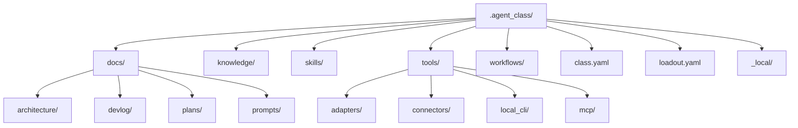
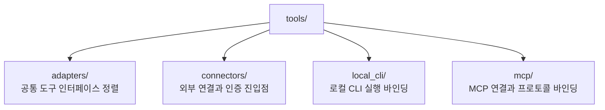

# 에이전트 클래스 모델

## 목적

클래스 계층은 Soulforge 본체를 위한 설치 가능하고 교체 가능한 직무 정의다.

본체 자체를 다시 정의하지 않으면서, 특정 환경에서 무엇을 수행하도록 장착되어 있는지를 설명한다.

## 구조 개요도



## 책임

- 클래스 정의
- 로드아웃 선택
- 설치된 스킬
- 장착된 도구
- 운영 워크플로우
- 지식 팩
- 클래스 문서

## 현재 클래스 영역

```text
.agent_class/
├── _local/
├── docs/
│   ├── architecture/
│   ├── devlog/
│   ├── plans/
│   └── prompts/
├── knowledge/
├── skills/
├── tools/
│   ├── adapters/
│   ├── connectors/
│   ├── local_cli/
│   └── mcp/
├── workflows/
├── class.yaml
└── loadout.yaml
```

## 중요한 구분

- `skills/` 는 설치된 행동 패턴을 둔다
- `tools/` 는 외부 장비와 연결 계층을 둔다
- `workflows/` 는 운용 절차를 둔다
- `knowledge/` 는 설치형 지식 팩을 둔다
- `_local/` 은 기본적으로 비추적 로컬 전용 상태를 둔다

## tools/ 하위 역할



- `adapters/` 는 도구별 입출력과 호출 차이를 공통 도구 인터페이스로 정렬한다
- `connectors/` 는 외부 서비스 접속 정보와 인증 진입점을 둔다
- `local_cli/` 는 호스트 로컬 CLI 자체를 실행하는 래퍼를 둔다
- `mcp/` 는 MCP 서버를 도구 계층에 연결하는 프로토콜 바인딩을 둔다

## 메타 파일

- `class.yaml` 은 설치된 class 의 정적 정의를 둔다
- `loadout.yaml` 은 현재 활성 장착 상태를 둔다
- 세부 필드 정의는 `.agent_class/docs/architecture/CLASS_METADATA_CONTRACT.md` 를 기준으로 관리한다

## class 문서 소유

- class 구조 설명, 메타 규약, 운영 계획, 작업 로그, 재사용 프롬프트는 `.agent_class/docs/` 아래에 둔다
- 이 문서는 `.agent_class/docs/architecture/` 아래에서 유지되는 class 소유 정본 문서다
- 루트 문서에서는 owner 위치에 대한 링크와 색인만 유지한다

## 설계 규칙

클래스는 설치 가능하며 교체 가능하다.
클래스가 바뀌어도 메모리는 본체에 남는다.
`.agent_class/_local/` 의 실제 로컬 상태는 기본적으로 Git 추적 대상이 아니다.
구조 설명과 ignore 정책 고정을 위해 `README.md` 와 `.gitignore` 만 예외적으로 추적한다.
