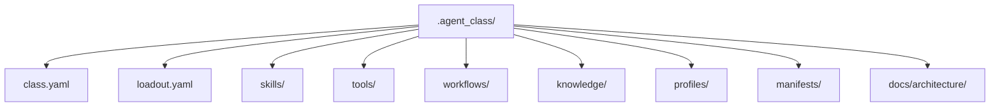

# 에이전트 클래스 모델

## 목적

- `.agent_class` 를 reusable loadout template 의 canonical owner 로 정의한다.
- body owner 인 `.agent` 와 class owner 인 `.agent_class` 의 경계를 고정한다.

## 구조 개요도

## owner 경계

- `.agent_class/**` 는 canonical class/loadout asset 정본이다.
- `.agent/catalog/class/**` 는 `.agent_class/**` 를 가리키는 selection index 다.
- `.agent_class` 는 identity, memory, sessions, autonomic, body policy 를 소유하지 않는다.

## 핵심 역할

| 영역 | 의미 |
| --- | --- |
| `skills/` | 익힌 행동 패턴 |
| `tools/` | 외부 장비와 실행 접점 |
| `workflows/` | explicit `required` 조합식 |
| `knowledge/` | 설치형 지식 팩 |
| `profiles/` | default preference mode |
| `manifests/` | canonical asset index, equip rule, dependency graph |

## 핵심 규칙

- profiles 는 hero 대체재가 아니다.
- profiles 는 installed asset 을 제한하지 않는다.
- workflows 는 required 조합식을 정의한다.
- manifests 는 canonical asset index 와 dependency graph 를 담당한다.
- loadout 는 active profile 과 equipped module id 를 담지만 canonical asset 본문을 복제하지 않는다.
