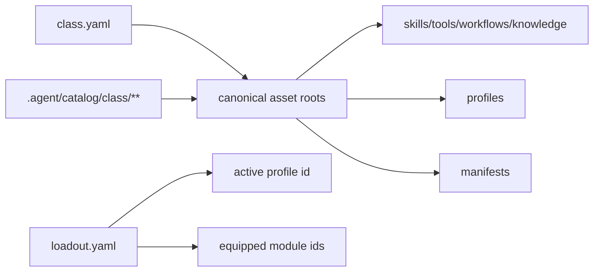

# class loadout 모델

## 목적

- `.agent_class` 를 reusable loadout template 로 설명한다.
- canonical asset, active loadout, selection index 의 관계를 고정한다.

## 관계

## 규칙

- canonical source 는 `.agent_class/**` 다.
- `.agent/catalog/class/**` 는 source_ref 기반 selection index 다.
- loadout 는 active profile 과 equipped module ids 만 고정한다.
- profile 은 preferred mode, workflow 는 required rule 이다.
