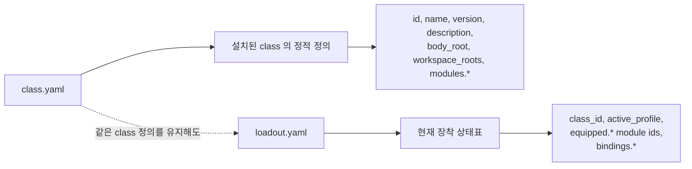

# class 메타 계약

## 목적

이 문서는 `.agent_class/class.yaml` 과 `.agent_class/loadout.yaml` 의 현재 기준 필드를 설명한다.

`soulforge.base` 는 최종 직업이 아니라 bootstrap scaffold 로 유지한다.

## 관계도

## 1. `class.yaml`

`class.yaml` 은 설치된 class 의 정적 정의를 둔다.
즉, 어떤 body 와 workspace 를 대상으로 어떤 모듈 경로를 사용하는지 설명하는 기준 파일이다.

### 현재 필드

| 필드 | 의미 |
| --- | --- |
| `id` | class 식별자 |
| `name` | 사람이 읽는 class 이름 |
| `version` | class 메타 버전 |
| `description` | class 설명 |
| `body_root` | 연결할 body 루트 경로 |
| `workspace_roots` | 연결할 workspace 루트 목록 |
| `modules.skills` | skills 디렉터리 경로 |
| `modules.tools` | tools 디렉터리 경로 |
| `modules.workflows` | workflows 디렉터리 경로 |
| `modules.knowledge` | knowledge 디렉터리 경로 |
| `modules.docs` | class 문서 디렉터리 경로 |

## 2. `loadout.yaml`

`loadout.yaml` 은 현재 장착 상태표다.
같은 class 정의를 유지하더라도, 어떤 프로필과 어떤 module id 를 활성화했는지는 loadout 에서 달라질 수 있다.

### 현재 필드

| 필드 | 의미 |
| --- | --- |
| `class_id` | 장착 중인 class 식별자 |
| `active_profile` | 현재 활성 프로필 이름 |
| `equipped.skills` | 현재 활성 skill module id 목록 |
| `equipped.tools` | 현재 활성 tool module id 목록 |
| `equipped.workflows` | 현재 활성 workflow module id 목록 |
| `equipped.knowledge` | 현재 활성 knowledge module id 목록 |
| `bindings.body` | 연결된 body 경로 |
| `bindings.company_workspace` | 회사 workspace 경로 |
| `bindings.personal_workspace` | 개인 workspace 경로 |

`equipped.*` 는 path 문자열이 아니라 installed library 안의 module id 를 참조한다.
세부 resolve 규칙은 `.agent_class/docs/architecture/MODULE_REFERENCE_CONTRACT.md` 를 따른다.

## 3. 차이

- `class.yaml` 은 설치 가능한 class 의 정적 골격을 설명한다.
- `loadout.yaml` 은 그 골격 위에서 지금 어떤 module id 가 장착되었는지를 설명한다.
- class 는 바뀌지 않아도 loadout 은 작업 환경마다 달라질 수 있다.

## 4. 확장 규칙

1. 새 필드를 추가할 때는 먼저 이 문서를 갱신한다.
2. 정적 정의 필드는 `class.yaml` 쪽에 둔다.
3. 현재 활성 상태 필드는 `loadout.yaml` 쪽에 둔다.
4. host-local 상태는 `_local/` 또는 project 쪽 계약으로 분리한다.
