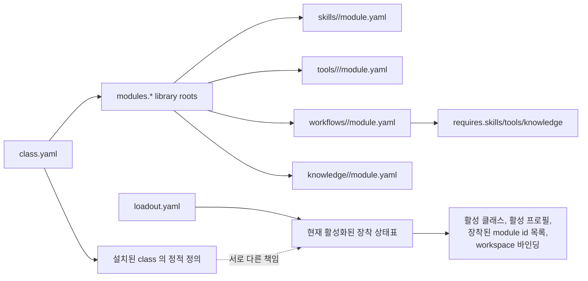

# 설치와 로드아웃 개념

## 설치

Soulforge는 클래스 콘텐츠를 설치 가능한 모듈로 다룬다.
이 문서는 class 소유 메타 규약 문서다.

Installed Library 는 installed module manifest 집합이다.
즉, `module.yaml` 이 없는 엔트리는 설치 모듈로 취급하지 않는다.

## 관계도

설치 가능한 library 는 다음 installed module manifest 집합으로 나뉜다.

- skill library
- tool library
- workflow library
- knowledge library

## 로드아웃

`class.yaml` 과 `loadout.yaml` 은 서로 다른 책임을 가진다.

- `class.yaml` = 설치된 class 의 정적 정의
- `loadout.yaml` = 현재 활성화된 장착 상태표

`class.yaml` 은 library root 를 정의한다.
`loadout.yaml` 은 그 installed library 안에서 현재 장착된 module id 목록을 정의한다.

최소한 로드아웃은 다음을 식별해야 한다.

- 활성 클래스
- 활성 프로필
- 장착된 skill module id 목록
- 장착된 tool module id 목록
- 장착된 workflow module id 목록
- 장착된 knowledge module id 목록
- 워크스페이스 바인딩

## 현재 메타 필드 기준

현재 Soulforge bootstrap class 에서는 아래 필드를 사용한다.

### `class.yaml`

- `id` = class 식별자
- `name` = 사람이 읽는 class 이름
- `version` = class 메타 버전
- `description` = class 설명
- `body_root` = 연결할 본체 루트
- `workspace_roots` = 연결할 워크스페이스 루트 목록
- `modules` = skills, tools, workflows, knowledge, docs 의 기본 경로 매핑
- `modules.skills/tools/workflows/knowledge` = installed library root 경로

### `loadout.yaml`

- `class_id` = 장착 중인 class 식별자
- `active_profile` = 현재 활성 프로필
- `equipped.skills` = 활성 skill module id 목록
- `equipped.tools` = 활성 tool module id 목록
- `equipped.workflows` = 활성 workflow module id 목록
- `equipped.knowledge` = 활성 knowledge module id 목록
- `bindings` = body 와 workspace 바인딩

### installed module manifest

- `module.yaml` 이 있는 엔트리만 installed module 이다.
- skill/workflow/knowledge 는 각 root 바로 아래 `<module_dir>/module.yaml` 을 쓴다.
- tool 은 `.agent_class/tools/<family>/<module_dir>/module.yaml` 을 쓴다.
- workflow 는 `requires.skills/tools/knowledge` 로 다른 module id 를 참조한다.

세부 계약은 `.agent_class/docs/architecture/CLASS_METADATA_CONTRACT.md` 와 `.agent_class/docs/architecture/MODULE_REFERENCE_CONTRACT.md` 를 기준으로 확장한다.

## 설계 규칙

설치는 어떤 installed module manifest 가 class 아래에 존재하는지를 설명한다.
로드아웃은 그중 무엇이 현재 장착되어 있는지를 module id 기준으로 설명한다.
bootstrap class `soulforge.base` 는 최종 직업이 아니라 초기 scaffold 로 유지한다.
