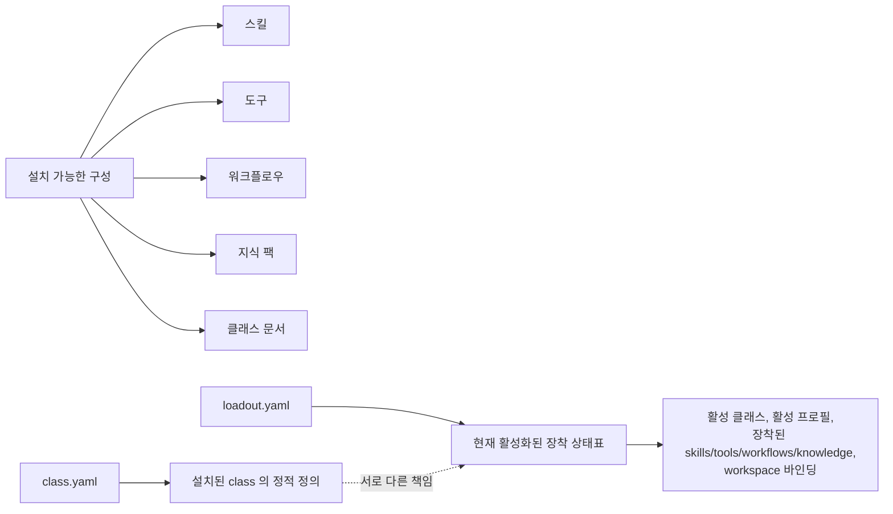

# 설치와 로드아웃 개념

## 설치

Soulforge는 클래스 콘텐츠를 설치 가능한 모듈로 다룬다.
이 문서는 class 소유 메타 규약 문서다.

## 관계도

설치 가능한 구성은 다음을 포함한다.

- 스킬
- 도구
- 워크플로우
- 지식 팩
- 클래스 문서

## 로드아웃

`class.yaml` 과 `loadout.yaml` 은 서로 다른 책임을 가진다.

- `class.yaml` = 설치된 class 의 정적 정의
- `loadout.yaml` = 현재 활성화된 장착 상태표

`loadout.yaml` 은 설치된 클래스에서 현재 활성화된 장비 구성을 정의한다.

최소한 로드아웃은 다음을 식별해야 한다.

- 활성 클래스
- 활성 프로필
- 장착된 스킬
- 장착된 도구
- 장착된 워크플로우
- 장착된 지식 팩
- 워크스페이스 바인딩

## 현재 메타 필드 기준

현재 Soulforge bootstrap class 에서는 아래 필드를 사용한다.

### `class.yaml`

- `id` = class 식별자
- `name` = 사람이 읽는 class 이름
- `version` = class 메타 버전
- `description` = class 설명
- `body_root` = 연결할 본체 루트
- `workspace_roots` = 연결할 워크스페이스 루트 목록
- `modules` = skills, tools, workflows, knowledge, docs 의 기본 경로 매핑

### `loadout.yaml`

- `class_id` = 장착 중인 class 식별자
- `active_profile` = 현재 활성 프로필
- `equipped.skills` = 활성 skill 목록
- `equipped.tools` = 활성 tool 목록
- `equipped.workflows` = 활성 workflow 목록
- `equipped.knowledge` = 활성 knowledge 목록
- `bindings` = body 와 workspace 바인딩

세부 계약은 `.agent_class/docs/architecture/CLASS_METADATA_CONTRACT.md` 를 기준으로 확장한다.

## 설계 규칙

설치는 무엇을 사용할 수 있는지를 설명한다.
로드아웃은 무엇이 현재 장착되어 있는지를 설명한다.
bootstrap class `soulforge.base` 는 최종 직업이 아니라 초기 scaffold 로 유지한다.
