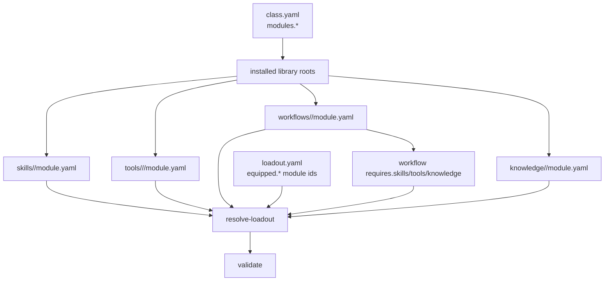

# 모듈 참조 계약

## 목적

이 문서는 `.agent_class` 계층에서 installed module manifest 규약과 loadout resolve 규칙을 고정한다.

이번 계약은 `loadout.yaml` 이 installed library 를 어떤 기준으로 참조하는지, 그리고 local CLI 가 그 참조를 어떻게 resolve/validate 해야 하는지를 class owner 기준으로 닫는다.

## 관계도

## 1. 공통 원칙

- installed module 로 인정하는 기준은 `module.yaml` 존재 여부다.
- `README.md`, 임시 파일, 예시 텍스트는 installed module 로 취급하지 않는다.
- `loadout.equipped.*` 는 경로가 아니라 module id 문자열 목록이다.
- resolve 대상 kind 는 `skill`, `tool`, `workflow`, `knowledge` 네 종류다.
- `class.yaml.modules.*` 는 각 installed library root 를 가리키는 class 기준 경로다.
- module id 는 사람이 읽기 쉬운 이름이 아니라 계약용 식별자다.
- runtime 상태, host-local 상태, UI 전용 장식 값은 manifest 에 넣지 않는다.

## 2. 경로 규약

| kind | 정식 installed module 경로 |
| --- | --- |
| `skill` | `.agent_class/skills/<module_dir>/module.yaml` |
| `workflow` | `.agent_class/workflows/<module_dir>/module.yaml` |
| `knowledge` | `.agent_class/knowledge/<module_dir>/module.yaml` |
| `tool` | `.agent_class/tools/<family>/<module_dir>/module.yaml` |

tool family 는 아래 네 값만 허용한다.

- `adapters`
- `connectors`
- `local_cli`
- `mcp`

경로 규약을 벗어난 `module.yaml` 은 installed module 로 인정하지 않으며 contract 위반으로 본다.

## 3. manifest 공통 필드

모든 `module.yaml` 은 최소한 아래 필드를 가져야 한다.

| 필드 | 타입 | 의미 |
| --- | --- | --- |
| `id` | string | 같은 kind 안에서 유일한 module 식별자 |
| `kind` | string | `skill`, `tool`, `workflow`, `knowledge` 중 하나 |
| `name` | string | 사람이 읽는 모듈 이름 |
| `version` | string | manifest 버전 |
| `description` | string | 모듈 설명 |

## 4. kind 별 최소 추가 필드

| kind | 필드 | 타입 | 의미 |
| --- | --- | --- | --- |
| `skill` | `entrypoint` | string | skill 진입점 |
| `tool` | `family` | string | `adapters`, `connectors`, `local_cli`, `mcp` 중 하나 |
| `tool` | `entrypoint` | string | tool 실행 진입점 |
| `workflow` | `entrypoint` | string | workflow 진입점 |
| `workflow` | `requires.skills` | list[string] | workflow 가 요구하는 skill module id 목록 |
| `workflow` | `requires.tools` | list[string] | workflow 가 요구하는 tool module id 목록 |
| `workflow` | `requires.knowledge` | list[string] | workflow 가 요구하는 knowledge module id 목록 |
| `knowledge` | `content_path` | string | knowledge 내용 위치 |

## 5. loadout 참조 규칙

- `equipped.skills` 는 skill module `id` 목록이다.
- `equipped.tools` 는 tool module `id` 목록이다.
- `equipped.workflows` 는 workflow module `id` 목록이다.
- `equipped.knowledge` 는 knowledge module `id` 목록이다.
- 경로 문자열, 파일명, 확장자 기반 참조는 허용하지 않는다.
- `/`, `.yaml`, `.py` 같은 path-like reference 는 contract 위반이다.
- `id` 는 같은 kind 안에서 유일해야 한다.
- tool 은 family 와 무관하게 `tools` 전체에서 `id` 충돌이 없어야 한다.

## 6. workflow 의존 규칙

- workflow manifest 의 `requires.skills/tools/knowledge` 역시 모두 module id 기반이다.
- workflow 가 요구하는 id 는 각각의 installed library 에 실제 resolve 되어야 한다.
- workflow 는 다른 workflow 를 `requires.*` 로 참조하지 않는다.
- workflow 는 연계기 카드 개념을 유지하지만, 참조 계약은 manifest 의 `requires.*` 로 고정한다.

## 7. resolve 규칙

- resolver 는 `class.yaml.modules.skills/tools/workflows/knowledge` 경로를 기준으로 installed library roots 를 찾는다.
- 각 root 아래에서 정식 경로 규약에 맞는 `module.yaml` 을 스캔해 catalog 를 만든다.
- catalog 는 kind 별 id 맵으로 구성한다.
- 같은 kind 내 duplicate id 는 FAIL 이다.
- tool 은 family mismatch 또는 path-family mismatch 가 있으면 FAIL 이다.
- manifest `kind` 와 실제 루트 종류가 다르면 FAIL 이다.
- equipped id 가 다른 kind 에만 있으면 kind mismatch FAIL 이다.
- equipped id 가 catalog 에 없으면 unknown id FAIL 이다.
- equipped workflow 의 `requires.*` 참조가 installed catalog 에 없으면 FAIL 이다.
- 실제 설치 모듈이 없으면 빈 catalog 로 통과한다.

## 8. validate 규칙

- validate 는 먼저 Scan 을 수행하고, 그 다음 module reference resolve 결과를 기준으로 PASS/FAIL 을 낸다.
- `loadout.equipped.*` 가 비어 있지 않다고 해서 blanket WARN 으로 넘기지 않는다.
- FAIL 기준은 최소한 아래를 포함한다.
  - contract 경로 위반 manifest
  - duplicate module id
  - manifest kind mismatch
  - tool family mismatch 또는 path-family mismatch
  - path-like equipped reference
  - equipped id kind mismatch
  - unknown equipped id
  - equipped workflow dependency unresolved
- workspace `.project_agent` resolve 는 이번 차수의 validate 대상이 아니다.

## 9. 확장 규칙

- 새 필드는 먼저 이 문서를 갱신한 뒤 추가한다.
- UI 전용 장식 필드는 아직 추가하지 않는다.
- runtime/host-local 상태는 module manifest 에 넣지 않는다.
- 새로운 module kind 를 추가할 때는 경로 규약, 필수 필드, resolve 규칙, validate 규칙을 함께 갱신한다.
