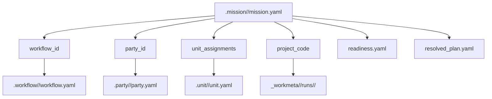

# .mission

## 정본 의미

- `.mission/` 은 현재 보유 중인 mission plan, readiness 상태, mission-scoped notify toggle 을 소유하는 canonical root 다.
- mission 은 어떤 workflow 를 어떤 party 와 unit assignment 로 실제 수행할지 정한 실행 계획이다.
- `.mission/` 은 raw run dump 나 project-local worksite truth owner 가 아니다.

## 관계도

## 무엇을 둔다

- `index.yaml`
- `DECISION_LOG.md`
- `OPS_NOTES.md`
- `GOVERNANCE_PACKET_MISSION_PROMOTION_RULES.md`
- `FUTURE_AGGREGATION_PLAN.md`
- `NIGHTLY_SWEEP_PLAN.md`
- `MORNING_PROJECT_REPORT_CONTRACT.md`
- `PLAY_LOOP_V0.md`
- `<mission_id>/mission.yaml`
- `<mission_id>/readiness.yaml`
- `<mission_id>/dispatch_request.yaml`
- `<mission_id>/resolved_plan.yaml`
- `<mission_id>/reports/`
- `<mission_id>/artifacts/`

## 무엇을 두지 않는다

- `_workmeta/<project_code>/runs/<run_id>/` raw execution truth
- project-local transcripts, logs, private input dump
- workflow, party, unit canon 원본 파일

## 왜 이렇게 둔다

- workflow 는 reusable 절차 canon 이고, mission 은 이번 실행을 위해 workflow/party/unit/binding 을 실제로 묶은 owner surface 다.
- mission 의 readiness 와 배정 상태는 루트에서 한눈에 보여야 하지만, raw run truth 는 여전히 project-local worksite 에 남아야 한다.
- 그래서 `.mission/` 은 held mission metadata 를 소유하고 `_workspaces/` 는 실제 현장 실행 기록을 소유한다.

## 현재 상태

- `.mission/` 은 새 owner root 로 도입된 baseline 이다.
- 현재는 public-safe sample mission 4건과 owner-local 운영 초안 문서군을 포함한다.
- `DECISION_LOG.md`, `OPS_NOTES.md` 는 러프해도 계속 누적하는 owner-local operating draft 다.
- `GOVERNANCE_PACKET_MISSION_PROMOTION_RULES.md` 는 현재 phase 의 승격 규칙 잠금 작업 패킷이다.
- `FUTURE_AGGREGATION_PLAN.md` 는 나중에 만들 종합 기능을 위한 owner-local planning note 다.
- `NIGHTLY_SWEEP_PLAN.md` 는 nightly sweep 의 역할과 보고 항목을 정리하는 owner-local planning note 다.
- `MORNING_PROJECT_REPORT_CONTRACT.md` 는 아침에 볼 project report 의 local-only contract 초안이다.
- `PLAY_LOOP_V0.md` 는 current-default dogfood loop 를 잠그는 owner-local planning note 다.
- `meeting_followup_packet_001` 은 잠근 회의 결과를 bounded follow-up packet 으로 정리하는 public-safe sample 이며, 실제 전달/발송/일정반영/PDR 반영은 범위에서 제외한다.
- mission-scoped Telegram notify toggle 은 각 `<mission_id>/mission.yaml` 의 `notifications:` 블록에 둔다.
- `BATTLE_LOG_STORAGE_PLAN.md`, `MISSION_CLOSE_PROVENANCE_V0.md`, `MAILBOX_CONCRETE_CONTRACT_V0.md` 는 mission owner-local note 가 아니라 workspace contract draft 로 보고 [`docs/architecture/workspace/`](../docs/architecture/workspace/README.md) 아래로 이동했다.
- mission 절차형 매뉴얼 초안은 [`docs/architecture/workspace/MISSION_MANUAL_DRAFT.md`](../docs/architecture/workspace/MISSION_MANUAL_DRAFT.md) 에 둔다.
- 실제 local/private run truth 는 계속 `_workmeta/<project_code>/runs/<run_id>/` 아래에 남긴다.

