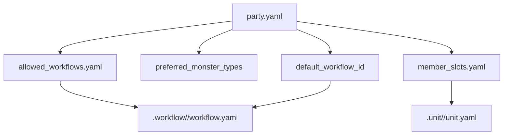
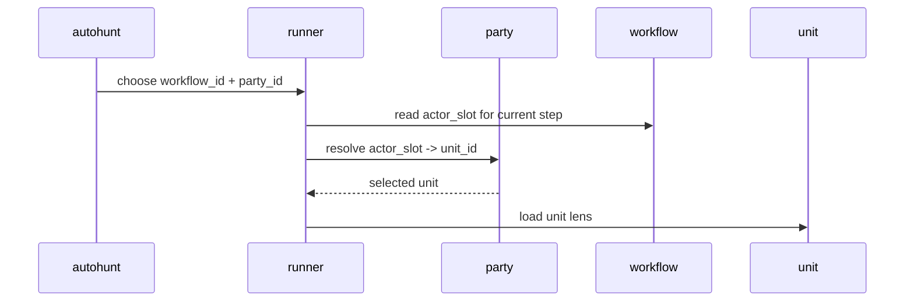

# .party

## 정본 의미

- `.party/` 는 reusable party template 와 template-level stats 의 정본 루트다.
- party 는 member slot, allowed species/class/workflow, default workflow, preferred monster type 같은 reusable team composition 정보를 소유한다.
- `.party/` 는 `.registry` 아래로 들어가지 않는 독립 orchestration root 다.
- `.party/` 는 raw battle log, project-specific operational metrics owner 가 아니다.

## 관계도

## 실행 시퀀스

## 무엇을 둔다

- `index.yaml`
- `<party_id>/party.yaml`
- `<party_id>/member_slots.yaml`
- `<party_id>/allowed_species.yaml`
- `<party_id>/allowed_classes.yaml`
- `<party_id>/allowed_workflows.yaml`
- `<party_id>/appserver_profile.yaml`
- `<party_id>/stats/`

## 무엇을 두지 않는다

- raw battle log, run id, feedback dump, project-local operational metrics
- `_workspaces/<project_code>/` run artifact 와 analytics truth
- active unit session transcript

## 왜 이렇게 둔다

- party 는 조합 템플릿이므로 reusable fit 정보만 공개 정본에 남기고 실제 전투 기록은 mission site 에 남겨야 한다.
- template-level stats 만 유지해야 party canon 과 project performance data 의 owner 경계가 분리된다.
- workflow 는 밖에 있는 절차 canon 이고, party 는 그 workflow 를 수행할 출전 조합이다.
- 그래서 `party.yaml` 은 `default_workflow_id`, `allowed_workflows.yaml`, `preferred_monster_types` 같은 운영 힌트만 소유하고 step 순서 자체는 소유하지 않는다.
- `guild_master_cell` 은 현재 skill authoring lane 의 canonical sample 이자 current default party composition 이지만, 모든 future authoring path 의 universal party standard 는 아니다.

## 샘플 구성

- [`vanguard_strike/party.yaml`](vanguard_strike/party.yaml): Vanguard Strike party template for reusable member combinations.
- [`lineage_strike/party.yaml`](lineage_strike/party.yaml): lineage-map production party template that binds workflow-facing slots to canonical units.
- [`guild_master_cell/party.yaml`](guild_master_cell/party.yaml): guild-master authoring party template for skill package review, drafting, and promotion handoff.
- [`vanguard_strike/stats/README.md`](vanguard_strike/stats/README.md): canonical stats guidance that keeps observational notes outside project runtime truth.
