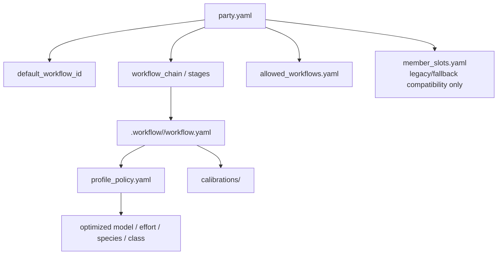
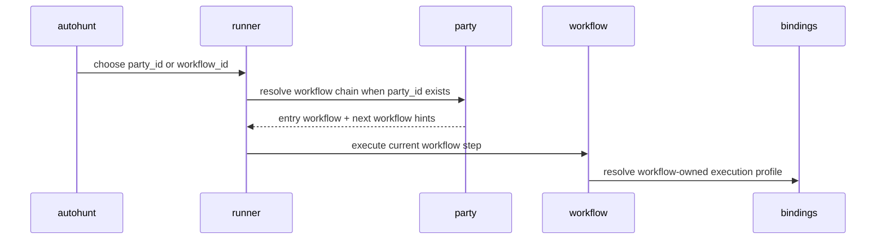

# .party

## 정본 의미

- `.party/` 는 reusable workflow party template 의 정본 루트다.
- party 는 여러 workflow 를 사용자가 한 번에 이해하고 실행할 수 있도록 묶는 상위 orchestration model 이다.
- party 는 `1 -> 2 -> 3 -> 4` 처럼 workflow chain, default entry workflow, allowed workflow set, handoff/routing hint 를 소유한다.
- party 는 각 workflow 의 내부 step 순서, 모델, reasoning 강도, species, class, unit 최적값을 소유하지 않는다.
- workflow 별 최적 실행 조합은 `.workflow/<workflow_id>/profile_policy.yaml` 과 `.workflow/<workflow_id>/calibrations/` 가 소유한다.
- `.party/` 는 `.registry` 아래로 들어가지 않는 독립 orchestration root 다.
- `.party/` 는 raw battle log, project-specific operational metrics owner 가 아니다.
- party 이름을 새로 정하거나 표시 이름을 붙일 때는 draft 규격인 [`docs/PARTY_NAMING_CONTRACT_V0.md`](docs/PARTY_NAMING_CONTRACT_V0.md) 를 먼저 참고한다.
- 2026-05-18 기준 전체 party alias 후보 목록은 draft 매핑표인 [`docs/PARTY_NAME_MAPPING_TABLE_V0.md`](docs/PARTY_NAME_MAPPING_TABLE_V0.md) 에 둔다. 이 표는 rename 이나 validator enforcement 가 아니다.
- 사람이 보기 쉬운 파생 정적 검토 뷰는 [`docs/PARTY_NAMING_DRAFT_V0.html`](docs/PARTY_NAMING_DRAFT_V0.html) 에 둔다. 정본은 Markdown/YAML/JSON 이며 HTML 은 rename, alias catalog, validator enforcement 를 만들지 않는다.

## 관계도

## 실행 시퀀스

## 무엇을 둔다

- `index.yaml`
- `docs/PARTY_NAMING_CONTRACT_V0.md`
- `docs/PARTY_NAME_MAPPING_TABLE_V0.md`
- `docs/PARTY_NAMING_DRAFT_V0.html`
- `<party_id>/party.yaml`
- `<party_id>/allowed_workflows.yaml`
- `<party_id>/member_slots.yaml`
- `<party_id>/allowed_species.yaml`
- `<party_id>/allowed_classes.yaml`
- `<party_id>/appserver_profile.yaml`
- `<party_id>/stats/`

`member_slots.yaml`, `allowed_species.yaml`, `allowed_classes.yaml` 는 current validator compatibility 와 legacy/fallback display 를 위해 유지한다. 이 파일들은 최적 unit 조합의 권위가 아니며, workflow optimizer 결과를 대체하지 않는다.

## 무엇을 두지 않는다

- workflow 내부 step graph
- workflow 별 최적 model / reasoning effort / species / class / unit profile
- raw battle log, run id, feedback dump, project-local operational metrics
- `_workspaces/<project_code>/` run artifact 와 analytics truth
- active unit session transcript

## 왜 이렇게 둔다

- 사용자는 낮은 단계 workflow 를 매번 모두 기억하지 않고, party 라는 상위 모델로 반복 실행 묶음을 부를 수 있어야 한다.
- workflow 는 절차와 최적 실행 profile 을 소유한다.
- party 는 여러 workflow 를 연결하는 loadout / playbook 이며, 내부 workflow 세부 구현을 복제하지 않는다.
- workflow optimizer 가 찾은 모델, reasoning 강도, 직업, 종족, unit 조합은 각 workflow 의 profile/calibration surface 에 저장한다.
- party 는 chain-level routing 과 handoff 를 제공하고, 실제 실행 결과와 raw 성능 truth 는 `_workmeta/<project_code>/runs/<run_id>/` 에 남긴다.
- 기존 `member_slots` 기반 party 파일은 backward-compatible fallback 으로 남기되, 새로운 정본 해석에서는 workflow chain 이 우선이다.

## 샘플 구성

- [`vanguard_strike/party.yaml`](vanguard_strike/party.yaml): Vanguard Strike party template for a frontline workflow loadout.
- [`lineage_strike/party.yaml`](lineage_strike/party.yaml): lineage-map workflow loadout.
- [`guild_master_cell/party.yaml`](guild_master_cell/party.yaml): guild-master authoring/review workflow chain.
- [`knowledge_wiki_cell/party.yaml`](knowledge_wiki_cell/party.yaml): Karpathy-style sourcebound wikiization workflow chain.
- [`knowledge_investigation_cell/party.yaml`](knowledge_investigation_cell/party.yaml): query-first knowledge investigation and curation workflow wrapper.
- [`vanguard_strike/stats/README.md`](vanguard_strike/stats/README.md): canonical stats guidance that keeps observational notes outside project runtime truth.
