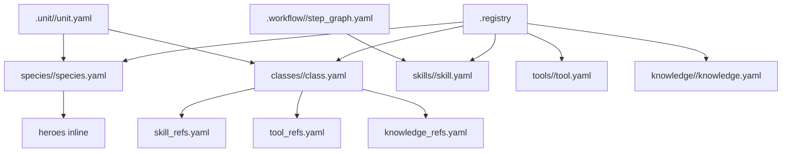

# .registry

## 정본 의미

- `.registry/` 는 Soulforge의 outer canon/store 정본 루트다.
- species, classes, skills, tools, knowledge 는 이 경로 아래에서만 canonical 의미를 가진다.
- `.unit/`, `.workflow/`, `.party/`, `.mission/`, `_workspaces/` 는 `.registry/` 를 참조할 수 있지만 그 내용을 소유하지 않는다.

## 관계도

## 무엇을 둔다

- `index.yaml`
- `species/`
- `classes/`
- `skills/`
- `tools/`
- `knowledge/`
- `docs/architecture/`

## 현재 phase에서 고정한 것

- species canon 은 `species/<species_id>/species.yaml` 단일 파일 모델을 사용한다.
- hero 는 species 내부의 `heroes:` inline entry 로만 표현한다.
- canonical id(`species_id`, `class_id`, skill/tool/knowledge id)는 stable ASCII 식별자를 유지한다.
- human-facing `title`, `display_name`, `label` 은 한국어를 current-default 로 둘 수 있다.
- class canon entry 와 assign/ref 입구는 `classes/<class_id>/class.yaml` 이다.
- species 와 class 는 서로를 소유하거나 제한하지 않는 독립 catalog 축이다.
- 실제 조합은 `.unit/<unit_id>/unit.yaml` 의 `identity.species_id + class_ids` 가 결정한다.
- 따라서 `orc + knight`, `human + archivist`, `dwarf + administrator` 같은 조합은 canon 상 허용되며, 제한이 필요하면 unit/party/workflow/mission 쪽에서 표현한다.
- current starter species set 은 `human`, `orc`, `elf`, `dwarf`, `darkelf` 다.
- `skills/`, `tools/`, `knowledge/` 는 reusable canon surface 이며, class-local refs 가 가리키는 entry 를 둘 수 있다.
- `skills/shield_wall`, `skills/charge_breaker`, `tools/kite_shield`, `tools/field_lance`, `knowledge/frontline_doctrine`, `knowledge/escort_etiquette` 는 `knight` sample 을 해석하기 위한 minimal canon entry 다.
- skill canon 은 behavior 와 execution requirement 를 기록할 수 있지만, 실제 모델/MCP/tool 장착은 runtime binding 에서 최종 resolve 한다.

## 무엇을 두지 않는다

- active unit state
- workflow orchestration canon
- party template canon
- project-local runtime truth

## owner 문서 메모

- owner-local 설명 문서는 `.registry/docs/architecture/` 를 기준으로 맞춘다.
