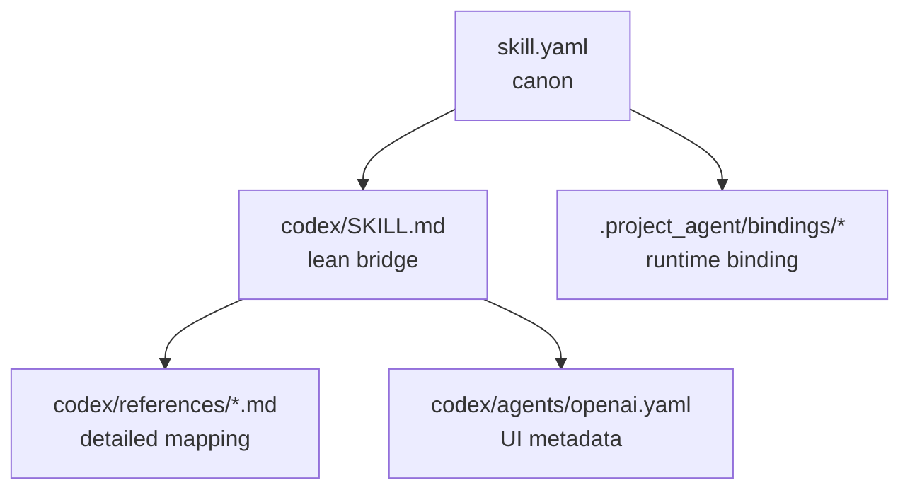

# Skill Canon Boundary

## 목적

- 이 문서는 Soulforge skill canon, executor-specific bridge, runtime execution binding 의 경계를 고정한다.
- `.registry/skills/<skill_id>/` 아래에 canon 과 adapter 를 함께 둘 수는 있지만, owner 책임은 섞지 않는다.

## 한 줄 원칙

- `skill.yaml` 은 executor-neutral canon 이고, `codex/` 는 optional executor bridge 이며, 실제 model/MCP/tool/installed skill 선택은 runtime binding owner 다.

## 관계도

## 파일별 책임

### `skill.yaml`

- 소유:
  - `skill_id`, `status`, `summary`
  - behavior
  - executor-neutral `execution_requirements`
  - canon note 와 class binding note
- 금지:
  - installed Codex skill name
  - actual model id
  - actual MCP endpoint
  - host-local absolute path
  - run truth, transcript, queue state

### `codex/SKILL.md`

- 소유:
  - trigger wording
  - 3~5줄 수준의 핵심 행동 규칙
  - 어떤 reference 를 추가로 읽을지에 대한 안내
- 원칙:
  - lean body 유지
  - canon 설명과 executor-specific prompt 를 과도하게 중복하지 않음
- 금지:
  - host-local absolute path
  - runtime truth
  - model/MCP/tool 최종 결정값

### `codex/references/*.md`

- 소유:
  - Soulforge mapping
  - output shape
  - canon linkage
  - executor-specific detailed notes
- 원칙:
  - `SKILL.md` 에서 필요할 때만 읽게 한다
  - detailed mapping 은 여기로 밀어넣고 `SKILL.md` 는 작게 유지한다
- 금지:
  - host-local absolute path
  - actual runtime payload dump

### `codex/agents/openai.yaml`

- 소유:
  - UI-facing `display_name`
  - `short_description`
  - `default_prompt`
  - dependency hint
- 금지:
  - actual model choice
  - local endpoint/secret
  - runtime truth

## runtime binding owner

- actual model choice
- reasoning effort
- attached skill package name
- MCP/tool set
- host-local install path

위 항목은 canonical skill folder 가 아니라 local `.project_agent/bindings/` 가 최종 owner 다.

## draft authoring-aid example

- `skill_check` 는 tracked `.registry/skills/<skill_id>/` package 와 optional `codex/` bridge 가 boundary 규칙을 지키는지 검토하는 draft sample 이다.
- 이 skill 은 owner mismatch 나 과잉 중복을 지적할 수 있지만, local `.project_agent/bindings/` 값을 tracked canon 안으로 materialize 하지는 않는다.

## tracked repo guardrail

- tracked skill package 에는 absolute filesystem path 를 적지 않는다.
- tracked skill package 는 public-safe canon/bridge sample 만 둔다.
- actual installed skill path 와 local runtime payload 는 tracked repo 밖 execution concern 으로 본다.

## baseline examples

- `shield_wall`
- `record_stitch`
- `skill_check` (draft authoring-aid sample)

`shield_wall` 와 `record_stitch` 는 active baseline example 이고, `skill_check` 는 같은 lean `SKILL.md + references/` split 을 따르는 draft authoring-aid sample 이다.
