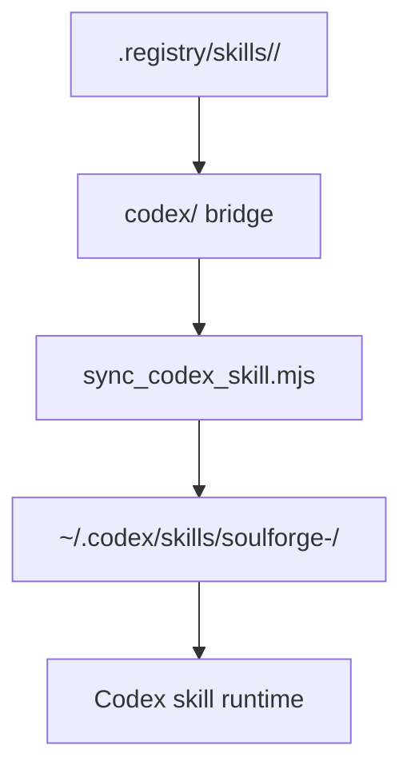

# Skill Install Sync

## 목적

- 이 문서는 tracked Soulforge skill package 와 local Codex installed mirror 사이의 최소 동기화 절차를 고정한다.
- 다른 PC 에서 저장소를 clone 한 뒤, `~/.codex/skills/` 를 다시 materialize 하는 baseline workflow 를 제공한다.

## 한 줄 원칙

- tracked repo 는 `.registry/skills/<skill_id>/` 아래 canon + optional `codex/` bridge 를 소유하고, local installed mirror 는 `~/.codex/skills/soulforge-<skill-id>/` 아래에 materialize 한다.

## 관계도



## 범위

- source owner:
  - `.registry/skills/<skill_id>/skill.yaml`
  - `.registry/skills/<skill_id>/codex/**`
- installed target:
  - `~/.codex/skills/soulforge-<skill-id>/`

`skill.yaml` 은 installed mirror 로 복사하지 않는다. installed mirror 는 `codex/` bridge 만 materialize 한다.

## 다른 PC bootstrap

1. 저장소를 clone 한다.
2. bootstrap 기본 경로에서는 sync 가능한 skill 전체를 대상으로 한다.
3. 아래 스크립트로 installed mirror 를 sync 한다.
4. Codex 를 재시작하거나 새 세션에서 skill list 를 다시 읽게 한다.

## sync script

- script: [`scripts/sync_codex_skill.mjs`](scripts/sync_codex_skill.mjs)
- usage:

```bash
node .registry/docs/operations/scripts/sync_codex_skill.mjs skill_check
node .registry/docs/operations/scripts/sync_codex_skill.mjs shield_wall record_stitch
node .registry/docs/operations/scripts/sync_codex_skill.mjs --all
```

## 규칙

1. source of truth 는 항상 tracked `.registry/skills/<skill_id>/codex/` 다.
2. installed mirror 는 generated local materialization 이며 Git tracked 대상이 아니다.
3. sync 대상 skill 은 `codex/SKILL.md` 가 있는 skill package 로 한정한다.
4. installed mirror 이름은 canonical `skill_id` 의 `_` 를 `-` 로 바꾼 `soulforge-<skill-id>` 형식을 기본으로 사용한다.
5. host-local install path 는 tracked binding 이 아니라 local machine concern 이다.

## bootstrap 기본값

- bootstrap/doctor 기본 경로는 `node .registry/docs/operations/scripts/sync_codex_skill.mjs --all` 또는 `npm run skills:sync -- --all` 로 sync 가능한 skill 전체를 local 에 materialize 한다.
- `codex/SKILL.md` 가 없는 skill package 는 canon-only 또는 test package 로 두고, local installed mirror 기본 대상에 포함하지 않는다.
