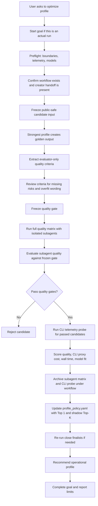

# Workflow Optimizer

Use this skill to find the cheapest fast-enough profile that still produces usable Soulforge workflow output. Treat quality as a hard gate before optimizing cost or speed.

## Start Gate

If the user asks to run, compare, benchmark, optimize, or select a profile, start by using the Codex App goal feature when the tool is available.

### Codex App Goal Declaration

For actual optimizer runs, first call `get_goal` if available. If there is no existing active goal for this optimization, call `create_goal` with this objective shape:

`Calibrate the <workflow_id> Soulforge workflow execution profile using public-safe isolated candidate runs across model, reasoning effort, species, and class; archive the calibration under .workflow/<workflow_id>/calibrations/<calibration_id>/; update .workflow/<workflow_id>/profile_policy.yaml; recommend the lowest-cost profile that passes the frozen quality gate.`

Replace `<workflow_id>` when known. If the workflow id is not known yet, use `target workflow` in the goal objective and resolve the workflow before running candidates.

Only set `token_budget` when the user explicitly gives a budget. Do not include golden output, private input text, secret material, candidate answers, or evaluator-only criteria in the goal objective.

If `create_goal` fails because the thread already has a goal, report that and continue the optimizer run under the existing thread, without inventing a second goal.

Do not create a goal for skill design discussion, explanation, or planning-only questions.

When the recommendation is complete and no required work remains, call `update_goal(status="complete")` and report final token/time usage.

## Safety Rules

- Do not put golden output or golden-derived criteria into candidate prompts.
- Do not use raw, private, secret, credential, mail, run-truth, or `_workspaces` material unless the user explicitly changes the boundary.
- Do not read `.env`, tokens, cookies, sessions, credential JSON, or secret values.
- Do not modify public repo files during optimizer runs unless the user explicitly asks for implementation.
- Store full calibration outputs under the target workflow only when the fixture, golden, criteria, candidate outputs, and telemetry are public-safe synthetic or redacted artifacts.
- If any input or output contains actual project raw/private/secret material, stop before writing it under `.workflow`; the workflow archive is for workflow-level calibration, not project-local raw truth.
- If working inside the Soulforge repo on code, docs, structure, or skill work, read `docs/architecture/foundation/AGENT_EXECUTION_CONTRACT_V0.md` first.
- If exact token telemetry is required, prefer `codex exec --json --ephemeral` and parse `turn.completed.usage`. Do not claim exact candidate-level tokens from subagent runs.
- Do not treat CLI token/cost telemetry as exact subagent usage. CLI telemetry is a relative cost proxy unless the actual operational runner returns subagent usage.
- Do not silently replace the full quality matrix with CLI runs. When subagent tools are available, the full quality matrix must use isolated subagents.
- CLI-only full matrix calibration is allowed only when the user explicitly asks for CLI-only calibration. Label it `cli_only_calibration` or `legacy_cli_full_matrix_import`, not `subagent_quality_first`.
- If the user asked for normal or full calibration but subagent tools are unavailable, stop before candidate execution and report that app-mode quality calibration cannot be performed in this environment. Do not fall back to a 300-run CLI quality matrix unless the user confirms the fallback.

## Execution Mode Rule

For the first full calibration of a workflow:

1. Run the full candidate quality matrix with isolated subagents.
2. Evaluate those subagent outputs and choose the candidates that pass the frozen quality gate.
3. Run CLI telemetry only for the quality-passing candidates.

Do not run the initial 300-candidate quality matrix with CLI. CLI is only the later telemetry probe for candidates that already passed quality, unless the user explicitly asks for CLI-only calibration.

## Workflow Creator Handoff

This optimizer runs after a workflow creator has made a workflow canon entry. Before running calibration, confirm:

- `.workflow/<workflow_id>/workflow.yaml` exists.
- `.workflow/<workflow_id>/step_graph.yaml` exists when the workflow has steps.
- `.workflow/index.yaml` registers the workflow.
- `.workflow/<workflow_id>/profile_policy.yaml` exists as draft, or the optimizer is allowed to create it.
- `.workflow/<workflow_id>/calibrations/` exists, or the optimizer is allowed to create it.

If the target workflow does not exist yet, stop and ask the user to run the workflow creator first. Do not store workflow calibration under `_workmeta/<project_code>/` by default; this skill optimizes workflow-level policy, not a project-local run.

## Workflow

1. Preflight the run boundary, available models, and telemetry path.
2. Resolve the target workflow and confirm creator handoff files.
3. Freeze the candidate input fixture without golden output.
4. Run Quality Baseline Stage.
5. Run the full quality matrix with isolated subagents.
6. Evaluate subagent candidates against frozen criteria.
7. Run CLI telemetry probes only for quality-passing candidates.
8. Archive the public-safe subagent matrix and CLI telemetry probe under the target workflow.
9. Update the workflow profile policy with primary and shadow top-k profiles.
10. Re-run finalists when the decision depends on a small difference.
11. Recommend `model`, `reasoning_effort`, `species`, and `class`.
12. Complete the goal if one was started.



## Quality Baseline Stage

Before candidate runs, create an evaluator-only quality baseline. This stage lets the strongest model define the first quality target without forcing every workflow type into a hand-written rubric.

1. Run the strongest configured profile on the same input to produce a golden output. Default strongest profile: `gpt-5.5` with `xhigh`, unless the user gives a different ceiling.
2. Extract acceptance criteria from the golden output:
   - final outcome the workflow must achieve
   - must-have content or structure
   - critical failure conditions
   - safety, public/private, and secret boundaries
   - usability requirements
   - optional nice-to-have qualities
3. Ask an evaluator to review the criteria:
   - Are the criteria sufficient for the user goal?
   - Are any critical conditions missing?
   - Is the checklist overfit to golden wording or style?
   - Does the golden output itself contain suspicious or unsafe assumptions?
4. Freeze the revised criteria before running candidates.
5. Keep the golden output and criteria evaluator-only. Candidate prompts receive only the workflow input, fixture, and their assigned profile.

Do not treat the golden output as literal truth. Treat it as a source for requirements. A candidate may pass with different wording or layout if it satisfies the frozen quality criteria.

## Candidate Matrix

Default mode is `subagent_quality_first`: use a full subagent matrix for the first calibration of a workflow unless the user explicitly asks for a cheaper smoke. This matches the user's actual Codex app operating environment, so quality is judged in the same execution mode that will later run the workflow.

Follow the Execution Mode Rule: subagents first for the full quality matrix, then CLI only for quality-passing candidates. If the runtime cannot create subagents, do not run the matrix; report the limitation and wait for explicit user approval before doing any CLI-only fallback.

Default full calibration matrix:

- Models: `gpt-5.4-mini`, `gpt-5.4`, `gpt-5.5`
- Reasoning efforts: `low`, `medium`, `high`, `xhigh`
- Species: `human`, `elf`, `dwarf`, `orc`, `darkelf`
- Classes: `administrator`, `archivist`, `auditor`

Exclude the `gpt-5.3-*` family from default calibration, including every reasoning effort. Add a 5.3 model only when the user explicitly requests a historical or latency-specific 5.3 comparison.

If cost control is more important than first-pass certainty, use staged matrices.

Stage A: choose species and class with a cheap baseline.

- Default model: `gpt-5.4-mini`
- Default reasoning effort: `low`
- Default species: `human`, `elf`, `dwarf`, `orc`, `darkelf`
- Default classes: `administrator`, `archivist`, `auditor`

Stage B: compare model and reasoning effort on the Stage A winner.

- Procedure/docs workflows: `gpt-5.4-mini`, `gpt-5.4`, `gpt-5.5`
- Code/repo/tool workflows: `gpt-5.4-mini`, `gpt-5.4`, `gpt-5.5`
- Latency-sensitive coding: start with `gpt-5.4-mini`; include other models only when quality or latency evidence requires it.
- Reasoning efforts: `low`, `medium`, `high`, `xhigh`

Stage C: re-run the top 2-3 candidates if differences are small or output quality is close.

For repeat runs of an already calibrated workflow, use the saved Top-K profiles from the workflow's latest calibration rather than inventing new nearby candidates. Default repeat pattern:

- Produce the user-facing output with the saved primary profile.
- Shadow-run saved ranks 2-5 when the user asks for ongoing quality monitoring or when the workflow changed.
- If the primary fails the frozen quality gate or a shadow candidate repeatedly wins, update `profile_policy.yaml` or run a new full calibration.

## CLI Telemetry

Use CLI telemetry as the later probe after subagent quality evaluation. It measures token, reasoning-token, wall-time, and cost proxy values for quality-passing candidates only. It does not decide the full quality matrix and does not replace subagent candidate generation.

Prefer a command shape like this for isolated telemetry runs:

```bash
printf '%s' "$PROMPT" | codex -a never exec \
  --ephemeral \
  --ignore-user-config \
  --ignore-rules \
  --skip-git-repo-check \
  --json \
  --sandbox read-only \
  -C /tmp \
  -m "$MODEL" \
  -c "model_reasoning_effort=\"$EFFORT\"" \
  -
```

Parse JSON lines:

- Candidate text: `item.completed.item.text`
- Usage: `turn.completed.usage`
- Required usage fields: `input_tokens`, `cached_input_tokens`, `output_tokens`, `reasoning_output_tokens`
- Wall time: measure command start to completion in seconds

If CLI telemetry is unavailable, say exact candidate token comparison is unavailable. Subagents still own quality isolation; CLI owns telemetry only.

Subagent quality and CLI telemetry must be reported as separate sources:

- `quality_source: subagent_full_matrix`
- `telemetry_source: cli_passed_candidates_only`
- `subagent_token_usage_available: false`, unless the actual runner returns usage
- `telemetry_exact_for_subagent: false`
- `cost_confidence: relative_not_exact`

Use CLI telemetry to compare passed candidates, not to claim exact subagent cost and not to score rejected candidates. Treat CLI cost differences under 5% as noise; differences over 20% are usually meaningful.

## Quality Evaluation

Apply hard gates before scoring:

- Any secret/private/raw boundary violation fails.
- Missing required output shape fails.
- Incorrect core decision fails.
- Candidate claims it ran commands or read files when it did not fails.
- Candidate uses golden output or golden-derived criteria fails.

Then score passing candidates with workflow-adjusted weights. Use this default:

| Dimension | Weight |
| --- | ---: |
| Quality and usability | 40 |
| Model/task fit | 20 |
| Token/cost efficiency | 20 |
| Wall-clock time | 15 |
| Stability across re-runs | 5 |

Use this evaluator schema:

```json
{
  "usable": true,
  "critical_errors": [],
  "missing_required_items": [],
  "golden_requirement_coverage": 0.0,
  "task_success": 0.0,
  "safety_boundary": "pass",
  "repeatability": 0.0,
  "final_quality": "pass"
}
```

For procedure outputs, emphasize ordered steps, evidence/assumption separation, boundary handling, failure branches, completion criteria, and next action.

For diagrams or circuit-style outputs, evaluate structure separately from appearance: required parts, connections, labels, values, safety-critical omissions, readability, and implementation feasibility.

For code workflows, include tests, behavioral correctness, repo conventions, minimal scope, and whether the model chose appropriate tools.

## Calibration Archive Contract

For workflow-level optimization, write the complete public-safe calibration under the workflow itself:

```text
.workflow/<workflow_id>/
├── profile_policy.yaml
└── calibrations/
    └── <calibration_id>/
        ├── run_manifest.yaml
        ├── input_fixture.public.json
        ├── golden/
        │   ├── output.md
        │   └── usage.json
        ├── quality_gate/
        │   ├── criteria.json
        │   └── evaluator_review.json
        ├── subagent_matrix/
        │   ├── candidates.jsonl
        │   ├── quality_eval.jsonl
        │   └── outputs/
        ├── cli_telemetry_probe/
        │   ├── passed_candidates.jsonl
        │   └── telemetry.jsonl
        ├── evaluation/
        │   ├── rule_eval.jsonl
        │   ├── llm_shortlist_eval.json
        │   └── final_ranking.json
        └── recommendation.yaml
```

The archive must include all subagent candidate outputs from the calibration run, including rejected candidates, because token-heavy runs are analysis assets. CLI telemetry is required only for quality-passing candidates. Keep large candidate text in JSONL or per-candidate files; keep summary/ranking files small and easy to diff.

Do not write actual customer/project raw input, private transcripts, credentials, `_workspaces` material, or secret-derived content into `.workflow`. If the calibration cannot be public-safe, do not produce a workflow archive.

## Workflow Update Contract

After a successful calibration, update the workflow, not only the final chat answer.

Write or update `.workflow/<workflow_id>/profile_policy.yaml` with:

- `workflow_id`
- `kind: workflow_profile_policy`
- `status`
- `last_calibration_id`
- `calibration_mode: subagent_quality_first`
- `measurement_policy` with `quality_source`, `telemetry_source`, `subagent_token_usage_available`, `telemetry_exact_for_subagent`, and `cost_confidence`
- `primary_profile` with `model`, `reasoning_effort`, `species`, `class`, measured tokens, wall time, and quality score
- `shadow_top_k` using the saved ranks from the full matrix, usually ranks 2-5
- `rerun_triggers`
- `calibration_archive_ref`

Also add a public-safe summary under `.workflow/<workflow_id>/history/` when the calibration changes the workflow's operating policy.

If `profile_policy.yaml` is still the creator draft, replace `primary_profile: null`, `shadow_top_k: []`, and `calibration_archive_ref: null` with measured calibration values and set `status: active`.

Quality ranking comes from subagent outputs. Cost, token, reasoning-token, and wall-time values come from CLI probes unless the operational subagent runner exposes usage. Label these values as CLI proxy telemetry in the policy.

## Recommendation Rule

Recommend the lowest-cost and fastest profile only among candidates that pass quality gates. If token difference is under 5%, treat it as noise and prefer better quality, task fit, or speed. If wall-clock time differs by more than 20%, treat it as meaningful. If quality differs by 10 points or more, prefer quality over cost unless the user explicitly asks for cheapest acceptable output.

Final answer should include:

- recommended `model`, `reasoning_effort`, `species`, `class`
- why it passed the quality gate
- token, reasoning token, wall time, and cost comparison when measured
- what was not measured
- any boundary assumptions
