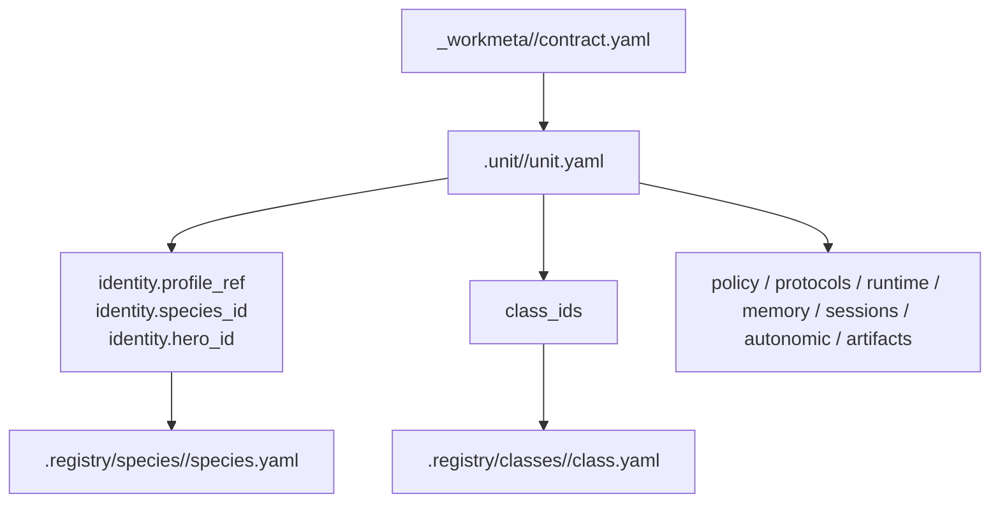

# .unit

## Canonical purpose

- `.unit/` 는 활성 unit 운영자가 책임지는 canonical root다. 각 unit owner 는 policy, protocols, runtime, memory, sessions, autonomic, artifacts 를 `.unit/<unit_id>/` 아래에서 직접 관리한다.
- `.unit/` 는 `.registry`, `.workflow`, `.party`, `.mission`, `_workspaces` 와 구분되어 catalog, workflow, party, mission plan, private project data 를 번갈아 처리하지 않는다.
- species 와 class 의 실제 조합은 `.unit/<unit_id>/unit.yaml` 이 결정한다. catalog 는 조합을 선점하지 않는다.

## 관계도

## 무엇을 둔다

- `<unit_id>/unit.yaml`
  현재 active subject의 `status`, `summary`, `identity`, `class_ids` 를 둔다.
- `<unit_id>/policy/`
- `<unit_id>/protocols/`
- `<unit_id>/runtime/`
- `<unit_id>/memory/`
- `<unit_id>/sessions/`
- `<unit_id>/autonomic/`
- `<unit_id>/artifacts/`

## 무엇을 두지 않는다

- species, hero, class, skill, tool, knowledge, workflow, party canon 정의
- `_workspaces/<project_code>/` project tree 와 `_workmeta/<project_code>/` 실행 truth
- 실제 비밀값, raw transcript, 민감 로그, 운영 dump 의 무분별한 public 반영

## 왜 이렇게 둔다

- 현재 운영 중인 unit 은 catalog 와 달리 책임 경계를 명시해야 하므로 `.unit/` 별도 루트를 유지한다.
- 운영 경계를 `.registry`, `.workflow`, `.party`, `.mission`, `_workspaces` 와 분리함으로써 재사용성과 책임 경계를 명확히 한다.

## Canonical sample

- [`guild_master/unit.yaml`](guild_master/unit.yaml)은 intake, mission review, boundary review, nightly oversight, promotion handoff, delegation 성향의 governance sample 이다. `author_skill_package`, `mission_check`, `nightly_sweep` 같은 guild-master operating lane 과 잘 맞는 canonical demo unit 으로 본다.
- `guild_master` 은 현재 사용자가 기본적으로 대화하는 current-default guild master unit 으로 본다. 다만 Soulforge 전반의 universal default unit 으로 확정한 것은 아니다.

## tracking 원칙

- 이 저장소에는 canonical active unit 과 그 owner surface baseline 만 둔다.
- 민감 데이터, 실제 session transcript, 비밀값, private runtime dump 는 tracked unit sample 에 넣지 않는다.

## Future direction

- 현재 `guild_master` 는 사용자의 기본 상위 창구로 쓰는 guild master unit 이다.
- 향후 human-operated / AI-operated variation 을 더 쪼갤 수는 있지만, 지금 phase 에서는 별도 guild master unit 을 중복 생성하지 않는다.
- human guild master lane 은 mailbox escalation, manual hunt review, workflow/skill promotion approval 같은 상위 운영 판단을 맡는다.
- Soulforge 전용 `skill creator` 또는 `skill checker` 같은 authoring aid 는 우선 `guild_master` 같은 guild-master owner surface 와 workflow lane 아래에서 운용하는 것을 기본안으로 본다.
