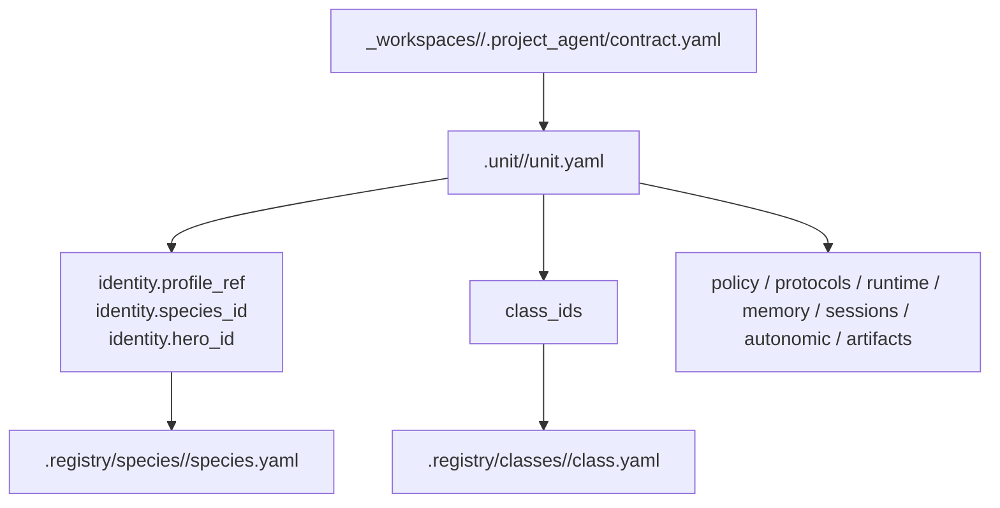

# .unit

## Canonical purpose

- `.unit/` 는 활성 unit 운영자가 책임지는 canonical root다. 각 unit owner 는 policy, protocols, runtime, memory, sessions, autonomic, artifacts 를 `/Users/seabotmoon-air/Workspace/Soulforge/.unit/<unit_id>/` 아래에서 직접 관리한다.
- `.unit/` 는 `.registry`, `.workflow`, `.party`, `.mission`, `_workspaces` 와 구분되어 catalog, workflow, party, mission plan, private project data 를 번갈아 처리하지 않는다.

## 관계도

## 무엇을 둔다

- `<unit_id>/unit.yaml`
  현재 active subject의 `status`, `summary`, `identity`, `class_ids` 를 둔다.
- `<unit_id>/policy/`
- `<unit_id>/protocols/`
- `<unit_id>/runtime/`
- `<unit_id>/memory/`
- `<unit_id>/sessions/`
- `<unit_id>/autonomic/`
- `<unit_id>/artifacts/`

## 무엇을 두지 않는다

- species, hero, class, skill, tool, knowledge, workflow, party canon 정의
- `_workspaces/<project_code>/` project tree 와 `.project_agent/` 실행 truth
- 실제 비밀값, raw transcript, 민감 로그, 운영 dump 의 무분별한 public 반영

## 왜 이렇게 둔다

- 현재 운영 중인 unit 은 catalog 와 달리 책임 경계를 명시해야 하므로 `.unit/` 별도 루트를 유지한다.
- 운영 경계를 `.registry`, `.workflow`, `.party`, `.mission`, `_workspaces` 와 분리함으로써 재사용성과 책임 경계를 명확히 한다.

## Canonical sample

- [`vanguard_01/unit.yaml`](vanguard_01/unit.yaml)은 현재 운영 중인 canonical active subject sample이다. 이 파일은 `identity.profile_ref`, `identity.species_id`, `identity.hero_id`, `class_ids` 로 active subject shape 를 고정하며, `.unit/`를 봤을 때 가장 먼저 참고할 실제 unit이다.
- [`vanguard_01/`](vanguard_01/) 아래의 owner surface 디렉터리는 policy, protocols, runtime, memory, sessions, autonomic, artifacts 의 tracked baseline 을 함께 제공한다.
- [`scribe_01/unit.yaml`](scribe_01/unit.yaml)은 research/documentation 성향의 contrasting unit sample 이다. capability comparison 과 unit-selection 실험에서 `vanguard_01`와 구분되는 owner lens 를 제공한다.
- [`guild_master_01/unit.yaml`](guild_master_01/unit.yaml)은 skill package authoring, boundary review, promotion handoff 성향의 administrative sample 이다. `author_skill_package` 와 `guild_master_cell` 조합의 canonical demo unit 으로 본다.
- `guild_master_01` 은 현재 skill authoring lane 의 canonical sample 이자 current default authoring unit 이지만, future guild-master 운영 전반의 universal default unit 으로 확정한 것은 아니다.

## tracking 원칙

- 이 저장소에는 canonical active unit 과 그 owner surface baseline 만 둔다.
- 민감 데이터, 실제 session transcript, 비밀값, private runtime dump 는 tracked unit sample 에 넣지 않는다.

## Future direction

- 현재 `guild_master_01` 는 AI-operated authoring lane sample 이고, 향후 human-operated `guild master` unit 를 별도 active unit 로 둘 수 있다.
- human guild master lane 은 mailbox escalation, manual hunt review, workflow/skill promotion approval 같은 상위 운영 판단을 맡는다.
- Soulforge 전용 `skill creator` 또는 `skill checker` 같은 authoring aid 는 우선 `guild_master_01` 같은 guild-master owner surface 와 workflow lane 아래에서 운용하는 것을 기본안으로 본다.
