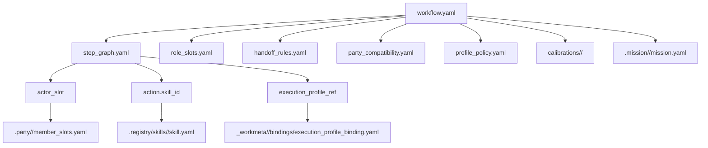
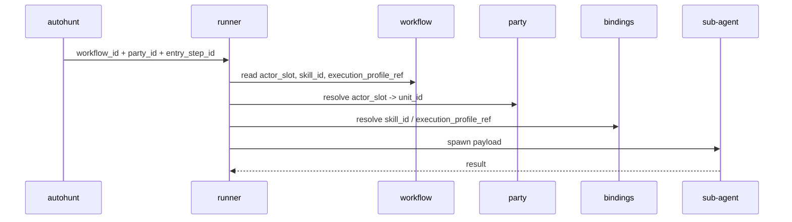

# .workflow

## 정본 의미

- `.workflow/` 는 workflow canon 과 curated learning history 의 정본 루트다.
- 각 workflow 는 작업 공략서, 협업 절차, handoff 규칙을 소유한다.
- `.workflow/` 는 `.registry` 아래로 들어가지 않는 독립 orchestration root 다.
- `.workflow/` 는 workflow-level profile calibration 결과와 public-safe candidate archive 를 소유할 수 있다.
- `.workflow/` 는 project-local raw run dump, battle log, private transcript owner 가 아니다.

## canon 과 authoring 구분

- workflow canon 목록은 `index.yaml` 이 소유한다.
- `.workflow/<workflow_id>/` 아래에서 `index.yaml` 에 등록된 항목만 workflow canon entry 로 본다.
- `.workflow/authoring/` 은 draft, template, guide 를 두는 대기실이며 workflow canon entry 가 아니다.
- UI 와 derive consumer 는 폴더 direct scan 대신 `index.yaml` 을 기준으로 workflow 목록을 만들므로, `authoring/` 은 workflow 목록에 표시하지 않는다.

## canon 과 성숙도 구분

- workflow 의 public-safe package owner 와 runtime 성숙도 평가는 같은 말이 아니다.
- 사람이 보는 기본 단계는 `draft -> pilot -> usable -> canon` 으로 읽는다.
- `draft` 는 authoring note 나 local/private evidence 에만 있고 아직 `index.yaml` 에 등록되지 않은 상태다.
- `pilot` 는 최소 1회 bounded fixture 또는 실행 packet 으로 절차를 실제로 돌려 본 상태다. run evidence 나 workflow note 에 `pilot-ready`, `pilot-executed` 같은 세부 표기가 붙을 수 있다.
- `usable` 은 반복 실행에서 경계와 출력 형식이 안정적이라고 판단된 상태다. workflow package 의 `validation_level` 에 `owner_accepted_usable` 같은 readiness 표현이 붙을 수 있다.
- `canon` 은 public-safe package 가 `.workflow/<workflow_id>/` 에 있고 `index.yaml` 에 등록된 상태다.
- canon 등록은 "이 절차가 reusable package 로 승격되었다"는 뜻이며, 모든 vendor/fixture/gap 이 영구히 해결되었다는 뜻은 아니다.
- canon entry 의 남은 gap 은 `validation_level`, package `notes`, calibration history, 그리고 private run evidence 에 남기고, 이미 등록된 canon entry 를 다시 `draft` 로 부르지 않는다.
- legacy registered entry 가 아직 `validation_level` 을 명시하지 않을 수 있으면, 그 경우 readiness 는 package README 와 history note 로 읽고 이후 정리 대상으로 남긴다.

## 관계도

## 실행 시퀀스

## 무엇을 둔다

- `index.yaml`
- `authoring/`
- `<workflow_id>/workflow.yaml`
- `<workflow_id>/role_slots.yaml`
- `<workflow_id>/step_graph.yaml`
- `<workflow_id>/handoff_rules.yaml`
- `<workflow_id>/monster_rules.yaml`
- `<workflow_id>/party_compatibility.yaml`
- `<workflow_id>/profile_policy.yaml`
- `<workflow_id>/calibrations/<calibration_id>/`
- `<workflow_id>/history/`

## 무엇을 두지 않는다

- project-local raw execution truth
- private/raw artifact, battle log, transcript dump
- active unit runtime state

## 왜 이렇게 둔다

- workflow 는 여러 unit 과 party 가 재사용하는 공략서이므로 project-local raw 실행 결과와 분리되어야 한다.
- workflow 자체를 최적화하기 위해 public-safe synthetic fixture 로 돌린 profile calibration 은 해당 workflow 의 반복 실행 정책을 바꾸는 근거이므로 `<workflow_id>/calibrations/<calibration_id>/` 아래에 둘 수 있다.
- calibration archive 에는 golden, frozen quality gate, candidate outputs, telemetry, evaluation, recommendation 을 둘 수 있으나 raw/private/secret 입력이나 실제 프로젝트 원문은 넣지 않는다.
- `profile_policy.yaml` 은 calibration 결과가 현재 workflow 를 어떻게 업데이트했는지, primary profile 과 shadow top-k profile 을 기록한다.
- workflow creator 는 새 workflow 를 등록할 때 `profile_policy.yaml` 을 draft 로 만들고 `calibrations/` placeholder 를 함께 만든다.
- profile optimizer 는 등록된 workflow 를 대상으로 subagent quality full matrix 결과를 `calibrations/<calibration_id>/` 에 저장하고, 품질 통과 후보만 CLI telemetry probe 로 측정한 뒤 `profile_policy.yaml` 을 active 추천값으로 갱신한다.
- held mission assignment 는 `.mission/` 이, project-local raw run 은 `_workmeta/<project_code>/runs/<run_id>/` 가 소유한다.
- `step_graph.yaml` 의 각 step 는 필요하면 `execution_profile_ref` 를 가질 수 있고, 실제 모델/도구 preset 은 `_workmeta/<project_code>/bindings/execution_profile_binding.yaml` 에서 resolve 한다.
- `step_graph.yaml` 의 `action.skill_id` 는 `.registry/skills/<skill_id>/skill.yaml` 을 가리키며, local runtime 에서는 `_workmeta/<project_code>/bindings/skill_execution_binding.yaml` 이 installed Codex skill name 을 resolve 할 수 있다.
- skill authoring 같은 운영 workflow 는 tracked package draft 와 install handoff note 를 만들 수 있지만, 실제 installed mirror sync 는 local operation 절차로 남길 수 있다.
- `author_skill_package` 는 현재 skill authoring lane 의 canonical sample 이자 current default workflow 이지만, future authoring path 전체의 universal standard 로 잠근 것은 아니다.

## 샘플 구성

- [`author_skill_package/workflow.yaml`](author_skill_package/workflow.yaml): guild-master authoring workflow sample for deciding when a request should become a reusable skill package.
- [`author_skill_package/positioning.md`](author_skill_package/positioning.md): current guild-master authoring lane positioning note.
- [`device_system_diagram_generation/workflow.yaml`](device_system_diagram_generation/workflow.yaml): owner-accepted usable workflow for generating editable draw.io device system diagrams plus SVG, PPTX, and PNG outputs from one Markdown input.
- [`whole_xml_page_split_v0/workflow.yaml`](whole_xml_page_split_v0/workflow.yaml): private-pilot-executed upstream workflow for splitting one project-bound large multi-page XML source into project-local page XML assets, page manifest, index, provenance, and readiness notes before `page_xml_normalize_spec_v0`.
- [`page_xml_normalize_spec_v0/workflow.yaml`](page_xml_normalize_spec_v0/workflow.yaml): private-pilot-executed bridge workflow for producing sidecar-first `page_module_spec_v0` metadata packages and manifests from read-only page XML assets before XML-first asset registration.
- [`capture_xml_intake_library_v0/workflow.yaml`](capture_xml_intake_library_v0/workflow.yaml): pilot-executed XML-first asset registration workflow for building a read-only Capture XML intake library with asset identity, MDD placeholder, block, net, connector, power, open-question, and provenance artifacts before component material collection.
- [`official_source_packet_collect_v0/workflow.yaml`](official_source_packet_collect_v0/workflow.yaml): private-pilot-executed source-bootstrap workflow for collecting or indexing official and owner-approved local source packets, source gaps, access blockers, owner follow-up, and downstream-ready refs before materials, layout, simulation, ECAD, or harness workflows consume source evidence.
- [`asset_patch_attach_mdd_v0/workflow.yaml`](asset_patch_attach_mdd_v0/workflow.yaml): draft follow-on workflow for attaching an owner-supplied MDD file to an existing XML-first asset set by metadata patch and version bump.
- [`exp_xml_component_materials/workflow.yaml`](exp_xml_component_materials/workflow.yaml): pilot-executed workflow for parsing `EXP.xml` component data and collecting official datasheet plus EVAL/reference-design materials into project-local folders.
- [`component_pcb_layout_guide_extraction/workflow.yaml`](component_pcb_layout_guide_extraction/workflow.yaml): owner-accepted usable follow-on workflow for extracting PCB layout guidance from per-component datasheet and EVAL materials into project-local `Layout Guide` folders with cache, source-map manifests, and cited full-page figures.
- [`page_quantitative_enrichment_v0/workflow.yaml`](page_quantitative_enrichment_v0/workflow.yaml): private-pilot-executed overlay workflow for filling only source-backed or explicitly derived quantitative page-module slots, preserving missing/review-required gaps, and writing harness-readiness deltas before harness composition.
- [`simulation_source_collect_v0/workflow.yaml`](simulation_source_collect_v0/workflow.yaml): private-pilot-executed pre-deck workflow for collecting or indexing official, owner-approved, and tool-library simulation sources with explicit model inventory, compatibility states, missing models, access blockers, owner follow-up, and downstream handoff before deck preparation or run verification.
- [`simulation_deck_prepare_v0/workflow.yaml`](simulation_deck_prepare_v0/workflow.yaml): private-pilot-executed pre-run workflow for staging simulation deck inputs from approved model packets, demo circuits, stimuli, measurements, and simulator policy while keeping unresolved deck blockers explicit and avoiding any execution or result claims.
- [`simulation_run_verify_v0/workflow.yaml`](simulation_run_verify_v0/workflow.yaml): private-pilot-executed run/verify workflow for executing a bounded simulation or recording why it cannot start, while packaging execution metadata, measurements, verdict rows, blockers, and downstream handoff without inferring owner acceptance.
- [`xml_harness_composition_v0/workflow.yaml`](xml_harness_composition_v0/workflow.yaml): private-pilot-executed derived harness-layer workflow for reading prepared page-level module contracts and optional enrichment packets, classifying possible joins as blocked, review-required, candidate-safe, or source-supported, and writing a project-local harness packet without mutating library assets.
- [`page_module_trace_matrix_v0/workflow.yaml`](page_module_trace_matrix_v0/workflow.yaml): private-pilot-executed governance workflow for building row-level trace, evidence-authority, gap, harness-delta, verification-seed, and review-index outputs over page/source/materials/layout/quantitative/harness packets without taking over upstream source authority.
- [`interface_control_and_harness_readiness_v0/workflow.yaml`](interface_control_and_harness_readiness_v0/workflow.yaml): private-pilot-executed governance bridge for evaluating page-module interface candidates and optional harness candidates into blocked, review-required, candidate-safe-possible, and source-supported-possible ceilings before harness strengthening.
- [`source_gap_followup_packet_v0/workflow.yaml`](source_gap_followup_packet_v0/workflow.yaml): private-pilot-executed follow-up workflow for consolidating source/evidence gaps from source, materials, layout, quantitative, and harness lanes into deduplicated owner actions, source batch intake templates, retry triggers, and downstream unblock maps without becoming source authority.
- [`verification_plan_from_page_contracts_v0/workflow.yaml`](verification_plan_from_page_contracts_v0/workflow.yaml): private-pilot-executed verification planning workflow for converting trace rows, quantitative gaps, simulation-source readiness, interface-control ceilings, harness blockers, source gaps, configuration refs, and owner decisions into explicit verification plan, requirements matrix, method map, gap register, readiness, owner-follow-up, TRR handoff, and FCA/SVR handoff outputs without claiming verification execution, approval, or pass/fail results.
- [`review_gate_evidence_pack_v0/workflow.yaml`](review_gate_evidence_pack_v0/workflow.yaml): private-pilot-executed review-readiness workflow for assembling SRR/SFR/PDR/CDR/TRR/FCA/PCA-style evidence packets with explicit entrance criteria, success criteria, blockers, actions, decisions, provenance, and non-claims without approving a gate, certifying verification completion, or mutating upstream evidence.
- [`review_action_item_closure_loop_v0/workflow.yaml`](review_action_item_closure_loop_v0/workflow.yaml): private-pilot-executed downstream governance workflow for tracking review action items, closure evidence, rerun-ready routes, and carry-forward state without approving decisions or mutating upstream review, trace, source, verification, or harness packets.
- [`configuration_baseline_and_change_control_v0/workflow.yaml`](configuration_baseline_and_change_control_v0/workflow.yaml): private-pilot-executed governance workflow for inventorying baseline refs, tracking change requests, and routing baseline-affecting reruns or carry-forward actions without approving baselines or mutating upstream artifacts.
- [`functional_configuration_audit_page_library_v0/workflow.yaml`](functional_configuration_audit_page_library_v0/workflow.yaml): private-pilot-executed FCA/SVR-style governance workflow for auditing whether configured page modules and harness claims are backed by accepted evidence and controlled baseline context without approving acceptance or mutating upstream artifacts.
- [`test_harness_asset_planning_v0/workflow.yaml`](test_harness_asset_planning_v0/workflow.yaml): private-pilot-executed TRR-oriented planning workflow for inventorying fixtures, interfaces, simulation harnesses, instruments, and planning blockers needed before test or simulation harness preparation can become execution-ready.
- [`source_packet_sufficiency_review_v0/workflow.yaml`](source_packet_sufficiency_review_v0/workflow.yaml): private-pilot-executed governance workflow for deciding whether current source/material/layout/simulation packets are sufficient for a bounded claim family while keeping blocked fields and owner follow-up explicit.
- [`physical_configuration_audit_asset_package_v0/workflow.yaml`](physical_configuration_audit_asset_package_v0/workflow.yaml): private-pilot-executed PCA-style governance workflow for auditing whether an artifact package matches the declared physical/configuration baseline without approving baselines or functional acceptance.
- [`technical_risk_open_question_burndown_v0/workflow.yaml`](technical_risk_open_question_burndown_v0/workflow.yaml): private-pilot-executed governance workflow for turning source gaps, ambiguous interfaces, unresolved quantitative fields, and review/open-question blockers into a bounded risk and open-question burndown register.
- [`project_readiness_digest_v0/workflow.yaml`](project_readiness_digest_v0/workflow.yaml): private-pilot-executed owner-readable reporting workflow for aggregating workflow status, blockers, owner-input backlog, calibration priorities, and next recommended actions without becoming a source of truth.
- [`accepted_verification_result_packet_v0/workflow.yaml`](accepted_verification_result_packet_v0/workflow.yaml): draft workflow skeleton for recording accepted verification result rows, blocked/inconclusive rows, and scoped acceptance provenance so later audit consumers do not mistake planning packets for accepted evidence.
- [`authoring/task_note.template.md`](authoring/task_note.template.md): raw task memo template for converting real work into workflow drafts.
- [`authoring/workflow_draft.template.yaml`](authoring/workflow_draft.template.yaml): workflow draft template for step sequencing, actors, skills, and outputs.
- [`authoring/SKILL_WORKFLOW_GUIDE.md`](authoring/SKILL_WORKFLOW_GUIDE.md): user-facing guide for deciding when to route work into a skill-authoring workflow.
- [`authoring/WORKFLOW_EVOLUTION_PLAN_V0.md`](authoring/WORKFLOW_EVOLUTION_PLAN_V0.md): authoring plan for discovering reusable workflow/skill candidates and slimming golden workflows with fixtures, regression, harness candidates, and class/species compression.
