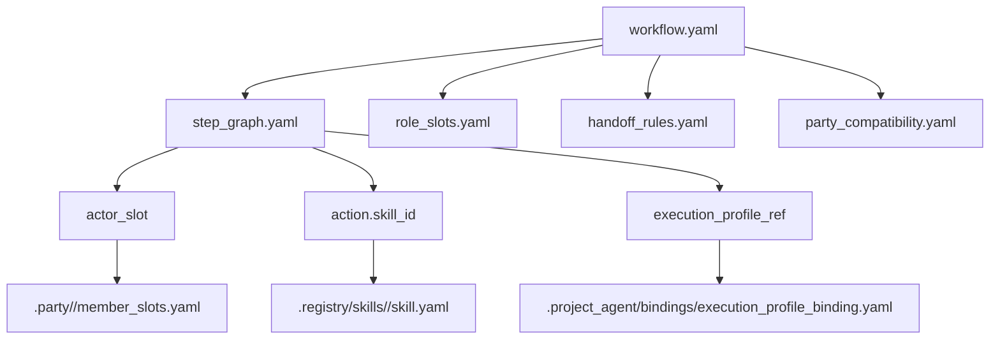
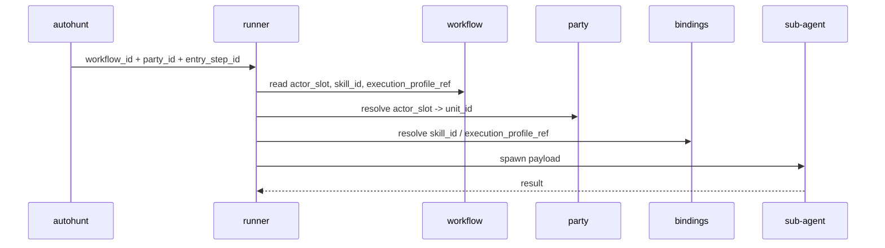

# .workflow

## 정본 의미

- `.workflow/` 는 workflow canon 과 curated learning history 의 정본 루트다.
- 각 workflow 는 작업 공략서, 협업 절차, handoff 규칙을 소유한다.
- `.workflow/` 는 `.registry` 아래로 들어가지 않는 독립 orchestration root 다.
- `.workflow/` 는 raw run dump, project-local battle log, run index owner 가 아니다.

## 관계도

## 실행 시퀀스

## 무엇을 둔다

- `index.yaml`
- `authoring/`
- `<workflow_id>/workflow.yaml`
- `<workflow_id>/role_slots.yaml`
- `<workflow_id>/step_graph.yaml`
- `<workflow_id>/handoff_rules.yaml`
- `<workflow_id>/monster_rules.yaml`
- `<workflow_id>/party_compatibility.yaml`
- `<workflow_id>/history/`

## 무엇을 두지 않는다

- `_workspaces/<project_code>/.project_agent/runs/<run_id>/` raw execution truth
- project code, run id, raw artifact, battle log, transcript dump
- active unit runtime state

## 왜 이렇게 둔다

- workflow 는 여러 unit 과 party 가 재사용하는 공략서이므로 raw 실행 결과와 분리되어야 한다.
- public repo 에 남길 수 있는 것은 curated learning summary 뿐이고, raw run 은 mission site 가 소유한다.
- `step_graph.yaml` 의 각 step 는 필요하면 `execution_profile_ref` 를 가질 수 있고, 실제 모델/도구 preset 은 `.project_agent/bindings/execution_profile_binding.yaml` 에서 resolve 한다.
- `step_graph.yaml` 의 `action.skill_id` 는 `.registry/skills/<skill_id>/skill.yaml` 을 가리키며, local runtime 에서는 `.project_agent/bindings/skill_execution_binding.yaml` 이 installed Codex skill name 을 resolve 할 수 있다.

## 샘플 구성

- [`frontline_assault/workflow.yaml`](frontline_assault/workflow.yaml): Frontline Assault workflow canon for coordinated assault operations.
- [`frontline_assault/history/README.md`](frontline_assault/history/README.md): history guidance that keeps curated lessons outside raw runtime truth.
- [`build_lineage_map/workflow.yaml`](build_lineage_map/workflow.yaml): bounded lineage-map opening workflow sample with explicit step sequence and planning artifacts.
- [`authoring/task_note.template.md`](authoring/task_note.template.md): raw task memo template for converting real work into workflow drafts.
- [`authoring/workflow_draft.template.yaml`](authoring/workflow_draft.template.yaml): workflow draft template for step sequencing, actors, skills, and outputs.
