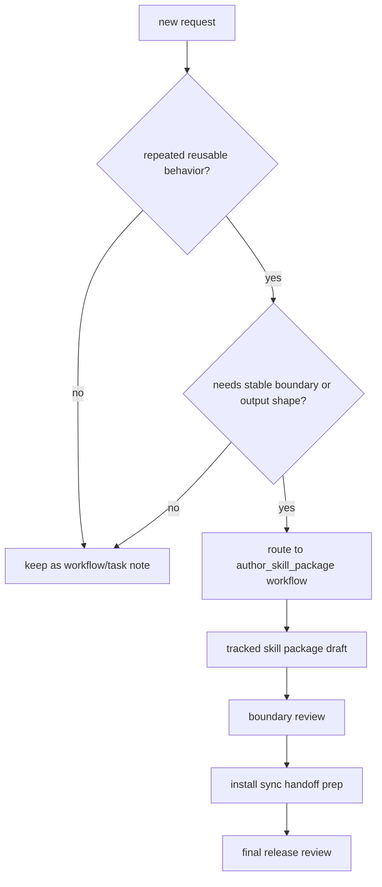

# Skill Workflow Guide

## 목적

- 이 문서는 어떤 요청이 reusable skill package 로 승격될 만큼 반복성과 경계 가치를 가지는지 판단하는 기준을 제공한다.
- 판단이 맞으면 [`author_skill_package`](/Users/seabotmoon-air/Workspace/Soulforge/.workflow/author_skill_package/workflow.yaml) workflow 로 넘기는 것을 기본안으로 한다.

## 언제 skill 을 만든다

아래 중 둘 이상이 맞으면 skill 후보로 본다.

- 같은 행동 규칙이 여러 workflow 나 task 에서 반복된다.
- tool/MCP 사용 순서와 경계가 자주 다시 설명된다.
- output shape 와 boundary rules 를 반복적으로 강제해야 한다.
- skill 로 묶으면 context 절약과 품질 안정화 효과가 크다.

다음이면 workflow 나 task note 만으로 충분한 경우가 많다.

- 한 번만 쓰는 일회성 작업
- project-local truth 에 강하게 묶인 작업
- reusable behavior 보다 결과물 자체가 더 중요한 작업

## 판단 흐름

## author_skill_package workflow 가 필요한 입력

- `skill_request`
- `supporting_examples`
- `existing_skill_package` (optional)

## 요청 분류 메모

- `request_mode` 는 보통 `create`, `revise`, `import_upstream` 중 하나로 적는다.
- script, template, reference 를 함께 가져와야 하면 `resource_bundle_scope` 를 같이 적는다.
- class binding 은 skill 등록 시점에 **반드시 고정할 필요는 없다**. 반복 사용 맥락이 아직 좁으면 `binding_followup` 으로 남기고, 나중에 class/workflow/party 쪽에서 붙여도 된다.

## 결과물

- `skill_boundary_brief.md`
- `skill_package_draft.md`
- `skill_boundary_review.md`
- `skill_install_sync_request.md`
- `skill_release_review.md`

## 관련 canon

- workflow: [`author_skill_package`](/Users/seabotmoon-air/Workspace/Soulforge/.workflow/author_skill_package/workflow.yaml)
- party: [`guild_master_cell`](/Users/seabotmoon-air/Workspace/Soulforge/.party/guild_master_cell/party.yaml)
- unit: [`guild_master_01`](/Users/seabotmoon-air/Workspace/Soulforge/.unit/guild_master_01/unit.yaml)
- class: [`administrator`](/Users/seabotmoon-air/Workspace/Soulforge/.registry/classes/administrator/class.yaml)
