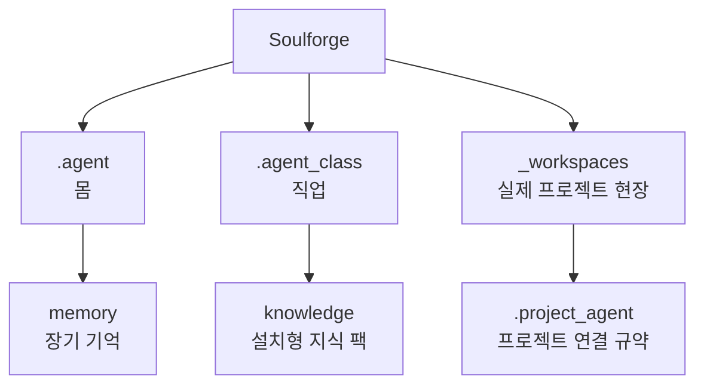

# Soulforge — 저장소 작업 헌장 (v0)

## 0. 목적

Soulforge는 새 정본 구조를 정의하는 설계 저장소다.

핵심 축은 아래 세 가지다.

1. `.agent` = 에이전트 본체
2. `.agent_class` = 현재 업무환경의 직업 계층
3. `_workspaces` = 실제 프로젝트 현장

현재 단계에서는 구현보다 문서와 메타 구조를 먼저 확정한다.

## 구조 개요도

## 1. 현재 단계

- 문서가 코드보다 먼저다.
- 구조가 기능보다 먼저다.
- UI와 runtime 구현은 아직 우선순위가 아니다.
- 기존 저장소는 참고용이며, Soulforge는 새 구조의 정본이다.

## 2. 비가역 원칙

### 2.1 기존 구조를 복사하지 않는다

- 기존 top-level 구조를 그대로 가져오지 않는다.
- 기존 경로를 정답처럼 전제하지 않는다.
- 필요한 요소만 선별적으로 참고한다.

### 2.2 세 축의 책임을 섞지 않는다

- `.agent` 는 몸이다.
- `.agent_class` 는 직업이다.
- `_workspaces` 는 실제 프로젝트 현장이다.

### 2.3 `memory` 와 `knowledge` 를 분리한다

- `memory` 는 `.agent` 의 장기 기억이다.
- `knowledge` 는 `.agent_class` 의 설치형 지식 팩이다.

### 2.4 `skills`, `tools`, `workflows` 를 분리한다

- `skills` = 몸이 익힌 행동 패턴
- `tools` = 몸 밖 외부 장비
- `workflows` = 절차와 운용 교범

### 2.5 프로젝트 실자료는 `_workspaces/` 안에 둔다

- 실제 프로젝트 자료는 루트에 흩뿌리지 않는다.
- 각 프로젝트는 필요하면 `.project_agent/` 를 가진다.

### 2.6 로컬 상태는 추적하지 않는다

- `.agent_class/_local/` 은 host-local 전용 영역이다.
- 기본적으로 `.gitignore` 만 추적하고 나머지는 무시한다.

## 3. 문서 소유 원칙

- 루트 `docs/` 는 저장소 전체 구조와 루트 설명만 둔다.
- body 문서는 `.agent/docs/` 아래에 둔다.
- class 문서는 `.agent_class/docs/` 아래에 둔다.
- 특정 프로젝트 전용 문서는 `_workspaces/.../<project>/.project_agent/` 아래에 둔다.
- 구조, 계층, 경로 배치를 설명하는 문서는 경로와 폴더를 텍스트로만 나열하지 않는다.
- 실제 구조 설명은 별도 그림 문서를 만들기보다 해당 문서 안에 Markdown/Mermaid 기반의 `구조 개요도` 또는 `관계도` 를 직접 포함하고, 실행 순서가 핵심이면 `흐름도` 를 추가한다.

문서가 다른 계층의 소유권을 침범하면 relocation 계획을 먼저 세운다.

## 4. 문서 우선 변경 순서

구조 변경은 아래 순서를 따른다.

1. 문서 초안 작성
2. 목표 구조 반영
3. 폴더 생성
4. 예시 메타 파일 생성
5. 마지막에 구현

문서와 실제 구조가 다르면, 먼저 문서를 갱신한 뒤 구조를 맞춘다.

## 4.1 README 최신화 규칙

- 어떤 폴더에 파일, 하위 폴더, 책임, 운영 방식이 추가·변경·삭제되면 같은 변경 안에서 해당 폴더의 `README.md` 를 확인하고 최신화한다.
- 해당 폴더에 `README.md` 가 없으면 먼저 신설한다.
- 변경이 owner 경계나 상위 구조 설명까지 영향을 주면 루트 `README.md` 또는 관련 `docs/architecture/` 문서도 함께 갱신한다.
- 캐시, 임시 파일, 생성 산출물처럼 문서 정합성 대상이 아닌 항목은 예외로 둘 수 있다.
- 폴더 내용이 바뀌었는데 해당 `README.md` 가 그대로면 문서 누락으로 본다.

## 5. 이번 단계에서 하지 않는 것

1. 기존 저장소 구현 코드를 대량 복사하지 않는다.
2. top-level `configs/`, `scripts/`, `tests/` 를 습관적으로 만들지 않는다.
3. UI를 먼저 만들지 않는다.
4. runtime 구현을 먼저 옮기지 않는다.
5. 구조 문서 없이 폴더만 먼저 늘리지 않는다.
6. `soulforge.base` 를 최종 직업처럼 고정하지 않는다.

## 6. 참조 문서

- 목표 구조: `docs/architecture/TARGET_TREE.md`
- 문서 소유 원칙: `docs/architecture/DOCUMENT_OWNERSHIP.md`
- 세계관 대응: `docs/architecture/AGENT_WORLD_MODEL.md`
- 프로젝트 연결 규약: `docs/architecture/PROJECT_AGENT_MINIMUM_SCHEMA.md`
- class 운영 문서: `.agent_class/docs/`

## 7. 커밋 원칙

1. 작은 단위 커밋
2. 문서와 구조를 같은 커밋에 묶기
3. 구조를 바꿨으면 관련 문서를 함께 갱신
4. 구현보다 문서 정합성을 우선

커밋 메시지는 한글을 우선한다.

## 8. 한 줄 규칙

Soulforge에서는 몸은 `.agent`, 직업은 `.agent_class`, 실제 프로젝트 현장은 `_workspaces` 이다.
