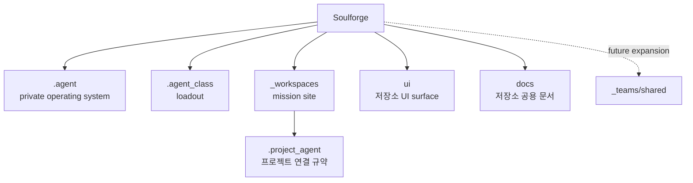

# Soulforge

Soulforge는 `.agent`, `.agent_class`, `_workspaces` 세 축으로 새 정본 구조를 정의하는 설계 저장소다.

## 목적

- `.agent` 를 한 명의 durable agent unit 의 private operating system 으로 정의한다.
- `.agent_class` 를 body 바깥에서 장착되는 loadout 계층으로 정리한다.
- `_workspaces` 를 실제 프로젝트가 실행되는 mission site 로 고정한다.

## 범위

- body/class/workspace 구조, resolve/validate/derive 흐름, read-only viewer, reference sample baseline 3종까지를 다룬다.
- 구현 확장보다 구조와 문서 정합성 고정이 우선이다.

## 포함 대상

- body/class/workspace 정본 구조와 메타 계약
- `.project_agent` 기반 workspace resolve 계약
- `derive-ui-state --json` 을 입력으로 쓰는 read-only viewer

## 제외 대상

- 대규모 runtime 구현 이전
- `.agent` 내부 team collaboration 설계
- 독립 top-level body 기관으로서의 `export/`

## 구조 개요도

## 상위 지도

- [`.agent/README.md`](.agent/README.md): 본체 계층 개요
- [`.agent_class/README.md`](.agent_class/README.md): loadout 계층 개요
- [`_workspaces/README.md`](_workspaces/README.md): mission site 개요
- [`ui/README.md`](ui/README.md): 저장소 공용 UI surface 개요
- [`docs/README.md`](docs/README.md): 저장소 공용 문서 개요
- [`dev/README.md`](dev/README.md): 개발 기록 문서 개요

## 핵심 경계

- `.agent` 는 몸이 아니라 body-owned private operating system 이다.
- `.agent_class` 는 직업 일반론보다 현재 장착 구성을 다루는 loadout 계층이다.
- `_workspaces` 는 실제 프로젝트 운영 현장인 mission site 다.
- 미래 팀 협업은 `.agent` 안이 아니라 루트 `_teams/shared/` 로 확장한다.
- `species` 는 `identity` 의 durable default 만 담당한다.
- `policy` 는 species-free floor 다.
- `sessions` 는 transcript 가 아니라 continuity 저장소다.
- `autonomic` 은 저소음 품질 보정 루틴이다.
- `engine/` 는 현재 경로를 유지하되 runtime 의미를 우선한다.

## 미래 확장 방향

- `engine/` 의 `runtime/` rename 여부는 major 문서 정리에서 결정한다.
- team shared 문서와 프로토콜은 `_teams/shared/` 경계에서 설계한다.
- `protocols/` 는 body 공통 운영 계약을 담는 신규 기관으로 확장한다.

## 주요 문서

- [`docs/architecture/REPOSITORY_PURPOSE.md`](docs/architecture/REPOSITORY_PURPOSE.md)
- [`docs/architecture/TARGET_TREE.md`](docs/architecture/TARGET_TREE.md)
- [`docs/architecture/DOCUMENT_OWNERSHIP.md`](docs/architecture/DOCUMENT_OWNERSHIP.md)
- [`.agent/docs/architecture/AGENT_BODY_MODEL.md`](.agent/docs/architecture/AGENT_BODY_MODEL.md)
- [`.agent/docs/architecture/BODY_METADATA_CONTRACT.md`](.agent/docs/architecture/BODY_METADATA_CONTRACT.md)
- [`.agent_class/docs/architecture/AGENT_CLASS_MODEL.md`](.agent_class/docs/architecture/AGENT_CLASS_MODEL.md)
- [`.agent_class/docs/architecture/MODULE_REFERENCE_CONTRACT.md`](.agent_class/docs/architecture/MODULE_REFERENCE_CONTRACT.md)
- [`docs/architecture/WORKSPACE_PROJECT_MODEL.md`](docs/architecture/WORKSPACE_PROJECT_MODEL.md)
- [`docs/architecture/PROJECT_AGENT_MINIMUM_SCHEMA.md`](docs/architecture/PROJECT_AGENT_MINIMUM_SCHEMA.md)
- [`docs/architecture/PROJECT_AGENT_RESOLVE_CONTRACT.md`](docs/architecture/PROJECT_AGENT_RESOLVE_CONTRACT.md)
- [`docs/architecture/UI_SOURCE_MAP.md`](docs/architecture/UI_SOURCE_MAP.md)
- [`docs/architecture/UI_SYNC_CONTRACT.md`](docs/architecture/UI_SYNC_CONTRACT.md)
- [`docs/architecture/UI_DERIVED_STATE_CONTRACT.md`](docs/architecture/UI_DERIVED_STATE_CONTRACT.md)
- [`docs/architecture/V1_CLOSEOUT_CHECKLIST.md`](docs/architecture/V1_CLOSEOUT_CHECKLIST.md)
- [`docs/architecture/KNOWN_LIMITATIONS.md`](docs/architecture/KNOWN_LIMITATIONS.md)

## 상태

- v1 closeout completed
- 현재 v1 범위는 `구조 + 상태판 + read-only viewer + baseline 3종` 기준으로 닫혀 있다.
- `sample_reference_project`, `sample_invalid_project`, `sample_unbound_project` 는 각각 `bound`, `invalid`, `unbound` baseline 으로 유지한다.
