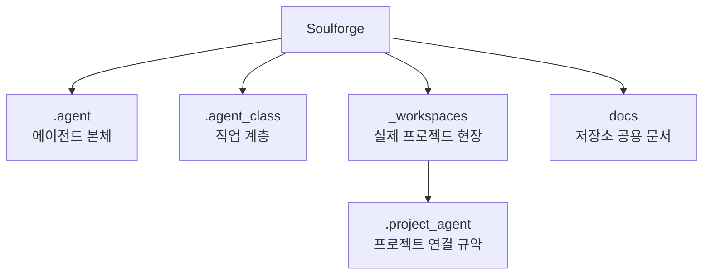

# Soulforge

Soulforge는 `.agent`, `.agent_class`, `_workspaces` 세 축으로 새 정본 구조를 정의하는 설계 저장소다.
현재 v1 범위는 body/class/workspace 구조, resolve/validate/derive 흐름, read-only viewer, reference sample baseline 3종까지로 닫혀 있다.
이 저장소는 새 기능을 계속 늘리는 단계가 아니라, 위 범위를 운영 가능한 기준선으로 고정한 `v1 closeout` 상태를 다룬다.

## 운영 원칙

- 루트 `README.md` 는 저장소 전체 개요와 상위 지도만 다룬다.
- 주요 폴더의 상세 설명은 각 폴더 바로 아래 `README.md` 를 정본으로 삼는다.
- 구조 원칙과 메타 규약은 `docs/architecture/` 또는 해당 owner 의 `docs/` 아래에서 관리한다.
- 폴더 내용이 바뀌면 같은 변경 안에서 해당 폴더 `README.md` 도 함께 최신화한다.
- UI는 정본이 아니라 메타와 구조에서 파생되는 결과로 다룬다.
- UI renderer 는 정본 파일 직접 읽기보다 derived state 소비자를 우선한다.
- read-only UI prototype 은 `.agent_class/tools/local_cli/ui_viewer/` 에 두고 `derive-ui-state --json` 만 읽는다.
- 9차 renderer polish 는 read-only viewer 의 표현과 가독성만 조정하며, 정본/resolve/derive 계약은 그대로 유지한다.

## 구조 개요도

## 상위 지도

- [`.agent/README.md`](.agent/README.md): 본체 계층 개요
- [`.agent_class/README.md`](.agent_class/README.md): 직업 계층 개요
- [`_workspaces/README.md`](_workspaces/README.md): 실제 프로젝트 현장 개요
- [`docs/README.md`](docs/README.md): 저장소 공용 문서 개요
- [`dev/README.md`](dev/README.md): 개발 기록 문서 개요

## 핵심 경계

- `.agent` 는 몸이다. `body.yaml` 과 `body_state.yaml` 으로 본체 메타를 관리하고 `memory` 는 여기에 둔다.
- `.agent_class` 는 직업이다. `skills`, `tools`, `workflows`, `knowledge` 는 여기에 둔다.
- `.agent_class` 는 `class.yaml`, `loadout.yaml`, 그리고 installed module `module.yaml` 로 직업 메타를 관리한다.
- `.agent_class/loadout.yaml` 의 `equipped.*` 는 경로가 아니라 module id 목록이다.
- `_workspaces` 는 실제 프로젝트 운영 현장이다. 프로젝트별 연결 규약은 각 프로젝트의 `.project_agent/` 에 둔다.
- `_workspaces` 의 workspace UI 상태는 실제 프로젝트 폴더 스캔과 `.project_agent` resolve 결과를 바탕으로 `bound`, `unbound`, `invalid` 로 파생한다.
- 루트 `docs/` 는 저장소 공용 구조 문서만 둔다.
- UI는 위 정본 파일과 실제 구조에서 재생성되어야 하며, renderer 는 `derive-ui-state` 가 만든 derived state 를 입력으로 삼는다.
- 첫 renderer prototype 은 `.agent_class/tools/local_cli/ui_viewer/ui_viewer.py` 에서 로컬 read-only 화면으로만 제공한다.

## 주요 문서

- [`docs/architecture/REPOSITORY_PURPOSE.md`](docs/architecture/REPOSITORY_PURPOSE.md)
- [`docs/architecture/TARGET_TREE.md`](docs/architecture/TARGET_TREE.md)
- [`docs/architecture/DOCUMENT_OWNERSHIP.md`](docs/architecture/DOCUMENT_OWNERSHIP.md)
- [`.agent/docs/architecture/AGENT_BODY_MODEL.md`](.agent/docs/architecture/AGENT_BODY_MODEL.md)
- [`.agent/docs/architecture/BODY_METADATA_CONTRACT.md`](.agent/docs/architecture/BODY_METADATA_CONTRACT.md)
- [`.agent_class/docs/architecture/AGENT_CLASS_MODEL.md`](.agent_class/docs/architecture/AGENT_CLASS_MODEL.md)
- [`.agent_class/docs/architecture/MODULE_REFERENCE_CONTRACT.md`](.agent_class/docs/architecture/MODULE_REFERENCE_CONTRACT.md)
- [`docs/architecture/WORKSPACE_PROJECT_MODEL.md`](docs/architecture/WORKSPACE_PROJECT_MODEL.md)
- [`docs/architecture/PROJECT_AGENT_MINIMUM_SCHEMA.md`](docs/architecture/PROJECT_AGENT_MINIMUM_SCHEMA.md)
- [`docs/architecture/PROJECT_AGENT_RESOLVE_CONTRACT.md`](docs/architecture/PROJECT_AGENT_RESOLVE_CONTRACT.md)
- [`docs/architecture/UI_SOURCE_MAP.md`](docs/architecture/UI_SOURCE_MAP.md)
- [`docs/architecture/UI_SYNC_CONTRACT.md`](docs/architecture/UI_SYNC_CONTRACT.md)
- [`docs/architecture/UI_DERIVED_STATE_CONTRACT.md`](docs/architecture/UI_DERIVED_STATE_CONTRACT.md)
- [`docs/architecture/V1_CLOSEOUT_CHECKLIST.md`](docs/architecture/V1_CLOSEOUT_CHECKLIST.md)
- [`docs/architecture/KNOWN_LIMITATIONS.md`](docs/architecture/KNOWN_LIMITATIONS.md)

## 상태

- v1 closeout completed
- 현재 v1 범위는 `구조 + 상태판 + read-only viewer + baseline 3종` 기준으로 닫혔다.
- `sample_reference_project`, `sample_invalid_project`, `sample_unbound_project` 는 각각 `bound`, `invalid`, `unbound` baseline 으로 유지한다.
- 종료 기준은 `V1_CLOSEOUT_CHECKLIST.md`, known warnings / limitations 는 `KNOWN_LIMITATIONS.md` 에서 운영 기준으로 관리한다.
- 루트 `dev/log/`, `dev/plan/` 아래에는 구조/계약/UI 기준선의 개발 이력과 계획 문서를 별도로 관리한다.
