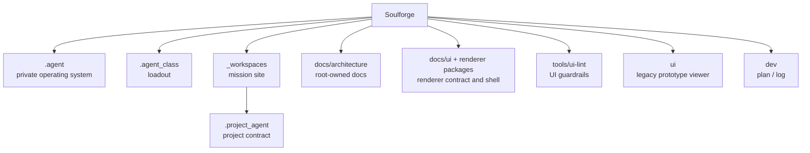

# Soulforge

Soulforge는 `.agent`, `.agent_class`, `_workspaces` 세 축을 중심으로 정본 구조를 관리하는 설계 저장소다.
`.agent` 는 active identity 와 selection catalog 를 소유하고, `.agent_class` 는 canonical loadout asset 을 소유한다.

## 목적

- 루트에서는 저장소 전체의 상위 지도와 owner 경계만 제공한다.
- 세부 운영 규칙과 계층별 메타 계약은 각 owner 문서에서 관리한다.

## 구조 개요도

## 상위 지도

- [`.agent/README.md`](.agent/README.md): `.agent` 상위 개요
- [`.agent_class/README.md`](.agent_class/README.md): `.agent_class` 상위 개요
- [`_workspaces/README.md`](_workspaces/README.md): `_workspaces` 상위 개요
- [`docs/architecture/TARGET_TREE.md`](docs/architecture/TARGET_TREE.md): 저장소 목표 트리와 최종 `.agent` target tree
- [`docs/architecture/DOCUMENT_OWNERSHIP.md`](docs/architecture/DOCUMENT_OWNERSHIP.md): 폴더별 정본 문서 소유 기준
- [`docs/ui/README.md`](docs/ui/README.md): renderer v1 문서군
- [`packages/renderer-core/README.md`](packages/renderer-core/README.md): renderer-core 개요
- [`apps/renderer-web/README.md`](apps/renderer-web/README.md): renderer-web shell 개요
- [`tools/ui-lint/README.md`](tools/ui-lint/README.md): UI/catalog lint suite

## 정본 안내

- 루트 `README.md` 는 상위 지도만 유지한다.
- `.agent` 상세 운영과 구조 의미의 정본은 [`.agent/docs/architecture/AGENT_BODY_MODEL.md`](.agent/docs/architecture/AGENT_BODY_MODEL.md), [`.agent/docs/architecture/BODY_METADATA_CONTRACT.md`](.agent/docs/architecture/BODY_METADATA_CONTRACT.md), 그리고 각 `.agent` 하위 로컬 `README.md` 에 둔다.
- `.agent_class` 상세 운영의 정본은 [`.agent_class/docs/architecture/`](.agent_class/docs/architecture) 문서와 각 로컬 `README.md` 에 둔다.
- `_workspaces` 상세 운영의 정본은 [`_workspaces/README.md`](_workspaces/README.md) 와 각 workspace/project 로컬 문서에 둔다.

## 루트 문서

- [`docs/architecture/REPOSITORY_PURPOSE.md`](docs/architecture/REPOSITORY_PURPOSE.md): 저장소 전체 목적
- [`docs/architecture/TARGET_TREE.md`](docs/architecture/TARGET_TREE.md): 목표 구조
- [`docs/architecture/DOCUMENT_OWNERSHIP.md`](docs/architecture/DOCUMENT_OWNERSHIP.md): 문서 소유 기준
- [`docs/architecture/UI_SOURCE_MAP.md`](docs/architecture/UI_SOURCE_MAP.md): UI source 정본 지도
- [`docs/architecture/UI_SYNC_CONTRACT.md`](docs/architecture/UI_SYNC_CONTRACT.md): UI 동기화 계약
- [`docs/ui/UI_RENDERER_MODEL.md`](docs/ui/UI_RENDERER_MODEL.md): renderer v1 경계
- [`docs/ui/UI_STATE_CONTRACT.md`](docs/ui/UI_STATE_CONTRACT.md): normalized UI state contract

## UI lint

- `npm run ui:lint:catalog`
- `npm run ui:lint:ui-state`
- `npm run ui:lint:read-only`
- `npm run ui:lint:packages`
- `npm run ui:lint:fixtures`
- `npm run ui:lint:theme`
- `npm run ui:lint:all`
