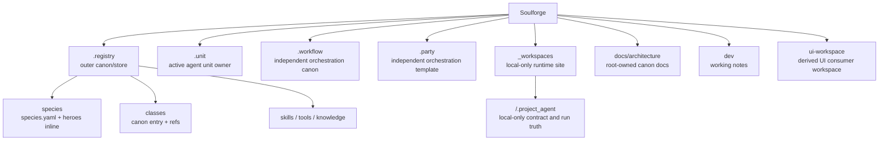

# Soulforge

Soulforge는 다섯 개의 canonical root 와 local-only runtime site 정책을 고정하는 설계 저장소다.
루트는 owner 경계, public/private tracking 원칙, 파생 UI 계약을 관리한다.
실제 프로젝트 현장 데이터와 private runtime truth 는 `_workspaces/<project_code>/` local-only materialization 에서 다룬다.

## 정본 5축

- `.registry`: outer canon/store
- `.unit`: active agent unit owner
- `.workflow`: orchestration canon
- `.party`: reusable orchestration template
- `_workspaces`: dungeon-like local-only runtime site

## 구조 개요도

## 상위 지도

- [`.registry/README.md`](.registry/README.md): `.registry` skeleton 과 owner 경계
- [`docs/architecture/foundation/TARGET_TREE.md`](docs/architecture/foundation/TARGET_TREE.md): 새 canonical target tree
- [`docs/architecture/foundation/DOCUMENT_OWNERSHIP.md`](docs/architecture/foundation/DOCUMENT_OWNERSHIP.md): 새 owner 기준 문서 소유 원칙
- [`_workspaces/README.md`](_workspaces/README.md): `_workspaces` local-only mount point 정책
- [`docs/architecture/workspace/WORKSPACE_PROJECT_MODEL.md`](docs/architecture/workspace/WORKSPACE_PROJECT_MODEL.md): `_workspaces/<project_code>/` 구조와 보안 경계
- [`docs/architecture/README.md`](docs/architecture/README.md): root-owned architecture 문서 색인
- [`ui-workspace/README.md`](ui-workspace/README.md): UI consumer workspace 개요

## 루트 정본 규칙

- 루트 `README.md` 는 상위 지도만 유지한다.
- `.registry` 는 outer canon/store owner 다.
- `.unit` 는 active agent unit owner 다.
- `.workflow` 와 `.party` 는 `.registry` 아래로 넣지 않는 독립 orchestration root 다.
- species canon 은 `species/<species_id>/species.yaml` 와 `heroes:` inline 모델을 사용한다.
- `_workspaces/<project_code>/` 실제 과제 내용은 public GitHub 에 올리지 않으며, 로컬 환경에서만 materialize 한다.
- tracked workspace sample 은 `_workspaces/` 아래가 아니라 `docs/architecture/workspace/examples/` 아래로만 둘 수 있다.
- `.agent/` 와 `.agent_class/` 는 transition bridge 다. 새 canonical entry 를 그 아래에 추가하지 않는다.
- `.run/` 루트는 새 정본에 포함하지 않는다.
- 상세 owner 규칙은 각 루트 `README.md` 와 `docs/architecture/**` 문서를 따른다.
