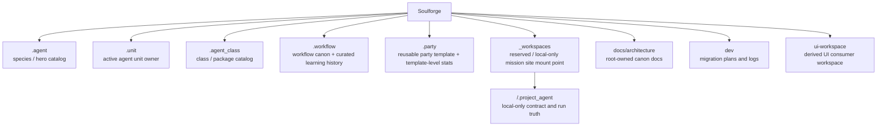

# Soulforge

Soulforge는 새 정본 vNext 구조를 문서로 고정하는 설계 저장소다.
루트는 여섯 축의 owner 경계와 public/private tracking 원칙만 관리한다.
실제 루트 materialization, validator refactor, fixture 정리는 별도 migration 단계에서 수행한다.

## 새 정본 6축

- `.agent`: species / hero catalog
- `.unit`: active agent unit owner
- `.agent_class`: class / package catalog
- `.workflow`: workflow canon + curated learning history
- `.party`: reusable party template + template-level stats
- `_workspaces`: reserved/local-only mission site mount point

## 구조 개요도

## 상위 지도

- [`docs/architecture/foundation/TARGET_TREE.md`](docs/architecture/foundation/TARGET_TREE.md): 새 정본 6축 target tree
- [`docs/architecture/foundation/DOCUMENT_OWNERSHIP.md`](docs/architecture/foundation/DOCUMENT_OWNERSHIP.md): 새 owner 기준 문서 소유 원칙
- [`_workspaces/README.md`](_workspaces/README.md): `_workspaces` local-only mount point 정책
- [`docs/architecture/workspace/WORKSPACE_PROJECT_MODEL.md`](docs/architecture/workspace/WORKSPACE_PROJECT_MODEL.md): `_workspaces/<project_code>/` 구조와 보안 경계
- [`dev/plan/2026-03-16_vnext_canon_migration_plan.md`](dev/plan/2026-03-16_vnext_canon_migration_plan.md): frozen decisions 와 migration phase
- [`docs/architecture/README.md`](docs/architecture/README.md): root-owned architecture 문서 색인
- [`ui-workspace/README.md`](ui-workspace/README.md): UI consumer workspace 개요

## 루트 정본 규칙

- 루트 `README.md` 는 상위 지도만 유지한다.
- `.agent` 는 더 이상 single active body owner 가 아니다.
- `.agent_class` 는 더 이상 canonical loadout root 나 workflow owner 가 아니다.
- `.run/` 루트는 새 정본에 포함하지 않는다.
- `_workspaces/<project_code>/` 실제 과제 내용은 public GitHub 에 올리지 않으며, 로컬 환경에서만 materialize 한다.
- `.unit`, `.workflow`, `.party` 의 실제 루트 생성과 owner-local README 작성은 후속 migration 범위다.
