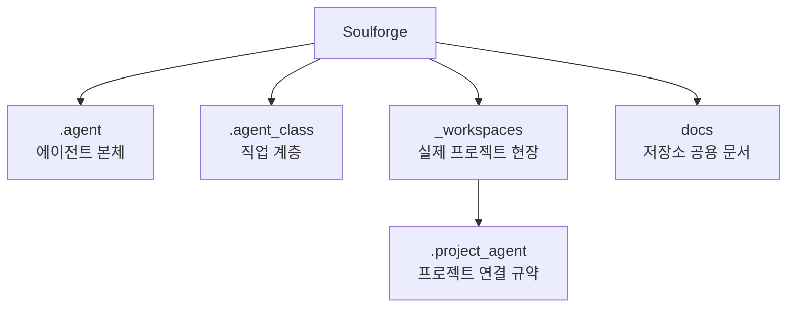

# Soulforge

Soulforge는 `.agent`, `.agent_class`, `_workspaces` 세 축으로 새 정본 구조를 정의하는 설계 저장소다.
현재 단계에서는 구현보다 문서와 메타 구조를 먼저 확정한다.

## 운영 원칙

- 루트 `README.md` 는 저장소 전체 개요와 상위 지도만 다룬다.
- 주요 폴더의 상세 설명은 각 폴더 바로 아래 `README.md` 를 정본으로 삼는다.
- 구조 원칙과 메타 규약은 `docs/architecture/` 또는 해당 owner 의 `docs/` 아래에서 관리한다.
- 폴더 내용이 바뀌면 같은 변경 안에서 해당 폴더 `README.md` 도 함께 최신화한다.

## 구조 개요도

## 상위 지도

- [`.agent/README.md`](.agent/README.md): 본체 계층 개요
- [`.agent_class/README.md`](.agent_class/README.md): 직업 계층 개요
- [`_workspaces/README.md`](_workspaces/README.md): 실제 프로젝트 현장 개요
- [`docs/README.md`](docs/README.md): 저장소 공용 문서 개요

## 핵심 경계

- `.agent` 는 몸이다. `memory` 는 여기에 둔다.
- `.agent_class` 는 직업이다. `skills`, `tools`, `workflows`, `knowledge` 는 여기에 둔다.
- `_workspaces` 는 실제 프로젝트 운영 현장이다. 프로젝트별 연결 규약은 각 프로젝트의 `.project_agent/` 에 둔다.
- 루트 `docs/` 는 저장소 공용 구조 문서만 둔다.

## 주요 문서

- [`docs/architecture/REPOSITORY_PURPOSE.md`](docs/architecture/REPOSITORY_PURPOSE.md)
- [`docs/architecture/TARGET_TREE.md`](docs/architecture/TARGET_TREE.md)
- [`docs/architecture/DOCUMENT_OWNERSHIP.md`](docs/architecture/DOCUMENT_OWNERSHIP.md)
- [`.agent/docs/architecture/AGENT_BODY_MODEL.md`](.agent/docs/architecture/AGENT_BODY_MODEL.md)
- [`.agent_class/docs/architecture/AGENT_CLASS_MODEL.md`](.agent_class/docs/architecture/AGENT_CLASS_MODEL.md)
- [`docs/architecture/WORKSPACE_PROJECT_MODEL.md`](docs/architecture/WORKSPACE_PROJECT_MODEL.md)
- [`docs/architecture/PROJECT_AGENT_MINIMUM_SCHEMA.md`](docs/architecture/PROJECT_AGENT_MINIMUM_SCHEMA.md)

## 상태

- Draft
- README 기반 설명 체계는 정리 중이다. 세부 스키마와 구현은 추후 정의 예정이다.
