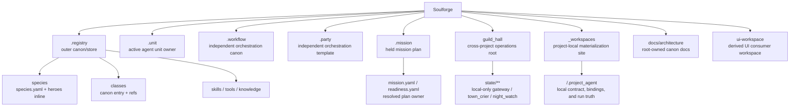

# Soulforge

Soulforge는 일곱 개의 canonical root 와 project-local materialization 정책을 고정하는 설계 저장소다.
루트는 owner 경계, public/private tracking 원칙, 파생 UI 계약을 관리한다.
현재 보유한 mission plan 은 `.mission/` 이 들고, cross-project 운영 ingress/state 는 `guild_hall/` 이 들고, 실제 프로젝트 현장 데이터와 private runtime truth 는 `_workspaces/<project_code>/` local-only materialization 에서 다룬다.

## 정본 7축

- `.registry`: outer canon/store
- `.unit`: active agent unit owner
- `.workflow`: orchestration canon
- `.party`: reusable orchestration template
- `.mission`: held mission plan owner
- `guild_hall`: cross-project operations root
- `_workspaces`: project-local materialization site

## 구조 개요도

## 상위 지도

- [`docs/architecture/foundation/VISION_AND_GOALS.md`](docs/architecture/foundation/VISION_AND_GOALS.md): Soulforge의 비전, 목표, 성공 조건
- [`.registry/README.md`](.registry/README.md): `.registry` skeleton 과 owner 경계
- [`docs/architecture/foundation/TARGET_TREE.md`](docs/architecture/foundation/TARGET_TREE.md): 새 canonical target tree
- [`docs/architecture/foundation/DOCUMENT_OWNERSHIP.md`](docs/architecture/foundation/DOCUMENT_OWNERSHIP.md): 새 owner 기준 문서 소유 원칙
- [`guild_hall/README.md`](guild_hall/README.md): cross-project 운영 루트와 state 경계
- [`docs/architecture/guild_hall/README.md`](docs/architecture/guild_hall/README.md): `guild_hall` owner 기준 문서 색인
- [`docs/architecture/bootstrap/README.md`](docs/architecture/bootstrap/README.md): clone 이후 설치, doctor, private state restore 가이드 묶음
- [`_workspaces/README.md`](_workspaces/README.md): `_workspaces` local-only mount point 정책
- [`docs/architecture/workspace/WORKSPACE_PROJECT_MODEL.md`](docs/architecture/workspace/WORKSPACE_PROJECT_MODEL.md): `_workspaces/<project_code>/` 구조와 보안 경계
- [`docs/architecture/workspace/INSTALLATION_MANUAL_V0.md`](docs/architecture/workspace/INSTALLATION_MANUAL_V0.md): 다른 PC 첫 설치와 gateway bootstrap 순서
- [`docs/architecture/workspace/MULTI_PC_DEVELOPMENT_V0.md`](docs/architecture/workspace/MULTI_PC_DEVELOPMENT_V0.md): 다른 PC clone, local state materialization, Git push/pull 운영 절차
- [`docs/architecture/workspace/PRIVATE_STATE_REPO_V0.md`](docs/architecture/workspace/PRIVATE_STATE_REPO_V0.md): 선택된 운영 기록만 별도 private Git 으로 mirror 하는 기준
- [`docs/architecture/workspace/GATEWAY_MAIL_FETCH_V0.md`](docs/architecture/workspace/GATEWAY_MAIL_FETCH_V0.md): gateway mailbox fetch capsule 과 local state 경계
- [`docs/architecture/workspace/GATEWAY_NOTIFY_V0.md`](docs/architecture/workspace/GATEWAY_NOTIFY_V0.md): Telegram outbound notify 최소 캡슐 경계
- [`docs/architecture/workspace/NOTIFY_MODEL_V0.md`](docs/architecture/workspace/NOTIFY_MODEL_V0.md): gateway local policy 와 mission notify toggle owner 경계
- [`docs/architecture/workspace/NOTEBOOKLM_MCP_SETUP_V0.md`](docs/architecture/workspace/NOTEBOOKLM_MCP_SETUP_V0.md): 다른 PC NotebookLM MCP 재설치 기준
- [`docs/architecture/README.md`](docs/architecture/README.md): root-owned architecture 문서 색인
- [`ui-workspace/README.md`](ui-workspace/README.md): UI consumer workspace 개요

## 루트 정본 규칙

- 루트 `README.md` 는 상위 지도만 유지한다.
- `.registry` 는 outer canon/store owner 다.
- `.unit` 는 active agent unit owner 다.
- `.workflow` 와 `.party` 는 `.registry` 아래로 넣지 않는 독립 orchestration root 다.
- `.mission` 은 held mission plan 과 readiness owner 다.
- `guild_hall` 은 `gateway`, `doctor`, `town_crier`, `night_watch`, `dungeon_assignment` 같은 cross-project 운영 owner 다.
- clone 된 PC bootstrap readiness 점검은 `npm run guild-hall:doctor` 를 canonical entrypoint 로 사용한다.
- cross-project 운영 명령 표면은 `guild-hall:*` 만 canonical 로 사용한다.
- `guild_hall/state/**` 는 local-only cross-project state 이며 public repo 에 올리지 않는다.
- species canon 은 `species/<species_id>/species.yaml` 와 `heroes:` inline 모델을 사용한다.
- `_workspaces/<project_code>/` 실제 과제 내용은 public GitHub 에 올리지 않으며, 로컬 환경에서만 materialize 한다.
- assigned execution plan 과 mission-level 배정 owner 는 `_workspaces/` 나 `.project_agent/` 가 아니라 `.mission/` 이 소유한다.
- tracked workspace sample 은 `_workspaces/` 아래가 아니라 `docs/architecture/workspace/examples/` 아래로만 둘 수 있다.
- `.run/` 루트는 새 정본에 포함하지 않는다.
- 상세 owner 규칙은 각 루트 `README.md` 와 `docs/architecture/**` 문서를 따른다.
