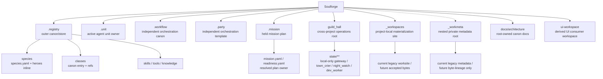

# Soulforge

## Soulforge 한 장 (2026-09-05)

- **한 줄**: 대장간은 그 몬스터에 맞춰 무기를 계속 진화시켜 무찌른다. 무기는 도구·봇·절차·지식이고, 쓰고 나면 쌓인다. Soulforge는 사람과 AI가 함께 업무를 수행하고, 그 업무의 출처·판단·결과·검증·책임을 연결해서 남기는 엔지니어링 업무 시스템이다. 모델과 실행기가 바뀌어도 이 연결은 남는다. 실행이 성공한 것과 업무가 완료된 것은 다른 사건이다(등록은 제출 영수증, 완료는 검토 → 사람 수락 → 지정 writer).
- **세 제품**: **World Tree** = ERP(업무·정본의 집), **Rune** = Engineering Engine(규칙과 검증), **Guild** = Agent Platform(사람과 봇의 조직). 항법은 [`docs/architecture/foundation/SOULFORGE_OWNER_MASTER_ARCHITECTURE_AND_RELEASE_MAP_V1.md`](docs/architecture/foundation/SOULFORGE_OWNER_MASTER_ARCHITECTURE_AND_RELEASE_MAP_V1.md)(M0–M16).
- **지금 위치**: **Canto I · The Kindling, Gram 0.1.x**. 대장간에 불을 지피는 시대이고, 벼리고 있는 보물은 Soulforge 자신이다. 시대·보물·부품 이름의 뜻과 유래는 [`docs/architecture/foundation/SHARED_GLOSSARY_V0.md`](docs/architecture/foundation/SHARED_GLOSSARY_V0.md) "세계 이름" 절.
- **대장간 이름 한 벌**: Ore(원천 자료) → Tributary(수집 lane) → Ingot(사본) → Heartwood(비공개 데이터 창고). Hearth(AI 모델·연산), Bellows(예약작업·자동화), Anvil(정본), Hammer(Task Engine), Guild, Quench(검증·검토 관문), Covenant(정본 승격 3규칙: W-AUTH · Canonical Empty-State Genesis · Legacy Freeze), Tongs(MCP 문), Vigil(포트 4192), Sigil(봇 SOUL 스냅샷), Reliquary(백업; 사본은 "N차 백업본"). 파일·폴더·스키마 식별자는 바꾸지 않고 표시명에만 쓴다.
- **지금 실제로 도는 것** (2026-09-05): Tributary 7줄기(메일·음성·PC 파일·Codex 작업맥락·Slack·Linear·Buzz; 주기는 lane별, Linear·Buzz는 15분 읽기 전용 — 두 lane의 health는 이 글 작성 시점에 `status: ok`로 관측). Vigil. Reliquary 안의 1차 백업본은 staged + 검증 완료(승격과 격리 복원은 사람 수락 대기). 수집(custody)은 백업이 아니다. 증거는 비공개 영수증에 있고 공개 문서는 digest만 인용한다.
- **어디서 도는가 — 저장소를 읽고 운영을 판단하지 말 것**: HPP 서버 팩은 0.1.7(current)·0.1.6(previous)이고, **Bellows는 `current` 포인터를 따라가지 않고 payload 경로를 판본까지 직접 pin한다**. 2026-09-05 작업 정의 판독 기준으로 판본은 **혼재**다: World Tree 서버(`Soulforge-MainNode-ERP`)는 `0.1.7`, 연속 수집·PC 활동·음성 ASR 세 작업은 아직 `0.1.6`을 pin한다. Vigil 두 작업(`상황판`·`감시면`)·사용량계·Hiworks 전달기·Codex 보존은 팩이 아니라 `install/source-lanes/operations-lane-v3`(source commit `e9c58e2a`, 2026-09-06 전환)에서, Linear·Buzz·Slack 수집은 각 `install/source-lanes/<lane>-v1`에서 돈다. secure-work 사이클 시험(`sfx`)은 등록된 예약작업이 없고 `install/source-lanes/secure-work-lane-v1`에서 Buzz DM 트리거(Hermes 스킬)로만 on-demand 실행된다. 예외 1건: NAS DR 백업 작업은 아직 legacy checkout에서 실행된다(정비 대상). 그래서 **`main` = 도는 것이 아니다**: main은 운영 lane이 담은 커밋보다 앞서 있을 수 있고, 무엇이 도는지의 정본은 각 lane의 `LANE_MANIFEST.md`가 기록한 source commit이다. lane 무결성은 `node guild_hall/deployment_pack/tools/build_source_lane.mjs --verify <lane 루트>`로 언제든 재확인한다. Tongs(MCP 문, 코드 `dev-erp-mcp`, 기본 4311)는 loopback 상시 기동 lane과 예약작업 `Soulforge-Tongs-Loopback-v1` 등록기(`ui-workspace/apps/dev-erp-mcp/ops/`)가 준비됐을 뿐 등록 전이고, 4311은 이 글 작성 시점에도 계속 아무것도 듣지 않는다.
- **읽는 순서**: 이 README → Master Map → 용어집 → `DOCUMENT_OWNERSHIP.md`·`TARGET_TREE.md` → plan 18(팀 파일럿 접속·출시 사다리) → plan 17(물리 구조) → plan 10(수집과 백업).
- **밖에서 읽을 때**: 저장소 전체를 외부 도구에 연결하지 말고 `npm run export:reviewer-packet`으로 만든 `docs/reviews/reviewer_packet_<date>.md` 하나를 준다(공개 안전 검사 통과본, 위 문서를 순서대로 이어 붙인 것). 비공개 저장소(`_workmeta`, `private-state`)는 밖에서 보이지 않는 것이 맞다. 외부 검토 결과의 대응표는 [`docs/reviews/`](docs/reviews/README.md)에 둔다.

Soulforge는 일곱 개의 canonical root 와 project-local materialization 정책을 고정하는 설계 저장소다.
루트는 owner 경계, public/private tracking 원칙, 파생 UI 계약을 관리한다.
현재 보유한 mission plan 은 `.mission/` 이 들고, cross-project 운영 ingress/state 는 `guild_hall/` 이 든다. current legacy project worksite와 companion metadata는 reference-in-place `_workspaces/<project_code>/`, `_workmeta/<project_code>/`에 남아 있으며 actual Legacy Freeze 전에는 기존 writer가 남아 있을 수 있다.
future target stores는 별도 greenfield canonical plane이다. target `_workspaces`는 Human/project authority가 accepted 한 exact canonical bytes만, target `_workmeta`는 그 byte-lineage만 받는다. target에는 run/worklog/battle/task/collector/analytics history를 새로 쓰지 않는다. 여러 PC의 current legacy shared view와 PC-local scratch/cache 정책은 workspace contract가 소유한다.

## 정본 7축

- `.registry`: outer canon/store
- `.unit`: active agent unit owner
- `.workflow`: orchestration canon
- `.party`: reusable orchestration template
- `.mission`: held mission plan owner
- `guild_hall`: cross-project operations root
- `_workspaces`: project-local materialization site

## 구조 개요도

```mermaid
flowchart TD
  S["Soulforge"] --> R[".registry<br/>outer canon/store"]
  R --> RS["species<br/>species.yaml + heroes inline"]
  R --> RC["classes<br/>canon entry + refs"]
  R --> RK["skills / tools / knowledge"]
  S --> U[".unit<br/>active agent unit owner"]
  S --> W[".workflow<br/>independent orchestration canon"]
  S --> PT[".party<br/>independent orchestration template"]
  S --> MI[".mission<br/>held mission plan"]
  S --> GH["guild_hall<br/>cross-project operations root"]
  S --> M["_workspaces<br/>project-local materialization site"]
  S -.-> WM["_workmeta<br/>nested private metadata root"]
  S --> D["docs/architecture<br/>root-owned canon docs"]
  S --> UI["ui-workspace<br/>derived UI consumer workspace"]
  MI --> MP["mission.yaml / readiness.yaml<br/>resolved plan owner"]
  GH --> GHS["state/**<br/>local-only gateway / town_crier / night_watch / dev_worker"]
  M --> PR["<project_code><br/>current legacy worksite / future accepted bytes"]
  WM --> PA["<project_code><br/>current legacy metadata / future byte-lineage only"]
```

## 상위 지도

- [`docs/architecture/foundation/PROJECT_MAP_V0.md`](docs/architecture/foundation/PROJECT_MAP_V0.md): 멈춘 뒤 다시 잡기 위한 한 장짜리 owner/폴더/게임 루프 지도
- [`docs/architecture/foundation/DEVELOPMENT_ROADMAP_V0.md`](docs/architecture/foundation/DEVELOPMENT_ROADMAP_V0.md): 큰 개발 방향과 현재 우선순위의 단일 정본
- [`docs/architecture/foundation/VISION_AND_GOALS.md`](docs/architecture/foundation/VISION_AND_GOALS.md): Soulforge의 비전, 목표, 성공 조건
- [`docs/architecture/foundation/SOULFORGE_WORLD_BIBLE_V0.md`](docs/architecture/foundation/SOULFORGE_WORLD_BIBLE_V0.md): Soulforge의 판타지 세계관·철학·영역·세력·명명 문법과 전체 균형검토 Owner 초안
- [`docs/architecture/foundation/SOULFORGE_ENGINEERING_OS_PRODUCT_FAMILY_REBASELINE_V0.md`](docs/architecture/foundation/SOULFORGE_ENGINEERING_OS_PRODUCT_FAMILY_REBASELINE_V0.md): `Soulforge Engineering OS` 전체 이름과 ERP·Engineering Engine·Agent Platform 제품군 재기준 Owner 결정 초안
- [`.registry/README.md`](.registry/README.md): `.registry` skeleton 과 owner 경계
- [`docs/architecture/foundation/TARGET_TREE.md`](docs/architecture/foundation/TARGET_TREE.md): 새 canonical target tree
- [`docs/architecture/foundation/DOCUMENT_OWNERSHIP.md`](docs/architecture/foundation/DOCUMENT_OWNERSHIP.md): 새 owner 기준 문서 소유 원칙
- [`docs/architecture/foundation/AGENT_EXECUTION_CONTRACT_V0.md`](docs/architecture/foundation/AGENT_EXECUTION_CONTRACT_V0.md): AI agent 의 가정 노출, 최소 변경, scoped edit, 검증 기준, post-development review gate 계약
- [`docs/architecture/foundation/SHARED_GLOSSARY_V0.md`](docs/architecture/foundation/SHARED_GLOSSARY_V0.md): owner 와 agent 가 공유하는 개발, 검증, 정본, RAG 용어집
- [`docs/architecture/foundation/POST_DEVELOPMENT_REVIEW_PACKET_TEMPLATE_V0.yaml`](docs/architecture/foundation/POST_DEVELOPMENT_REVIEW_PACKET_TEMPLATE_V0.yaml): post-development review gate 결과 packet shape
- [`docs/architecture/foundation/ONTOLOGY_MODEL_V0.md`](docs/architecture/foundation/ONTOLOGY_MODEL_V0.md): Soulforge 개체/관계 모델과 ontology-style 저장 위치 규칙
- [`docs/architecture/foundation/ONTOLOGY_REVIEW_MANUAL_V0.md`](docs/architecture/foundation/ONTOLOGY_REVIEW_MANUAL_V0.md): ontology review 트리거, carry-forward, guild_master 상기 규칙
- [`guild_hall/README.md`](guild_hall/README.md): cross-project 운영 루트와 state 경계
- [`docs/architecture/guild_hall/README.md`](docs/architecture/guild_hall/README.md): `guild_hall` owner 기준 문서 색인
- [`docs/architecture/guild_hall/SOULFORGE_ACTIVITY_LOG_V0.md`](docs/architecture/guild_hall/SOULFORGE_ACTIVITY_LOG_V0.md): Soulforge 전체 활동 로그 surface 와 recent-context 읽기 규칙
- [`docs/architecture/guild_hall/ONTOLOGY_CANON_OPERATING_POLICY_V0.md`](docs/architecture/guild_hall/ONTOLOGY_CANON_OPERATING_POLICY_V0.md): Google Drive ontology canon package, `.registry/knowledge` 실행 투영, NotebookLM 책장, NAS 재해복구 권한 지도
- [`docs/architecture/guild_hall/AI_USAGE_METER_V1.md`](docs/architecture/guild_hall/AI_USAGE_METER_V1.md): Soulforge 전체 Codex 토큰·크레딧 계측, 업무 귀속, 개인정보 경계와 팀원·MCP 확장 계약
- [`docs/architecture/guild_hall/NIGHT_WATCH_AUTOMATION_V0.md`](docs/architecture/guild_hall/NIGHT_WATCH_AUTOMATION_V0.md): 길마 새벽 점검 자동화 후보와 Codex app local automation 경계
- [`docs/architecture/guild_hall/DEV_WORKER_AUTOMATION_V0.md`](docs/architecture/guild_hall/DEV_WORKER_AUTOMATION_V0.md): task packet 을 받아 검증 가능한 branch 를 만드는 dev worker 자동화 경계
- [`docs/architecture/bootstrap/README.md`](docs/architecture/bootstrap/README.md): clone 이후 설치, doctor, private state restore 가이드 묶음
- [`CHANGELOG.md`](CHANGELOG.md): public repo revision note 와 patch note
- [`docs/architecture/foundation/CHANGELOG_POLICY_V0.md`](docs/architecture/foundation/CHANGELOG_POLICY_V0.md): public/private changelog 작성 규칙
- [`docs/architecture/bootstrap/BOOTSTRAP_PROFILES_V0.md`](docs/architecture/bootstrap/BOOTSTRAP_PROFILES_V0.md): `public-only`, `operator`, `owner-with-state` bootstrap 프로필
- [`docs/architecture/bootstrap/UPDATE_MANUAL_V0.md`](docs/architecture/bootstrap/UPDATE_MANUAL_V0.md): 설치 후 GitHub 최신 상태 확인, public/private pull, skill sync, doctor 재점검 절차
- [`docs/architecture/bootstrap/OWNER_HANDOFF_CHECKLIST_V0.md`](docs/architecture/bootstrap/OWNER_HANDOFF_CHECKLIST_V0.md): 회사/집 사이 owner handoff 체크리스트와 시작 전 `doctor --remote` 절차
- [`CONTRIBUTING.md`](CONTRIBUTING.md): public repo 변경 전 기본 validate/done:check 와 문서 동기화 규칙
- [`SECURITY.md`](SECURITY.md): 공개 저장소 보안 경계와 비공개 제보 원칙
- [`_workspaces/README.md`](_workspaces/README.md): `_workspaces` local-only mount point 정책
- [`docs/architecture/workspace/WORKSPACE_PROJECT_MODEL.md`](docs/architecture/workspace/WORKSPACE_PROJECT_MODEL.md): `_workspaces/<project_code>/` 구조와 보안 경계
- [`docs/architecture/workspace/WORKSPACE_PATH_IDENTITY_POLICY_V0.md`](docs/architecture/workspace/WORKSPACE_PATH_IDENTITY_POLICY_V0.md): `_workspaces/<name>` shared view 와 PC-local namespace 경계
- [`docs/architecture/workspace/INSTALLATION_MANUAL_V0.md`](docs/architecture/workspace/INSTALLATION_MANUAL_V0.md): 다른 PC 첫 설치와 gateway bootstrap 순서
- [`docs/architecture/workspace/MULTI_PC_DEVELOPMENT_V0.md`](docs/architecture/workspace/MULTI_PC_DEVELOPMENT_V0.md): 다른 PC clone, local state materialization, node role, Git push/pull 운영 절차
- [`docs/architecture/workspace/PRIVATE_STATE_REPO_V0.md`](docs/architecture/workspace/PRIVATE_STATE_REPO_V0.md): 선택된 운영 기록만 별도 private Git 으로 mirror 하는 기준
- [`docs/architecture/workspace/GATEWAY_MAIL_FETCH_V0.md`](docs/architecture/workspace/GATEWAY_MAIL_FETCH_V0.md): gateway mailbox fetch capsule 과 local state 경계
- [`docs/architecture/workspace/GATEWAY_NOTIFY_V0.md`](docs/architecture/workspace/GATEWAY_NOTIFY_V0.md): Telegram outbound notify 최소 캡슐 경계
- [`docs/architecture/workspace/NOTIFY_MODEL_V0.md`](docs/architecture/workspace/NOTIFY_MODEL_V0.md): gateway local policy 와 mission notify toggle owner 경계
- [`docs/architecture/workspace/NOTEBOOKLM_MCP_SETUP_V0.md`](docs/architecture/workspace/NOTEBOOKLM_MCP_SETUP_V0.md): 다른 PC NotebookLM MCP 재설치 기준
- [`docs/architecture/README.md`](docs/architecture/README.md): root-owned architecture 문서 색인
- [`ui-workspace/README.md`](ui-workspace/README.md): UI consumer workspace 개요

## 루트 정본 규칙

- 루트 `README.md` 는 상위 지도만 유지한다.
- `.registry` 는 outer canon/store owner 다.
- Soulforge 핵심 개념은 ontology-style 로 읽되, 규칙은 public foundation 문서에 둔다. `ontology canon`은 관계/의미 model의 정본이고 `canonical byte/revision`은 authority가 exact artifact bytes를 수락한 상태이므로 서로 다르다. current legacy project-local ontology instance는 existing metadata contract가 소유하며 future target `_workmeta`에는 canonical byte-lineage만 둔다.
- `.unit` 는 active agent unit owner 다.
- `.workflow` 와 `.party` 는 `.registry` 아래로 넣지 않는 독립 orchestration root 다.
- `.mission` 은 held mission plan 과 readiness owner 다.
- `guild_hall` 은 `gateway`, `doctor`, `town_crier`, `night_watch`, `dev_worker`, `dungeon_assignment` 같은 cross-project 운영 owner 다.
- clone 된 PC bootstrap readiness 점검은 `npm run guild-hall:doctor` 를 canonical entrypoint 로 사용한다.
- root canon 과 public-safe harness 검증은 `npm run validate`, `npm run done:check` 를 canonical entrypoint 로 사용한다. Windows PowerShell 에서는 `npm.ps1` execution policy 를 피하기 위해 같은 entrypoint 를 `npm.cmd run validate`, `npm.cmd run done:check` 로 실행한다.
- cross-project 운영 명령 표면은 `guild-hall:*` 만 canonical 로 사용한다.
- `guild_hall/state/**` 는 local-only cross-project state 이며 public repo 에 올리지 않는다.
- 기능 코드, 구조 문서, public-safe sample 변경은 public repo 에 commit/push 한다.
- 보호 대상 업무 데이터는 current legacy project-local metadata 면 Soulforge root 아래 nested `_workmeta/` repo 에, cross-project continuity data 면 nested `private-state/` repo 에만 commit/push 한다. future target canonical byte-lineage는 W-AUTH, Genesis, applicable Legacy Freeze, sole-writer route가 adopted 되기 전까지 만들지 않는다.
- species canon 은 `species/<species_id>/species.yaml` 와 `heroes:` inline 모델을 사용한다.
- current legacy `_workspaces/<project_code>/` 실제 과제 내용은 public GitHub 에 올리지 않으며, 로컬 환경에서만 materialize 한다. future target workspace에는 accepted canonical bytes만 atomic byte+lineage publication으로 들어간다.
- current legacy `_workmeta/<project_code>/` 는 Soulforge root 아래 nested private repo 이다. future target `_workmeta`는 canonical byte-lineage metadata 전용이며 operation history의 새 writer가 아니다.
- assigned execution plan 과 mission-level 배정 owner 는 `_workspaces/` 나 `_workmeta/` 가 아니라 `.mission/` 이 소유한다.
- tracked workspace sample 은 `_workspaces/` 아래가 아니라 `docs/architecture/workspace/examples/` 아래로만 둘 수 있다.
- `.run/` 루트는 새 정본에 포함하지 않는다.
- 상세 owner 규칙은 각 루트 `README.md` 와 `docs/architecture/**` 문서를 따른다.
