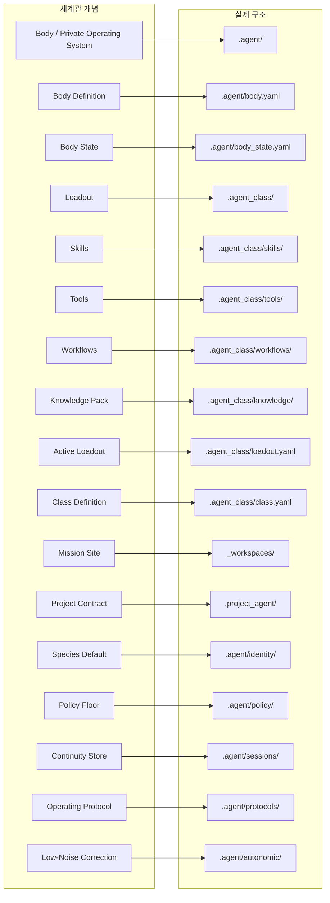

# 에이전트 세계관 모델

## 목적

- 이 문서는 Soulforge의 설명용 세계관 모델과 실제 경로 구조의 대응 관계를 정리한다.
- 은유가 아니라 owner 경계를 더 명확히 읽기 위한 설명 문서로 유지한다.

## 범위

- body, loadout, mission site, project contract 의 대응 관계만 다룬다.
- 실제 shared team 구조나 세부 runtime 스키마는 범위 밖이다.

## 포함 대상

- `.agent`, `.agent_class`, `_workspaces` 의 세계관 대응
- species, policy floor, continuity, protocol, quality correction 의 배치
- `.project_agent/` 의 연결 의미

## 제외 대상

- 세부 class module 계약
- workspace validator 세부 규칙
- `_teams/shared/` 실제 폴더 구조

## 대응 관계도

## 대응표

| 세계관 개념 | 실제 구조 | 의미 |
| --- | --- | --- |
| Body / Private Operating System | `.agent/` | durable agent unit 의 body-owned operating system |
| Body Definition | `.agent/body.yaml` | body 정적 정의 |
| Body State | `.agent/body_state.yaml` | body 현재 상태 스냅샷 |
| Loadout | `.agent_class/` | 현재 환경에서 장착된 구성 계층 |
| Skills | `.agent_class/skills/` | 설치된 행동 패턴 |
| Tools | `.agent_class/tools/` | 외부 장비와 연결 계층 |
| Workflows | `.agent_class/workflows/` | 절차와 운용 교범 |
| Knowledge Pack | `.agent_class/knowledge/` | 설치형 지식 팩 |
| Active Loadout | `.agent_class/loadout.yaml` | 현재 장착 상태표 |
| Class Definition | `.agent_class/class.yaml` | class 정적 정의 |
| Mission Site | `_workspaces/` | 실제 프로젝트 운영 현장 |
| Project Contract | `.project_agent/` | 현장과 body/class 를 잇는 연결 규약 |
| Species Default | `.agent/identity/` | durable species 와 identity baseline |
| Policy Floor | `.agent/policy/` | species-free floor |
| Continuity Store | `.agent/sessions/` | transcript 가 아닌 continuity 저장소 |
| Operating Protocol | `.agent/protocols/` | body 공통 운영 프로토콜 |
| Low-Noise Correction | `.agent/autonomic/` | 저소음 품질 보정 루틴 |

## 핵심 구분

### 몸과 직업

- `.agent` 는 body-owned private operating system 이다.
- `body.yaml` 은 몸의 정적 정의다.
- `body_state.yaml` 은 몸의 현재 상태 스냅샷이다.
- `.agent_class` 는 직업 일반론보다 loadout 계층이다.
- body 는 지속되고, loadout 은 교체 가능하다.

### 기억과 지식

- `memory` 는 몸이 축적한 장기 기억이다.
- `knowledge` 는 class 에 설치되는 지식 팩이다.
- 지식 팩이 바뀌어도 기억은 몸에 남는다.

### 스킬과 도구

- `skills` 는 익힌 행동 패턴이다.
- `tools` 는 외부 장비와 연결 수단이다.
- `workflows` 는 수행 순서와 운용 규범이다.

### 직업 정의와 장착 상태

- `class.yaml` 은 class 의 정적 정의다.
- `loadout.yaml` 은 지금 무엇이 장착되어 있는지 보여주는 상태표다.
- 같은 class 정의라도 loadout 은 상황에 따라 달라질 수 있다.

### 본체 정의와 본체 상태

- `body.yaml` 은 body 섹션의 기준 경로를 설명한다.
- `body_state.yaml` 은 실제 `.agent/` 구조와 동기화한 상태를 설명한다.
- 둘 다 설명용 은유보다 실제 경로 구조를 우선해 읽는다.

### 프로젝트 현장과 연결 규약

- `_workspaces/` 는 실제 프로젝트 파일과 결과물이 존재하는 mission site 다.
- `.project_agent/` 는 해당 현장에서 어떤 body 와 class 가 어떻게 연결되는지 기록하는 계약층이다.
- project 전용 계획과 로그는 현장 안에서 소유하는 것이 원칙이다.

### species, floor, continuity

- species 는 `identity/` 의 durable default 만 담당한다.
- `policy/` 는 species-free floor 로서 어떤 species 나 loadout 보다 앞선다.
- `sessions/` 는 transcript archive 가 아니라 continuity 저장소다.
- `autonomic/` 은 저소음 품질 보정 루틴이다.
- `protocols/` 는 위 기관들을 잇는 body 공통 operating contract 다.

## 운영 규칙

1. 은유가 경로 구조를 덮어쓰지 않는다.
2. 실제 소유권은 폴더 계층을 따른다.
3. 본체, 직업, 프로젝트 현장의 책임은 혼합하지 않는다.
4. 문서도 자신이 설명하는 주체의 소유 위치를 따른다.

## 미래 확장 방향

- 협업 shared 세계관은 `.agent` 안이 아니라 루트 `_teams/shared/` 에서 확장한다.
- body runtime layer 는 현재 `runtime/` 경로를 사용한다.
- body export 는 독립 세계관 기관으로 두지 않는다.
