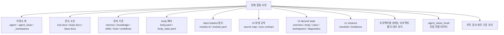

# 현재 결정 사항

## 결정 구조도

- Soulforge를 저장소명과 아키텍처명으로 사용한다.
- 저장소는 `.agent`, `.agent_class`, `_workspaces` 를 중심으로 구성한다.
- 루트 `docs/` 는 저장소 전체 설명만 소유한다.
- 메모리는 본체 계층에 속한다.
- 지식은 클래스 계층에 속한다.
- 스킬과 도구는 분리된 모델로 다룬다.
- 워크플로우는 운영 규범으로 취급한다.
- `.agent` 는 `body.yaml` 과 `body_state.yaml` 의 2파일 메타 체계를 사용한다.
- `body_state.yaml` 은 저장소 추적 대상이지만 재생성 가능한 파생 상태 파일로 본다.
- `.agent_class/loadout.yaml` 의 `equipped.*` 는 path 가 아니라 module id 목록이다.
- `.agent_class` 의 installed module 은 `module.yaml` manifest 기준으로만 인정한다.
- 2차에서는 class installed/loadout resolve 규칙을 `MODULE_REFERENCE_CONTRACT.md` 와 local CLI 로 닫는다.
- 3차에서는 workspace project 상태를 `bound`, `unbound`, `invalid` 로 분류한다.
- `.project_agent` 공통 resolve 규칙은 root owner 문서 `PROJECT_AGENT_RESOLVE_CONTRACT.md` 로 관리한다.
- `unbound` 프로젝트는 허용하고, `invalid` 프로젝트만 FAIL 로 본다.
- UI는 정본이 아니라 메타와 구조에서 파생되는 결과다.
- 4차에서는 `derive-ui-state` 와 `UI_DERIVED_STATE_CONTRACT.md` 로 `Derive` 단계를 실제 구현한다.
- 5차에서는 `.agent_class/tools/local_cli/ui_viewer/ui_viewer.py` 로 `Render` 단계를 read-only prototype 으로 도입한다.
- 6차에서는 실제 library roots 와 `_workspaces/company/` 아래에 첫 reference sample 1세트를 도입한다.
- 7차에서는 `_workspaces/company/sample_invalid_project/` 로 첫 invalid reference sample 1세트를 도입한다.
- 8차에서는 `_workspaces/personal/sample_unbound_project/` 로 첫 unbound reference sample 1세트를 도입한다.
- 10차에서는 `V1_CLOSEOUT_CHECKLIST.md` 와 `KNOWN_LIMITATIONS.md` 를 도입해 v1 종료 기준과 운영상 남는 제한을 root owner 문서로 고정한다.
- renderer 는 정본 파일 직접 소비자가 아니라 derived state 소비자로 본다.
- derived state top-level 구조는 `ui`, `overview`, `body`, `class`, `workspaces`, `diagnostics` 로 고정한다.
- UI source map 과 UI sync contract 를 루트 문서 세트에 포함한다.
- UI derived state contract 를 루트 문서 세트에 포함한다.
- reference sample 전략은 fixture bundle 이 아니라 repo-tracked `bound`, `invalid`, `unbound` baseline 3종으로 닫는다.
- 프로젝트별 상태는 프로젝트 폴더 내부에 유지한다.
- body 운영 문서는 `.agent/docs/` 아래에 둔다.
- `.agent_class` 아래 `_local/` 은 무시되는 로컬 전용 데이터를 위해 남겨 둔다.
- class 운영 문서는 `.agent_class/docs/` 아래에 둔다.
- 루트 문서 세트는 `REPOSITORY_PURPOSE`, `AGENT_WORLD_MODEL`, `WORKSPACE_PROJECT_MODEL`, `PROJECT_AGENT_MINIMUM_SCHEMA`, `PROJECT_AGENT_RESOLVE_CONTRACT`, `TARGET_TREE`, `DOCUMENT_OWNERSHIP`, `CURRENT_DECISIONS`, `UI_SOURCE_MAP`, `UI_SYNC_CONTRACT`, `UI_DERIVED_STATE_CONTRACT`, `V1_CLOSEOUT_CHECKLIST`, `KNOWN_LIMITATIONS`, `MIGRATION_REFERENCE` 를 기준으로 유지한다.
