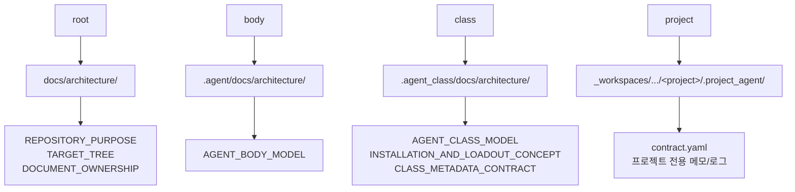

# 문서 소유 원칙

## 목적

이 문서는 Soulforge에서 문서가 어느 계층에 소유되어야 하는지 저장소 전체 관점에서 정리한다.

## owner 관계도



## 기본 원칙

- 루트 `docs/` 는 저장소 전체 구조와 루트 설명만 둔다.
- body 문서는 `.agent/docs/` 아래에 둔다.
- class 문서는 `.agent_class/docs/` 아래에 둔다.
- project 전용 문서는 각 프로젝트의 `.project_agent/` 아래에 둔다.
- 구조, 계층, 경로 배치를 설명하는 문서는 경로와 폴더를 텍스트로만 나열하지 않는다.
- 실제 구조 설명은 별도 그림 문서를 만들기보다 해당 문서 안에 Markdown/Mermaid 기반의 `구조 개요도` 또는 `관계도` 를 직접 포함하고, 실행 순서가 핵심이면 `흐름도` 를 추가한다.

## owner 기준 배치

| owner | 기본 위치 | 예시 문서 |
| --- | --- | --- |
| root | `docs/architecture/` | `REPOSITORY_PURPOSE`, `TARGET_TREE`, `DOCUMENT_OWNERSHIP` |
| body | `.agent/docs/architecture/` | `AGENT_BODY_MODEL` |
| class | `.agent_class/docs/architecture/` | `AGENT_CLASS_MODEL`, `INSTALLATION_AND_LOADOUT_CONCEPT`, `CLASS_METADATA_CONTRACT` |
| project | `_workspaces/.../<project>/.project_agent/` | `contract.yaml`, 프로젝트 전용 메모/로그 |

## `.agent_class/docs/` 운영 구조

```text
.agent_class/docs/
├── architecture/
├── plans/
├── devlog/
└── prompts/
```

## 폴더별 역할

- `architecture/` = class 구조 설명, 메타 규약, 소유 원칙
- `plans/` = 아직 수행 전인 계획, 수정 계획, relocation 계획
- `devlog/` = 실제 수행 결과, 변경 이유, 남은 리스크
- `prompts/` = 반복 사용 가능한 class 작업 프롬프트

## 적용 규칙

1. root 문서에는 root 설명만 남긴다.
2. body 전용 문서는 `.agent/docs/` 아래에서 정본으로 관리한다.
3. class 전용 문서는 `.agent_class/docs/` 아래에서 정본으로 관리한다.
4. root `docs/` 에 owner 전용 문서가 남아 있으면 relocation 계획 또는 즉시 정리 대상으로 본다.
5. project 전용 변경 계획과 로그는 class 문서 공간으로 끌어오지 않는다.
