# 문서 소유 원칙

## 목적

- 이 문서는 Soulforge에서 어떤 문서가 어느 폴더 설명의 정본인지 저장소 전체 관점에서 고정한다.
- 루트 문서와 owner-local 문서의 역할을 분리해 중복 설명을 줄인다.

## owner 관계도

```mermaid
flowchart TD
  Root["root-owned docs"] --> R1["README.md"]
  Root --> R2["docs/architecture/"]
  Body["body-owned docs"] --> B1[".agent/README.md"]
  Body --> B2[".agent/docs/architecture/"]
  Body --> B3[".agent/**/README.md"]
  Class["class-owned docs"] --> C1[".agent_class/README.md"]
  Class --> C2[".agent_class/docs/architecture/"]
  Class --> C3[".agent_class/**/README.md"]
  Work["workspace-owned docs"] --> W1["_workspaces/README.md"]
  Work --> W2["_workspaces/**/README.md"]
  Project["project-owned docs"] --> P1["_workspaces/.../<project>/.project_agent/"]
```

## 기본 원칙

- 루트 `README.md` 는 저장소 전체 상위 지도만 다룬다.
- 각 폴더 바로 아래 `README.md` 는 그 폴더 개요의 정본이다.
- `.agent` 상세 운영과 구조 의미의 정본은 `.agent/docs/architecture/*` 와 각 `.agent/**/README.md` 다.
- root `docs/architecture/` 는 저장소 전체 구조, root-owned 계약, owner 경계만 다룬다.
- owner-local 문서 본문을 root 문서에 장문으로 복제하지 않는다.

## 폴더별 정본 문서

| 대상 폴더/범위 | 상위 지도 정본 | 상세 정본 |
| --- | --- | --- |
| 저장소 루트 `./` | `README.md` | `docs/architecture/REPOSITORY_PURPOSE.md`, `docs/architecture/TARGET_TREE.md`, `docs/architecture/DOCUMENT_OWNERSHIP.md` |
| `.agent/` | `.agent/README.md` | `.agent/docs/architecture/AGENT_BODY_MODEL.md`, `.agent/docs/architecture/BODY_METADATA_CONTRACT.md` |
| `.agent/identity/` | `.agent/identity/README.md` | `.agent/identity/README.md` |
| `.agent/engine/` | `.agent/engine/README.md` | `.agent/engine/README.md` |
| `.agent/memory/` | `.agent/memory/README.md` | `.agent/memory/README.md` |
| `.agent/sessions/` | `.agent/sessions/README.md` | `.agent/sessions/README.md` |
| `.agent/communication/` | `.agent/communication/README.md` | `.agent/communication/README.md` |
| `.agent/protocols/` | `.agent/protocols/README.md` | `.agent/protocols/README.md` |
| `.agent/policy/` | `.agent/policy/README.md` | `.agent/policy/README.md` |
| `.agent/registry/` | `.agent/registry/README.md` | `.agent/registry/README.md` |
| `.agent/artifacts/` | `.agent/artifacts/README.md` | `.agent/artifacts/README.md` |
| `.agent/autonomic/` | `.agent/autonomic/README.md` | `.agent/autonomic/README.md` |
| `.agent/docs/` | `.agent/docs/README.md` | `.agent/docs/README.md` |
| `.agent/docs/architecture/` | `.agent/docs/architecture/README.md` | `.agent/docs/architecture/AGENT_BODY_MODEL.md`, `.agent/docs/architecture/BODY_METADATA_CONTRACT.md` |
| `.agent_class/` | `.agent_class/README.md` | `.agent_class/docs/architecture/AGENT_CLASS_MODEL.md`, `.agent_class/docs/architecture/MODULE_REFERENCE_CONTRACT.md` |
| `.agent_class/docs/architecture/` | `.agent_class/docs/architecture/README.md` 가 있으면 그 문서, 없으면 `.agent_class/docs/README.md` | 해당 architecture 문서 세트 |
| `_workspaces/` | `_workspaces/README.md` | `_workspaces/README.md` |
| `_workspaces/company/` | `_workspaces/company/README.md` | 각 project 로컬 문서와 `.project_agent/` |
| `_workspaces/personal/` | `_workspaces/personal/README.md` | 각 project 로컬 문서와 `.project_agent/` |
| `_workspaces/.../<project>/.project_agent/` | 해당 프로젝트 문서 | `contract.yaml` 과 같은 project-owned 계약 파일 |
| `docs/architecture/` | `docs/README.md` | root-owned architecture 문서 세트 |
| `ui/` | `ui/README.md` | `ui` 하위 로컬 문서 |
| `dev/` | `dev/README.md` | `dev/plan/`, `dev/log/` 하위 문서 |

## 적용 규칙

1. 루트 `README.md` 에는 저장소 전체 설명과 상위 링크만 남긴다.
2. `.agent` 상세 운영은 루트 문서가 아니라 `.agent/docs/architecture/*` 와 각 로컬 `README.md` 를 정본으로 삼는다.
3. `TARGET_TREE.md` 는 구조 배치의 정본이고, 폴더 운영 규칙 본문은 각 owner-local 문서가 정본이다.
4. 폴더에 파일, 하위 폴더, 책임, 운영 방식이 추가·변경·삭제되면 같은 변경 안에서 그 폴더의 정본 문서를 함께 갱신한다.
5. root `docs/architecture/` 에 owner-local 세부 운영을 장문으로 중복하지 않는다.
