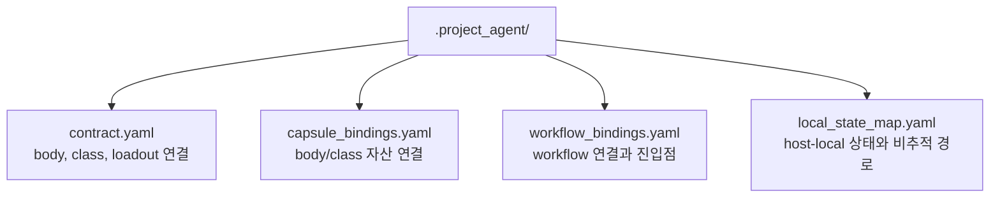

# `.project_agent` 최소 스키마

## 목적

이 문서는 각 프로젝트 폴더 아래에 둘 수 있는 `.project_agent/` 의 최소 계약을 정의한다.

현재 단계의 목표는 구현이 아니라 구조 정본 확정이다.
따라서 이 문서는 네 개의 핵심 파일이 무엇을 설명해야 하는지와 최소 필드를 먼저 고정한다.
상세 resolve/validate 규칙은 root owner 문서 `docs/architecture/PROJECT_AGENT_RESOLVE_CONTRACT.md` 로 위임한다.

## 구조 개요도



## 최소 파일 세트

```text
.project_agent/
├── contract.yaml
├── capsule_bindings.yaml
├── workflow_bindings.yaml
└── local_state_map.yaml
```

이 문서는 최소 파일 세트와 최소 필드만 다룬다.
`bound`, `unbound`, `invalid` 상태 분류와 local CLI resolve/validate 규칙은 `PROJECT_AGENT_RESOLVE_CONTRACT.md` 를 따른다.

## 파일별 역할

| 파일 | 역할 |
| --- | --- |
| `contract.yaml` | 이 프로젝트가 어떤 body, class, loadout 과 연결되는지 정의 |
| `capsule_bindings.yaml` | body/class 자산이 프로젝트 내부 어디에 연결되는지 정의 |
| `workflow_bindings.yaml` | 프로젝트에서 활성화할 workflow 연결과 진입점을 정의 |
| `local_state_map.yaml` | host-local 상태와 비추적 경로를 명시 |

## 1. `contract.yaml`

### 최소 역할

- 프로젝트 식별
- workspace 종류 식별
- 연결할 body 와 class 식별
- 기본 loadout 프로필 식별

### 최소 필드

- `project_id`
- `project_name`
- `workspace_kind`
- `body_ref`
- `class_ref`
- `default_loadout`

### 예시

```yaml
project_id: company.sample
project_name: Sample Project
workspace_kind: company
body_ref: .agent
class_ref: .agent_class
default_loadout: soulforge.profile.default
```

예시의 `default_loadout` 은 현재 단계에서는 `.agent_class/loadout.yaml.active_profile` 과 비교되는 기본 profile id 다.

## 2. `capsule_bindings.yaml`

### 최소 역할

- class 또는 body 자산이 프로젝트 안에서 어떤 이름과 경로로 노출되는지 기록

### 최소 필드

- `bindings`
- 각 항목의 `capsule_id`
- 각 항목의 `source_ref`
- 각 항목의 `target_path`
- 각 항목의 `mode`

### 예시

```yaml
bindings:
  - capsule_id: docs_reference
    source_ref: .agent_class/docs
    target_path: docs/agent_reference
    mode: read_only
```

## 3. `workflow_bindings.yaml`

### 최소 역할

- 프로젝트에서 어떤 workflow 를 어떤 방식으로 사용할지 정의

### 최소 필드

- `bindings`
- 각 항목의 `workflow_id`
- 각 항목의 `entrypoint`
- 각 항목의 `trigger`
- 각 항목의 `enabled`

### 예시

```yaml
bindings:
  - workflow_id: docs_integrity
    entrypoint: run
    trigger: manual
    enabled: true
```

## 4. `local_state_map.yaml`

### 최소 역할

- 프로젝트 안의 host-local 경로와 비추적 상태를 명시
- 무엇이 Git 추적 대상이 아니어야 하는지 설명

### 최소 필드

- `local_entries`
- 각 항목의 `key`
- 각 항목의 `path`
- 각 항목의 `purpose`
- 각 항목의 `tracked`

### 예시

```yaml
local_entries:
  - key: cache
    path: .project_agent/_local/cache
    purpose: local cache
    tracked: false
```

## 설계 규칙

1. `.project_agent/` 는 프로젝트별 연결 계약만 다룬다.
2. 실제 프로젝트 실자료는 여전히 프로젝트 루트 아래에 남는다.
3. host-local 상태는 `local_state_map.yaml` 에 명시하고 기본적으로 비추적 처리한다.
4. 스키마를 확장하더라도 네 파일의 역할 경계는 유지한다.
5. 공통 resolve/validate 규칙은 `PROJECT_AGENT_RESOLVE_CONTRACT.md` 에서 관리한다.
