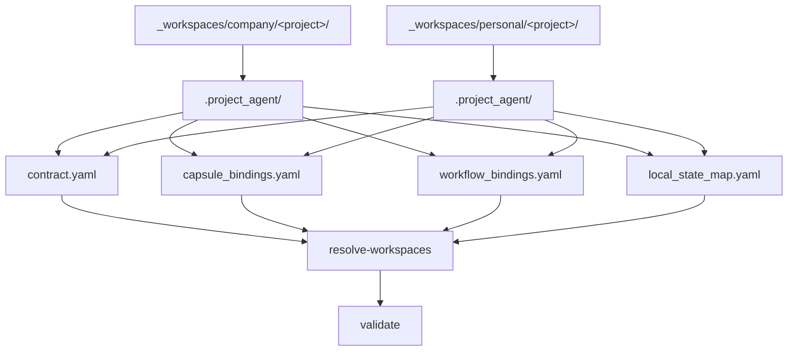

# `.project_agent` resolve 계약

## 목적

이 문서는 `_workspaces/**/.project_agent/*.yaml` 의 공통 resolve/validate 규칙과 workspace project 상태 분류 기준을 저장소 전체 관점에서 고정한다.

`PROJECT_AGENT_MINIMUM_SCHEMA.md` 가 최소 파일 세트와 최소 필드를 정의한다면, 이 문서는 그 파일들을 local CLI 가 어떤 기준으로 Scan, Resolve, Validate 해야 하는지를 정한다.

## 관계도

## 1. 공통 원칙

- 프로젝트는 `_workspaces/company/<project>/` 또는 `_workspaces/personal/<project>/` 아래의 실제 폴더다.
- `.project_agent/` 는 선택적 연결 계약 계층이다. 프로젝트 폴더 자체의 존재와 `.project_agent/` 존재는 별개다.
- `.project_agent/` 가 있으면 최소 파일 세트 네 개를 모두 갖춰야 한다.
- `resolve-workspaces` 는 body/class/loadout/module catalog 를 참조할 수 있지만 runtime readiness 는 판정하지 않는다.
- path normalize 나 자동 보정은 하지 않는다. 입력이 계약을 어기면 그대로 FAIL 로 남긴다.
- `unbound` 는 허용되는 상태 분류 결과다. `invalid` 만 validate FAIL 대상이다.

## 2. 프로젝트 상태 분류

| 상태 | 의미 |
| --- | --- |
| `bound` | `.project_agent/` 와 최소 파일 세트가 있고 핵심 참조가 resolve 된다 |
| `unbound` | 프로젝트 폴더는 있으나 `.project_agent/` 가 없다 |
| `invalid` | `.project_agent/` 는 있으나 스키마, 참조, 경로 계약이 깨진다 |

`bound`, `unbound`, `invalid` 는 UI의 `_workspaces` 탭과 후속 derive 단계가 공유하는 정식 상태 집합이다.

## 3. 파일별 resolve 규칙

### 3.1 `contract.yaml`

필수 필드:

- `project_id`
- `project_name`
- `workspace_kind`
- `body_ref`
- `class_ref`
- `default_loadout`

resolve 규칙:

- `workspace_kind` 는 프로젝트 부모 루트 이름인 `company` 또는 `personal` 과 일치해야 한다.
- `body_ref` 는 repo root 기준 `.agent` 경로로 resolve 가능해야 한다.
- `class_ref` 는 repo root 기준 `.agent_class` 경로로 resolve 가능해야 한다.
- `default_loadout` 은 현재 단계에서 `.agent_class/loadout.yaml.active_profile` 과 기본 일치 여부를 검사한다.
- 현재 `default_loadout` 값은 active profile id 로 해석한다.
- 다중 profile 구조가 도입되기 전까지 `default_loadout` 비교 기준은 `active_profile` 하나로 제한한다.

### 3.2 `capsule_bindings.yaml`

필수 필드:

- `bindings`
- 각 항목의 `capsule_id`
- `source_ref`
- `target_path`
- `mode`

resolve 규칙:

- `bindings` 는 list 여야 한다.
- `source_ref` 는 repo root 기준 `.agent` 또는 `.agent_class` 아래 경로로 resolve 가능해야 한다.
- `target_path` 는 프로젝트 루트 기준 상대 경로여야 하며 프로젝트 루트를 벗어나면 안 된다.
- `mode` 는 `read_only`, `read_write`, `copy` 중 하나여야 한다.

### 3.3 `workflow_bindings.yaml`

필수 필드:

- `bindings`
- 각 항목의 `workflow_id`
- `entrypoint`
- `trigger`
- `enabled`

resolve 규칙:

- `bindings` 는 list 여야 한다.
- `workflow_id` 는 installed workflow module id 와 resolve 되어야 한다.
- `entrypoint` 는 resolve 된 workflow manifest 의 `entrypoint` 와 일치해야 한다.
- `trigger` 는 `manual`, `on_demand`, `scheduled` 중 하나여야 한다.
- `enabled` 는 bool 이어야 한다.

### 3.4 `local_state_map.yaml`

필수 필드:

- `local_entries`
- 각 항목의 `key`
- `path`
- `purpose`
- `tracked`

resolve 규칙:

- `local_entries` 는 list 여야 한다.
- `path` 는 프로젝트 루트 기준 상대 경로여야 하며 프로젝트 루트를 벗어나면 안 된다.
- `tracked` 는 bool 이어야 한다.
- `tracked: false` 항목은 host-local, cache, temp 같은 비추적 상태를 설명할 수 있다.
- 이 파일은 reference map 이지 실제 파일 생성 규칙이 아니다.

## 4. validate 규칙

- validate 는 `_workspaces/company` 와 `_workspaces/personal` 존재 여부를 먼저 확인한다.
- 각 workspace root 아래의 직접 하위 디렉터리를 프로젝트 폴더로 스캔한다.
- `.project_agent/` 가 없으면 해당 프로젝트를 `unbound` 로 기록하고 FAIL 로 올리지 않는다.
- `.project_agent/` 가 있으면 최소 파일 세트 존재 여부, YAML root type, 최소 필드, resolve 규칙을 검사한다.
- `contract.yaml` 위반, `capsule_bindings.yaml` 위반, `workflow_bindings.yaml` 위반, `local_state_map.yaml` 위반은 모두 `invalid` 판정 대상이다.
- `default_loadout` 이 현재 `active_profile` 과 다르면 FAIL 이다.
- 다중 profile 미도입으로 인한 설명성 경고는 명시적 WARN 한 종류만 허용한다.
- `invalid` 프로젝트가 하나라도 있으면 validate 는 non-zero exit code 를 반환한다.
- 모든 bound project 가 유효하고 나머지가 unbound 이면 validate 는 zero exit code 를 반환한다.

## 5. 확장 규칙

- 새 필드나 새 상태 분류를 추가할 때는 먼저 이 문서를 갱신한다.
- project 전용 workflow 정책, runtime readiness, renderer 입력 스키마는 여기서 고정하지 않는다.
- UI derive 나 카드 표현 스키마는 후속 차수 문서에서 다룬다.
- 다중 loadout profile 이 도입되면 `contract.yaml.default_loadout` resolve 규칙을 이 문서에서 확장한다.
