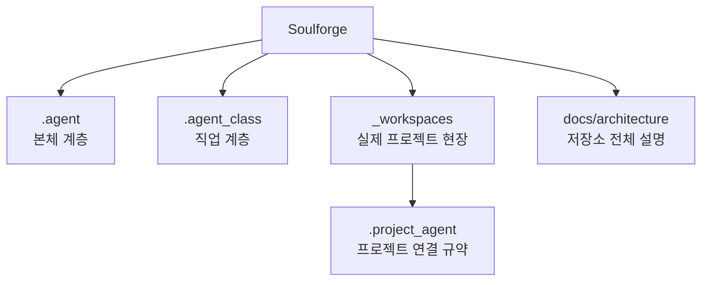

# 저장소 목적

## 한눈에 보기

Soulforge는 에이전트 구조를 `.agent(에이전트 본체)`, `.agent_class(직업 계층)`, `_workspaces(실제 프로젝트 현장)` 로 나누어 정리하는 정본 저장소다.

이 저장소는 구현 코드 저장소가 아니라, 구조와 문서를 먼저 확정하는 설계 저장소에 가깝다.

## 구조 개요도

## 이 저장소가 하는 일

- 새 기준 저장소 구조를 문서로 정의한다
- 본체 계층과 직업 계층의 책임 경계를 정리한다
- 실제 프로젝트 현장과 연결 규약의 위치를 정리한다
- 문서 소유 원칙을 정리한다
- body 정의와 body 상태 스냅샷을 분리해 설명한다
- 설치와 로드아웃 개념을 분리해 설명한다
- UI source map 과 UI sync contract 를 먼저 고정한다
- class installed/loadout resolve 가 module reference contract 위에 올라가도록 기준을 닫는다
- workspace resolve 계약이 UI derive 이전 단계의 전제로 올라가도록 기준을 닫는다
- 향후 구현과 UI가 붙을 수 있도록 최소 메타 구조를 준비한다

## 이 저장소가 지금 하지 않는 일

- 기존 저장소 구현 코드를 대량 복사하지 않는다
- top-level `configs/`, `scripts/`, `tests/` 를 먼저 만들지 않는다
- UI를 먼저 만들지 않는다
- 런타임 동작을 먼저 옮기지 않는다

## 중요한 경계

- `.agent(에이전트 본체)` 는 몸이다
- `.agent_class(직업 계층)` 는 직업이다
- `_workspaces(실제 프로젝트 현장)` 는 실제 프로젝트의 운영 공간이다
- `.project_agent(프로젝트 연결 규약)` 는 각 프로젝트 안에 둔다
- 루트 `docs/` 는 저장소 전체 설명만 둔다
- `memory(장기 기억)` 와 `knowledge(설치형 지식 팩)` 는 서로 다르다
- UI는 정본이 아니라 메타와 구조에서 파생되는 결과다

## 자주 찾는 파일

- `README.md`
- `AGENTS.md`
- `docs/architecture/DOCUMENT_OWNERSHIP.md`
- `docs/architecture/AGENT_WORLD_MODEL.md`
- `docs/architecture/PROJECT_AGENT_MINIMUM_SCHEMA.md`
- `docs/architecture/PROJECT_AGENT_RESOLVE_CONTRACT.md`
- `docs/architecture/TARGET_TREE.md`
- `docs/architecture/CURRENT_DECISIONS.md`
- `.agent/docs/architecture/AGENT_BODY_MODEL.md`
- `.agent/docs/architecture/BODY_METADATA_CONTRACT.md`
- `.agent/body.yaml`
- `.agent/body_state.yaml`
- `.agent_class/docs/architecture/AGENT_CLASS_MODEL.md`
- `.agent_class/docs/architecture/INSTALLATION_AND_LOADOUT_CONCEPT.md`
- `.agent_class/docs/architecture/MODULE_REFERENCE_CONTRACT.md`
- `.agent_class/class.yaml`
- `.agent_class/loadout.yaml`
- `docs/architecture/UI_SOURCE_MAP.md`
- `docs/architecture/UI_SYNC_CONTRACT.md`

## 이식 관점

기존 저장소는 참고용이다.
새 구조의 기준은 Soulforge 문서 세트에 두고, 필요한 요소만 선별적으로 이식한다.
