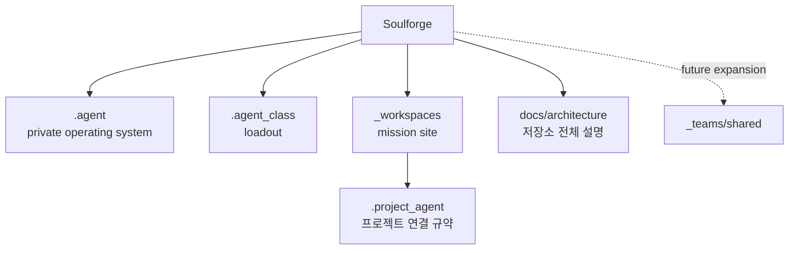

# 저장소 목적

## 목적

- Soulforge를 `.agent(private operating system)`, `.agent_class(loadout)`, `_workspaces(mission site)` 세 축으로 정리하는 정본 저장소로 고정한다.
- 구현보다 문서와 구조를 먼저 닫아 이후 runtime 과 UI 가 같은 기준을 읽게 만든다.

## 범위

- 구조 문서, 메타 계약, resolve/validate/derive 기준선, read-only viewer 기준까지만 다룬다.
- 협업 shared 영역과 대규모 runtime 이전은 미래 확장으로 남긴다.

## 포함 대상

- body/class/workspace 구조 정의
- `.project_agent` 연결 규약
- UI source map, sync contract, derived state contract
- v1 운영 기준과 known limitation

## 제외 대상

- 기존 저장소 구현 대량 이식
- `.agent` 내부 팀 협업 구조
- 독립 `export/` body 기관

## 구조 개요도

## 이 저장소가 하는 일

- 새 기준 저장소 구조를 문서로 정의한다
- body, loadout, mission site 의 책임 경계를 정리한다
- species, policy floor, continuity, protocol, quality correction 같은 body 의미를 고정한다
- 실제 프로젝트 현장과 연결 규약의 위치를 정리한다
- UI source map 과 UI sync contract 를 먼저 고정한다
- class installed/loadout resolve 가 module reference contract 위에 올라가도록 기준을 닫는다
- workspace resolve 계약이 UI derive 이전 단계의 전제로 올라가도록 기준을 닫는다

## 중요한 경계

- `.agent` 는 durable agent body 의 private operating system 이다
- `.agent_class` 는 직업 일반론보다 현재 장착 구성인 loadout 계층이다
- `_workspaces` 는 실제 프로젝트가 수행되는 mission site 다
- 미래 팀 협업은 `.agent` 안이 아니라 `_teams/shared/` 로 확장한다
- `species` 는 `identity` 의 durable default 만 담당한다
- `policy` 는 species-free floor 다
- `sessions` 는 transcript 가 아니라 continuity 저장소다
- `autonomic` 은 저소음 품질 보정 루틴이다

## 자주 찾는 파일

- `README.md`
- `AGENTS.md`
- `docs/architecture/DOCUMENT_OWNERSHIP.md`
- `docs/architecture/AGENT_WORLD_MODEL.md`
- `docs/architecture/PROJECT_AGENT_MINIMUM_SCHEMA.md`
- `docs/architecture/PROJECT_AGENT_RESOLVE_CONTRACT.md`
- `docs/architecture/UI_DERIVED_STATE_CONTRACT.md`
- `docs/architecture/TARGET_TREE.md`
- `.agent/docs/architecture/AGENT_BODY_MODEL.md`
- `.agent/docs/architecture/BODY_METADATA_CONTRACT.md`
- `.agent/body.yaml`
- `.agent/body_state.yaml`
- `.agent_class/class.yaml`
- `.agent_class/loadout.yaml`

## 미래 확장 방향

- `engine/` runtime rename 여부를 major 문서 정리 때 결정한다.
- 팀 shared 자산과 canonical shared protocol 은 `_teams/shared/` 로 분리한다.
- 본체 `protocols/` 는 private default 중심으로 확장한다.

## 이식 관점

- 기존 저장소는 참고용이다.
- 새 구조의 기준은 Soulforge 문서 세트에 두고, 필요한 요소만 선별적으로 이식한다.
