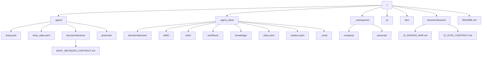

# 목표 트리

## 목적

- 저장소의 목표 구조와 owner 경계를 한눈에 보여준다.
- `.agent` private operating system, `.agent_class` loadout, `_workspaces` mission site 의 배치를 고정한다.

## 범위

- 현재 목표 트리와 각 경로의 책임만 요약한다.
- shared team 확장과 major rename 은 미래 방향으로만 다룬다.

## 포함 대상

- 루트 구조
- `.agent` 핵심 기관
- `.agent_class`, `_workspaces`, `docs`, `ui`, `dev` 의 상위 책임

## 제외 대상

- 세부 스키마와 resolve 알고리즘
- 협업용 `_teams/shared/` 실제 폴더 생성
- 독립 `export/` 기관

## 구조 개요도



```text
./
├── .agent/
│   ├── body.yaml
│   ├── body_state.yaml
│   ├── artifacts/
│   ├── autonomic/
│   ├── communication/
│   ├── docs/
│   │   └── architecture/
│   │       ├── AGENT_BODY_MODEL.md
│   │       └── BODY_METADATA_CONTRACT.md
│   ├── engine/
│   ├── identity/
│   ├── memory/
│   ├── policy/
│   ├── protocols/
│   ├── registry/
│   └── sessions/
├── .agent_class/
│   ├── _local/
│   ├── docs/
│   │   ├── architecture/
│   │   └── prompts/
│   ├── knowledge/
│   ├── skills/
│   ├── tools/
│   │   ├── adapters/
│   │   ├── connectors/
│   │   ├── local_cli/
│   │   └── mcp/
│   ├── workflows/
│   ├── class.yaml
│   └── loadout.yaml
├── _workspaces/
│   ├── company/
│   └── personal/
├── ui/
│   └── viewer/
├── dev/
│   ├── log/
│   └── plan/
├── docs/
│   └── architecture/
│       ├── UI_SOURCE_MAP.md
│       └── UI_SYNC_CONTRACT.md
└── README.md
```

## README 운영 규칙

- 루트 `README.md` 는 저장소 전체 진입문과 상위 지도만 둔다.
- 주요 디렉터리는 각 경로 바로 아래 `README.md` 를 정본 설명으로 둔다.
- 이 문서는 목표 트리와 책임 경계만 요약한다. 폴더별 상세 운영은 로컬 `README.md` 를 따른다.

## 폴더별 책임

| 경로 | 책임 |
| --- | --- |
| `.agent/` | durable agent unit 의 private operating system |
| `.agent/body.yaml` | 본체 정적 정의 메타 파일 |
| `.agent/body_state.yaml` | 본체 현재 상태 스냅샷 |
| `.agent/identity/` | durable identity default 와 species baseline |
| `.agent/engine/` | 현재 경로명은 `engine` 이지만 의미는 runtime layer |
| `.agent/sessions/` | transcript 가 아닌 continuity 저장소 |
| `.agent/memory/` | 장기 기억 |
| `.agent/communication/` | 외부와의 상호작용 규칙 |
| `.agent/protocols/` | body 공통 operating protocol |
| `.agent/autonomic/` | 저소음 품질 보정 루틴 |
| `.agent/policy/` | species-free floor |
| `.agent/registry/` | 등록 정보와 색인 정보 |
| `.agent/artifacts/` | 본체 측 파생 산출물, 단 `export/` 는 별도 기관으로 두지 않음 |
| `.agent/docs/` | 본체 내부 문서 |
| `.agent/docs/architecture/` | body 구조 문서 |
| `.agent/docs/architecture/BODY_METADATA_CONTRACT.md` | body 메타 계약 |
| `.agent_class/` | installed library 와 equipped state 를 다루는 loadout 계층 |
| `.agent_class/class.yaml` | 직업 정의 메타 파일 |
| `.agent_class/loadout.yaml` | 현재 장착 상태 정의 |
| `.agent_class/skills/` | 설치된 스킬 |
| `.agent_class/tools/` | 외부 도구와 연결 계층 |
| `.agent_class/tools/adapters/` | 공통 도구 인터페이스로 정렬하는 어댑터 |
| `.agent_class/tools/connectors/` | 외부 연결과 인증 진입점 |
| `.agent_class/tools/local_cli/` | 로컬 CLI 기반 도구 래퍼와 실행 바인딩 |
| `.agent_class/tools/mcp/` | MCP 서버 연결과 프로토콜 바인딩 |
| `.agent_class/workflows/` | 운용 절차 |
| `.agent_class/knowledge/` | 설치형 지식 팩 |
| `.agent_class/docs/` | 직업 내부 문서 |
| `.agent_class/docs/architecture/` | class 구조와 메타 규약 |
| `.agent_class/docs/prompts/` | class 재사용 프롬프트 |
| `.agent_class/_local/` | 비추적 로컬 전용 상태 |
| `_workspaces/` | 실제 프로젝트 운영 현장 |
| `_workspaces/company/` | 회사 프로젝트 |
| `_workspaces/personal/` | 개인 프로젝트 |
| `ui/` | 저장소 공용 UI surface |
| `ui/viewer/` | `derive-ui-state --json` 소비자 renderer |
| `dev/log/` | 저장소 공용 개발 이력 |
| `dev/plan/` | 저장소 공용 개발 계획 |
| `docs/architecture/` | 저장소 전체 구조 문서 |
| `docs/architecture/UI_SOURCE_MAP.md` | UI source 정본 지도 |
| `docs/architecture/UI_SYNC_CONTRACT.md` | UI 동기화 계약 |
| `docs/architecture/DOCUMENT_OWNERSHIP.md` | 문서 소유권 기준 |
| `README.md` | 저장소 전체 개요와 상위 지도 |

## 미래 확장 방향

- 미래 팀 협업은 `.agent` 안이 아니라 루트 `_teams/shared/` 로 확장한다.
- `engine/` 은 runtime 의미를 유지하고 major 정리에서 `runtime/` rename 을 검토한다.
- `protocols/` 는 body 공통 운영 계약의 고정 경계로 유지한다.
