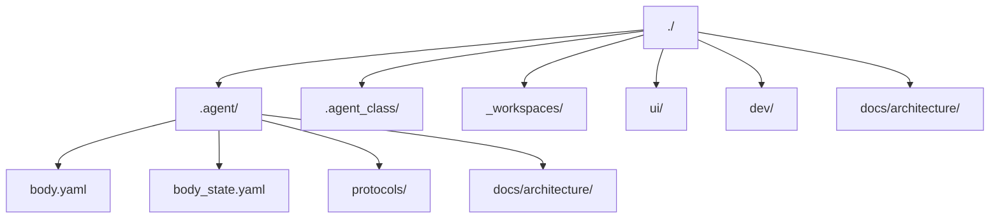

# 목표 트리

## 목적

- 저장소의 목표 구조와 owner 경계를 한눈에 보여준다.
- 특히 최종 `.agent` target tree 를 루트 문서 기준으로 고정한다.

## 범위

- 현재 목표 트리와 각 경로의 상위 책임만 요약한다.
- 세부 운영 절차와 low-level 계약 본문은 각 owner 문서로 위임한다.

## 포함 대상

- 루트 구조
- 최종 `.agent` target tree
- `.agent_class`, `_workspaces`, `docs`, `ui`, `dev` 의 상위 책임

## 제외 대상

- 세부 스키마와 resolve 알고리즘
- 협업용 `_teams/shared/` 실제 폴더 생성
- 별도 `.agent/export/` 폴더

## 구조 개요도



## 최종 `.agent` target tree

```text
.agent/
├── README.md
├── body.yaml
├── body_state.yaml
├── artifacts/
│   └── README.md
├── autonomic/
│   └── README.md
├── communication/
│   ├── README.md
│   ├── human_channel_profile.yaml
│   └── peer_channel_profile.yaml
├── docs/
│   ├── README.md
│   └── architecture/
│       ├── AGENT_BODY_MODEL.md
│       ├── BODY_METADATA_CONTRACT.md
│       └── README.md
├── engine/
│   ├── README.md
│   ├── context_assembly.yaml
│   ├── sandbox_profile.yaml
│   └── tool_scope.yaml
├── identity/
│   ├── README.md
│   ├── identity_manifest.yaml
│   ├── species_profile.yaml
│   └── trait_bindings.yaml
├── memory/
│   └── README.md
├── policy/
│   ├── README.md
│   ├── approval_matrix.yaml
│   ├── precedence.yaml
│   └── scope_rules.yaml
├── protocols/
│   ├── README.md
│   ├── decision_contract.yaml
│   ├── escalation_contract.yaml
│   ├── handoff_contract.yaml
│   ├── incident_contract.yaml
│   └── request_contract.yaml
├── registry/
│   ├── README.md
│   ├── active_class_binding.yaml
│   ├── capability_index.yaml
│   └── workspace_binding.yaml
└── sessions/
    ├── README.md
    └── checkpoint_template.yaml
```

## 저장소 상위 구조

```text
./
├── .agent/
├── .agent_class/
│   ├── _local/
│   ├── docs/
│   │   ├── architecture/
│   │   └── prompts/
│   ├── knowledge/
│   ├── skills/
│   ├── tools/
│   │   ├── adapters/
│   │   ├── connectors/
│   │   ├── local_cli/
│   │   └── mcp/
│   ├── workflows/
│   ├── class.yaml
│   └── loadout.yaml
├── _workspaces/
│   ├── company/
│   └── personal/
├── ui/
│   └── viewer/
├── dev/
│   ├── log/
│   └── plan/
├── docs/
│   └── architecture/
└── README.md
```

## README 운영 규칙

- 루트 `README.md` 는 저장소 전체 상위 지도만 둔다.
- `.agent` 상세 구조와 운영은 `.agent/docs/architecture/*` 와 각 로컬 `README.md` 를 정본으로 본다.
- 이 문서는 구조 배치와 owner 경계만 요약하고, low-level 규칙 본문은 중복하지 않는다.

## 폴더별 상위 책임

| 경로 | 상위 책임 |
| --- | --- |
| `.agent/` | durable agent unit 의 private operating system |
| `.agent/engine/` | 현재 경로명은 `engine` 이지만 의미는 runtime layer |
| `.agent/protocols/` | body 공통 operating contract |
| `.agent/registry/` | binding, index, reference 계층 |
| `.agent/docs/architecture/` | body 구조와 body 메타 계약의 정본 문서 |
| `.agent_class/` | installed library 와 equipped state 를 다루는 loadout 계층 |
| `_workspaces/` | 실제 프로젝트 운영 현장 |
| `docs/architecture/` | 저장소 전체 구조와 root-owned 계약 문서 |
| `ui/viewer/` | `derive-ui-state --json` 소비자 renderer |
| `dev/{plan,log}/` | 저장소 공용 계획과 이력 |
