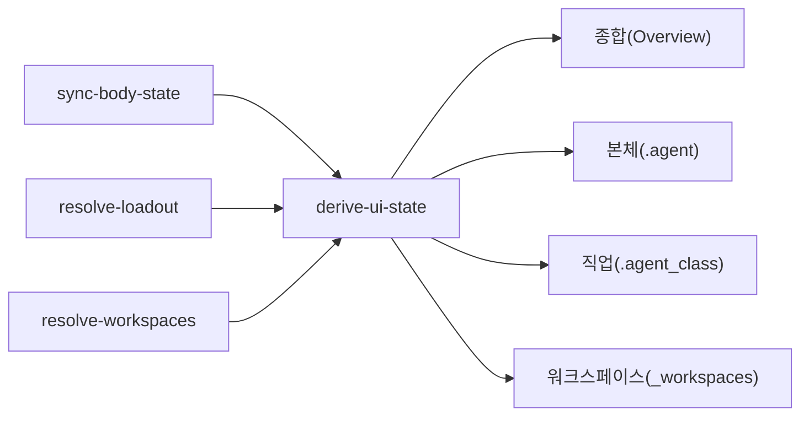

# UI 파생 상태 계약

## 목적

이 문서는 Soulforge UI가 직접 소비할 수 있는 파생 상태 JSON 구조를 저장소 전체 관점에서 고정한다.

이번 계약은 renderer 를 정의하지 않는다.
대신 `sync-body-state`, `resolve-loadout`, `resolve-workspaces`, `validate` 위에 올라가는 `derive-ui-state` 의 안정된 입력/출력 구조를 정의한다.

## 관계도

## 1. 공통 원칙

- derived state 는 정본이 아니다.
- derived state 는 `UI_SOURCE_MAP.md`, `UI_SYNC_CONTRACT.md`, 각 owner 계약 문서를 따른다.
- renderer 는 derived state 를 읽는 소비자다.
- derived state 는 body/class/workspace resolve 가 성공한 범위 안에서만 안정적으로 생성한다.
- validate FAIL 이 있어도 `derive-ui-state --json` 은 가능한 범위의 partial output 을 반환할 수 있다.
- `invalid` 는 diagnostics 의 error 로 남는다.
- `unbound` 는 정상 상태 분류 결과이며 error 가 아니다.
- derive 단계는 저장소 추적 파일을 새로 쓰지 않는다.

## 2. 최상위 derived state 구조

`derive-ui-state --json` 은 최소한 아래 top-level 키를 고정한다.

| 키 | 의미 |
| --- | --- |
| `ui` | 상단 탭과 기본 UI 메타 |
| `overview` | body/class/workspace 합성 요약 |
| `body` | `.agent` 탭 입력 상태 |
| `class` | `.agent_class` 탭 입력 상태 |
| `workspaces` | `_workspaces` 탭 입력 상태 |
| `diagnostics` | warn/error findings |

## 3. `ui`

`ui.tabs` 는 아래 순서와 값을 고정한다.

| `id` | `label` |
| --- | --- |
| `overview` | `종합(Overview)` |
| `body` | `본체(.agent)` |
| `class` | `직업(.agent_class)` |
| `workspaces` | `워크스페이스(_workspaces)` |

각 tab 은 최소한 아래 필드를 가진다.

- `id`
- `label`
- `enabled`

`enabled` 는 해당 탭이 파생 JSON 에서 렌더 가능한 최소 구조를 갖는지를 뜻한다.
empty catalog 나 empty workspace 때문에 탭을 자동 비활성화하지는 않는다.

## 4. `overview`

`overview` 는 counts 중심의 합성 요약이다.

최소 필드:

- `body_id`
- `class_id`
- `active_profile`
- `counts.body_sections_present`
- `counts.installed.skills`
- `counts.installed.tools`
- `counts.installed.workflows`
- `counts.installed.knowledge`
- `counts.equipped.skills`
- `counts.equipped.tools`
- `counts.equipped.workflows`
- `counts.equipped.knowledge`
- `counts.projects.total`
- `counts.projects.bound`
- `counts.projects.unbound`
- `counts.projects.invalid`
- `status.result`
- `status.warning_count`
- `status.error_count`

`status.result` 는 최소한 `PASS`, `WARN`, `FAIL` 중 하나를 사용한다.

## 5. `body`

최소 필드:

- `id`
- `name`
- `sections`

각 `sections[*]` 항목 최소 필드:

- `id`
- `path`
- `present`

`body.sections` 순서는 `body.yaml.sections` 정의 순서를 유지한다.
`body_state.yaml` 이 없거나 깨졌더라도 body 정적 정의가 남아 있으면 그 순서를 우선한다.

## 6. `class`

최소 필드:

- `id`
- `active_profile`
- `installed.skills`
- `installed.tools`
- `installed.workflows`
- `installed.knowledge`
- `equipped.skills`
- `equipped.tools`
- `equipped.workflows`
- `equipped.knowledge`
- `tools_by_family`
- `workflow_cards`

`installed.*` 각 항목 최소 필드:

- `id`
- `name`
- `version`
- `description`
- `manifest_path`

kind 별 추가 필드는 필요 시 아래를 포함할 수 있다.

- `family`
- `entrypoint`
- `content_path`
- `requires`

`equipped.*` 는 단순 id 목록이 아니라 resolve 된 installed module object list 로 파생한다.

`tools_by_family` 최소 구조:

- `adapters`
- `connectors`
- `local_cli`
- `mcp`

각 family 값은 해당 family 의 installed tool object list 다.

## 7. workflow card 구조

`class.workflow_cards` 는 installed workflow catalog 기준으로 만든다.

각 카드 최소 필드:

- `id`
- `name`
- `version`
- `description`
- `entrypoint`
- `equipped`
- `requires.skills`
- `requires.tools`
- `requires.knowledge`
- `dependency_status`

`dependency_status` 는 이번 차수에서 아래 둘 중 하나만 사용한다.

- `resolved`
- `invalid`

workflow card 는 `연계기 카드` 개념을 유지하지만, 의존 판정 기준은 workflow manifest 의 `requires.*` 와 installed catalog resolve 결과다.

## 8. `workspaces`

최소 필드:

- `summary.total`
- `summary.bound`
- `summary.unbound`
- `summary.invalid`
- `company.projects`
- `personal.projects`

각 project 최소 필드:

- `project_path`
- `workspace_kind`
- `state`
- `project_agent_present`
- `contract.project_id`
- `contract.project_name`
- `contract.default_loadout`
- `capsule_binding_count`
- `workflow_binding_count`
- `local_state_entry_count`

주의:

- `unbound` project 는 `.project_agent` 세부 정보가 비어 있어도 된다.
- `invalid` project 는 가능한 범위까지 구조를 싣고 diagnostics 에 오류를 남긴다.
- 구현은 위 최소 필드 외에 file section path, present/valid, project-scoped warnings/errors 를 추가로 보존할 수 있다.

## 9. 상태/진단 규칙

`diagnostics` 는 최소한 아래 필드를 가진다.

- `warnings`
- `errors`

각 항목 최소 필드:

- `level`
- `code`
- `message`

규칙:

- derived state 는 validate 결과를 반영해야 한다.
- `warnings` 와 `errors` 는 기존 finding 구조와 호환되게 유지한다.
- `warnings` 는 기존 `WARN` finding 을, `errors` 는 기존 `FAIL` finding 을 옮긴다.
- renderer 는 PASS finding 에 의존하지 않는다.
- error 가 있으면 `derive-ui-state` 는 non-zero exit code 를 반환할 수 있다.
- text 출력은 `FAIL derive-ui-state` 또는 `WARN derive-ui-state` 로 시작할 수 있다.

## 10. 확장 규칙

- 새 top-level key 를 추가할 때는 먼저 이 문서를 갱신한다.
- renderer 전용 시각 장식 값은 이 문서에서 먼저 강제하지 않는다.
- 실제 카드 컴포넌트 구조, CSS, theme, icon 규칙은 후속 renderer 차수에서 다룬다.
- project runtime readiness, scheduling, 실행 정책은 이 문서 범위가 아니다.
- 구현은 minimum field 를 깨지 않는 범위에서 추가 메타를 보존할 수 있다.
