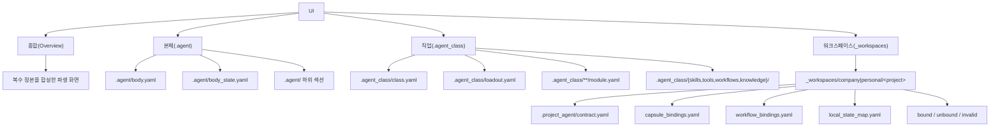

# UI source map

## 목적

이 문서는 Soulforge UI가 어떤 정본 파일과 경로에서 파생되는지 저장소 전체 관점에서 고정한다.

UI는 정본이 아니다.
정본은 메타 파일과 실제 구조에 남고, 화면은 그 결과를 재구성한 파생물로 본다.

## 구조 개요도

## 상단 탭 표기

- `종합(Overview)`
- `본체(.agent)`
- `직업(.agent_class)`
- `워크스페이스(_workspaces)`

상단 탭은 한글 표기와 실제 폴더명을 함께 유지한다.
내부 섹션명은 실제 구조명에 맞춰 영어를 유지한다.

## 탭별 source map

| 탭 | 정본 파일/경로 | 설명 |
| --- | --- | --- |
| `종합(Overview)` | 단일 정본 없음 | body, class, workspace 정본을 합성한 파생 화면 |
| `본체(.agent)` | `.agent/body.yaml`, `.agent/body_state.yaml`, `.agent/` 하위 섹션 | body 정적 정의, 현재 상태 스냅샷, 실제 섹션 구조를 함께 읽어 구성 |
| `직업(.agent_class)` | `.agent_class/class.yaml`, `.agent_class/loadout.yaml`, `.agent_class/**/module.yaml`, `.agent_class/{skills,tools,workflows,knowledge}/` | class 정적 정의, 현재 장착 상태, installed module manifest, 라이브러리 구조를 함께 읽어 구성 |
| `워크스페이스(_workspaces)` | `_workspaces/company|personal` 아래 실제 프로젝트 폴더, `_workspaces/**/.project_agent/contract.yaml`, `capsule_bindings.yaml`, `workflow_bindings.yaml`, `local_state_map.yaml` | 프로젝트 존재 여부, `.project_agent` resolve 결과, 상태 분류를 함께 읽어 구성 |

## 표현 기준

- `Installed Library` 는 `.agent_class/class.yaml` 의 `modules.*` 와 `.agent_class/**/module.yaml` manifest 에서 파생한다.
- `Loadout` 은 `.agent_class/loadout.yaml` 의 `equipped.* module id` 에서 파생한다.
- `워크스페이스(_workspaces)` 는 실제 프로젝트 폴더 스캔 결과와 `.project_agent` resolve 결과에서 `bound`, `unbound`, `invalid` 상태를 파생한다.
- `Installed Library` 와 `Loadout` 은 같은 화면에 있더라도 다른 정본을 가진다.
- workflow 는 기본적으로 `연계기 카드` 개념으로 표현한다.
- UI는 언제든 파일과 메타에서 다시 생성되어야 한다.
- UI 자체를 사람이 직접 수정하는 정본으로 취급하지 않는다.
