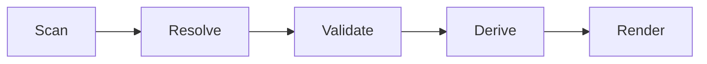

# UI 동기화 계약

## 목적

이 문서는 Soulforge UI의 최신화 원칙을 저장소 계약으로 고정한다.

이번 단계에서 다루는 대상은 구현 코드가 아니라, 어떤 정본이 어떤 순서로 UI로 파생되어야 하는지에 대한 규칙이다.

## 기본 원칙

1. UI는 정본이 아니다.
2. UI에 구조 정보와 참조를 하드코딩하지 않는다.
3. 정본이 바뀌면 UI 파생 상태도 같은 변경 흐름에서 갱신한다.
4. `body_state.yaml` 은 저장소 추적 대상이지만 host-local 상태 파일이 아니다.

## 정본 계층

- `.agent/body.yaml`
- `.agent/body_state.yaml`
- `.agent_class/class.yaml`
- `.agent_class/loadout.yaml`
- `.agent_class/**/module.yaml`
- `.agent_class/{skills,tools,workflows,knowledge}/`
- `_workspaces/**/.project_agent/*.yaml`

## 생성 순서

- `Scan` = 정본 파일과 실제 경로를 수집한다.
- `Resolve` = 참조, 바인딩, 모듈 경로를 실제 엔트리로 해석한다.
- `Validate` = dangling reference 와 구조 불일치를 검사한다.
- `Derive` = 화면용 상태를 계산한다.
- `Render` = 계산된 상태로 UI를 출력한다.

## 1차, 2차, 3차, 4차, 5차 구현 범위

- 1차에서는 `sync-body-state` 와 body/class/loadout 최소 구조 검증만 구현했다.
- 2차에서는 class installed/loadout 에 대해 `Resolve` + `Validate` 를 실제 구현한다.
- 3차에서는 workspace `.project_agent` 에 대해 `resolve-workspaces` 와 workspace 통합 `validate` 를 구현한다.
- 4차에서는 `derive-ui-state` 로 `Derive` 단계를 실제 구현한다.
- 5차에서는 `.agent_class/tools/local_cli/ui_viewer/ui_viewer.py` 로 `Render` 단계의 read-only prototype 을 구현한다.
- 6차에서는 첫 happy-path reference sample 1세트를 실제 library roots 와 `_workspaces/company/` 아래에 도입한다.
- 7차에서는 첫 invalid reference sample 1세트를 `_workspaces/company/` 아래에 도입해 validate FAIL 과 partial/error render 경로를 실제 입력으로 검증한다.
- `sync-body-state` 는 `.agent/body.yaml` 과 실제 `.agent/` 구조를 스캔해 `.agent/body_state.yaml` 을 재생성한다.
- `resolve-loadout` 는 `.agent_class/class.yaml` 의 `modules.*` 와 installed `module.yaml` manifest 를 스캔해 catalog 를 구성하고 `loadout.yaml` 의 equipped module id 를 resolve 한다.
- `resolve-workspaces` 는 `_workspaces/company|personal` 아래 프로젝트 폴더를 스캔하고 `.project_agent` 4파일을 resolve 해 `bound`, `unbound`, `invalid` 상태를 분류한다.
- `validate` 는 body 메타 정합성, `body_state.yaml` 정합성, class/loadout 구조, class installed/loadout resolve 결과, workspace project contract resolve 결과를 함께 검사한다.
- equipped workflow 의 `requires.skills/tools/knowledge` 는 installed 여부 기준으로 먼저 resolve 한다.
- `derive-ui-state` 는 body/class/workspace resolve 결과를 `overview`, `body`, `class`, `workspaces`, `diagnostics` 구조로 합친다.
- `derive-ui-state` 는 text/json 출력을 지원하지만 기본적으로 저장소 파일을 새로 쓰지 않는다.
- `ui_viewer.py` 는 `derive-ui-state --json` 만 읽고 4탭 UI 와 diagnostics 패널을 read-only 로 렌더링한다.
- `ui_viewer.py` 는 `derive-ui-state` 가 non-zero exit code 를 반환해도 JSON payload 가 있으면 partial render 를 유지한다.

## 동기화 트리거

- body 구조 변경
- body 메타 변경
- skill, tool, workflow, knowledge 의 추가, 삭제, 이동, 이름 변경
- class 또는 loadout 변경
- `.project_agent` 계약 변경

## 검증 규칙

1. loadout 참조는 실제 installed module manifest catalog 로 resolve 되어야 한다.
2. non-empty `equipped.*` 를 blanket WARN 으로 넘기지 않는다.
3. `body_state.yaml` 은 실제 `.agent/` 구조와 일치해야 한다.
4. class installed/loadout 에서 아래는 FAIL 이다: contract 경로 위반 manifest, duplicate id, path-like equipped reference.
5. class installed/loadout 에서 아래는 FAIL 이다: kind mismatch, tool family mismatch, path-family mismatch, unknown equipped id.
6. equipped workflow dependency 는 installed catalog 기준으로 resolve 하고, unknown dependency id 는 FAIL 이다.
7. `.project_agent` resolve 는 `PROJECT_AGENT_RESOLVE_CONTRACT.md` 의 상태 분류와 파일별 규칙을 따른다.
8. `unbound` 프로젝트는 FAIL 이 아니라 상태 분류 결과다.
9. `invalid` 프로젝트는 FAIL 이다.
10. workspace binding resolve 는 project 계약 수준까지만 다루고 `derive-ui-state` 는 그 결과를 renderer 입력 상태로만 정리한다.
11. dangling reference 가 하나라도 있으면 UI patch 와 파생 상태 갱신을 진행하지 않는다.

## derive 규칙

1. `derive-ui-state` 는 `UI_DERIVED_STATE_CONTRACT.md` 의 top-level 구조를 따른다.
2. `body.sections` 는 `body.yaml.sections` 순서를 유지한다.
3. `class.installed.*` 는 installed manifest catalog 기준이다.
4. `class.equipped.*` 는 resolve 된 installed module object list 기준이다.
5. `class.workflow_cards` 는 installed workflow catalog 기준으로 만들고 `equipped` 와 `dependency_status` 를 포함한다.
6. `workspaces` 는 `resolve-workspaces` 결과를 summary 와 project list 로 보존한다.
7. diagnostics 는 validate findings 와 호환되는 `warnings`, `errors` 만 renderer 입력에 남긴다.
8. validate FAIL 이 있어도 `derive-ui-state --json` 은 partial output 을 반환할 수 있다.

## 커밋 규칙

1. 구조 또는 메타 변경과 UI 파생 상태 변경은 같은 변경 묶음에서 처리한다.
2. 정본만 바꾸고 관련 UI 파생 상태를 갱신하지 않은 커밋은 허용하지 않는다.
3. 문서 계약이 먼저 바뀌고, 그 다음 메타와 파생 상태를 맞춘다.

## 표현 규칙

- 상단 탭은 `종합(Overview)`, `본체(.agent)`, `직업(.agent_class)`, `워크스페이스(_workspaces)` 로 고정한다.
- 내부 섹션명은 실제 구조명에 맞춰 영어를 유지한다.
- workflow 는 `연계기 카드` 표현을 우선한다.
- renderer 는 정본 파일 직접 읽기보다 derived state 소비자를 우선한다.
- 첫 renderer 는 편집 기능 없는 로컬 read-only prototype 으로 시작한다.
