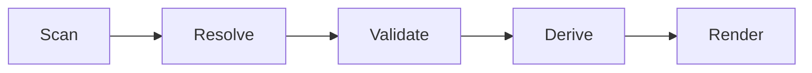

# UI 동기화 계약

## 목적

이 문서는 Soulforge UI의 최신화 원칙을 저장소 계약으로 고정한다.

이번 단계에서 다루는 대상은 구현 코드가 아니라, 어떤 정본이 어떤 순서로 UI로 파생되어야 하는지에 대한 규칙이다.

## 기본 원칙

1. UI는 정본이 아니다.
2. UI에 구조 정보와 참조를 하드코딩하지 않는다.
3. 정본이 바뀌면 UI 파생 상태도 같은 변경 흐름에서 갱신한다.
4. `body_state.yaml` 은 저장소 추적 대상이지만 host-local 상태 파일이 아니다.

## 정본 계층

- `.agent/body.yaml`
- `.agent/body_state.yaml`
- `.agent_class/class.yaml`
- `.agent_class/loadout.yaml`
- `.agent_class/{skills,tools,workflows,knowledge}/`
- `_workspaces/**/.project_agent/*.yaml`

## 생성 순서

- `Scan` = 정본 파일과 실제 경로를 수집한다.
- `Resolve` = 참조, 바인딩, 모듈 경로를 실제 엔트리로 해석한다.
- `Validate` = dangling reference 와 구조 불일치를 검사한다.
- `Derive` = 화면용 상태를 계산한다.
- `Render` = 계산된 상태로 UI를 출력한다.

## 동기화 트리거

- body 구조 변경
- body 메타 변경
- skill, tool, workflow, knowledge 의 추가, 삭제, 이동, 이름 변경
- class 또는 loadout 변경
- `.project_agent` 계약 변경

## 검증 규칙

1. loadout 참조는 실제 모듈로 resolve 되어야 한다.
2. `body_state.yaml` 은 실제 `.agent/` 구조와 일치해야 한다.
3. workflow binding 은 실제 workflow 와 entrypoint 로 resolve 되어야 한다.
4. dangling reference 가 하나라도 있으면 UI patch 와 파생 상태 갱신을 진행하지 않는다.

## 커밋 규칙

1. 구조 또는 메타 변경과 UI 파생 상태 변경은 같은 변경 묶음에서 처리한다.
2. 정본만 바꾸고 관련 UI 파생 상태를 갱신하지 않은 커밋은 허용하지 않는다.
3. 문서 계약이 먼저 바뀌고, 그 다음 메타와 파생 상태를 맞춘다.

## 표현 규칙

- 상단 탭은 `종합(Overview)`, `본체(.agent)`, `직업(.agent_class)`, `워크스페이스(_workspaces)` 로 고정한다.
- 내부 섹션명은 실제 구조명에 맞춰 영어를 유지한다.
- workflow 는 `연계기 카드` 표현을 우선한다.
