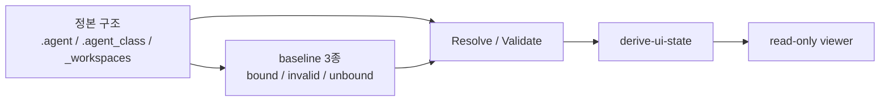

# v1 종료 체크리스트

## 목적

이 문서는 Soulforge의 현재 v1 범위를 명시적으로 닫기 위한 종료 기준을 고정한다.
이번 v1은 새 기능을 더하는 단계가 아니라, 이미 정리된 구조와 계약, 상태판, read-only viewer, baseline 3종을 운영 가능한 기준선으로 확정하는 단계다.

## 범위 개요도



## 이번 v1의 범위

- `.agent / .agent_class / _workspaces` 3축 구조와 owner 경계를 정본으로 고정한다.
- body/class/workspace 의 `resolve`, `validate`, `derive`, `render(read-only)` 흐름을 v1의 운영 범위로 본다.
- 실제 입력 기준선은 reference sample baseline 3종으로 닫는다.
- v1은 배포용 앱이나 편집 UI가 아니라, 로컬 검증 가능한 구조/상태판 기준선까지를 다룬다.

## 포함된 핵심 구성

- `.agent / .agent_class / _workspaces` 3축 구조
- `.agent/body.yaml`, `.agent/body_state.yaml` body 메타 2파일
- class installed/loadout resolve
- workspace `.project_agent` resolve
- `derive-ui-state` 기반 derived state generator
- `ui_viewer.py` read-only viewer
- reference sample baseline 3종

## baseline 상태 세트

| project | workspace | 기대 상태 | 역할 |
| --- | --- | --- | --- |
| `sample_reference_project` | `company` | `bound` | happy-path baseline |
| `sample_invalid_project` | `company` | `invalid` | diagnostics / partial render baseline |
| `sample_unbound_project` | `personal` | `unbound` | 허용 상태 분류 baseline |

## 검증 명령 목록

```bash
python .agent_class/tools/local_cli/ui_sync/ui_sync.py resolve-loadout
python .agent_class/tools/local_cli/ui_sync/ui_sync.py resolve-workspaces
python .agent_class/tools/local_cli/ui_sync/ui_sync.py validate
python .agent_class/tools/local_cli/ui_sync/ui_sync.py derive-ui-state --json
python .agent_class/tools/local_cli/ui_viewer/ui_viewer.py --once --output /tmp/soulforge-v1-closeout.html
python -m py_compile .agent_class/tools/local_cli/ui_sync/ui_sync.py .agent_class/tools/local_cli/ui_viewer/ui_viewer.py
git diff --check
```

운영 메모:

- 현재 저장소 상태에서는 `sample_invalid_project` 가 의도적으로 남아 있으므로 `resolve-workspaces`, `validate`, `derive-ui-state --json` 은 non-zero 동작을 보일 수 있다.
- 그 경우에도 `derive-ui-state --json` payload 와 `ui_viewer --once` HTML snapshot 은 baseline 3종과 diagnostics 를 계속 보여줘야 한다.

## 종료 판단 기준

- `resolve-loadout` 가 sample module baseline 을 인식하고 installed/equipped 를 모두 resolve 한다.
- `resolve-workspaces` 가 `bound / invalid / unbound` 세 상태를 실제 프로젝트 입력에서 분류한다.
- `validate` 는 `invalid` baseline 을 FAIL 로, `unbound` baseline 을 허용 상태로 유지한다.
- `derive-ui-state --json` 이 diagnostics 를 포함한 payload 구조를 유지한다.
- `ui_viewer` 가 세 상태를 시각적으로 구분하고 partial render 를 유지한다.
- `invalid` 는 diagnostics error 로 남고, `unbound` 는 상태 분류 결과로 남는다.
- `workspace_default_loadout_scope` 경고는 숨기지 않고 노출된 상태로 유지한다.

## 제외 범위

- 편집/저장 UI
- richer detail panel
- diagnostics filtering
- multi-profile 정식 설계
- CI/pre-commit 자동화
- 배포용 앱

## 다음 버전 후보

- `contract.default_loadout` 의 multi-profile 정식 설계
- viewer diagnostics filtering, deep-link, detail panel 보강
- 대형 catalog/workspace 목록용 collapse, expand, filtering 전략
